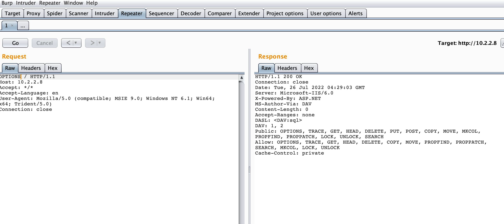
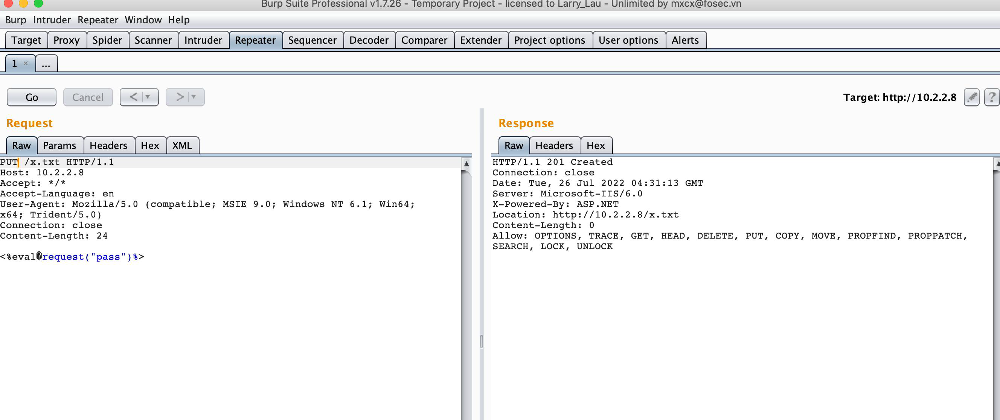
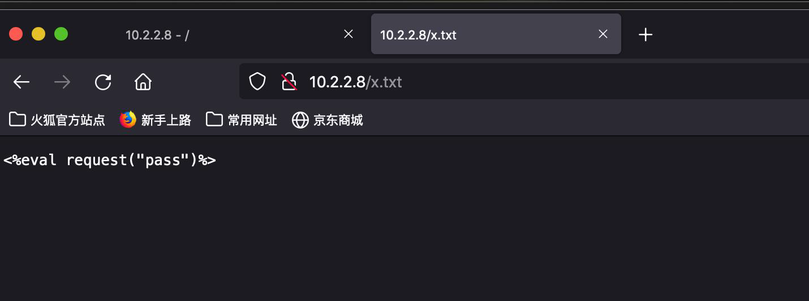
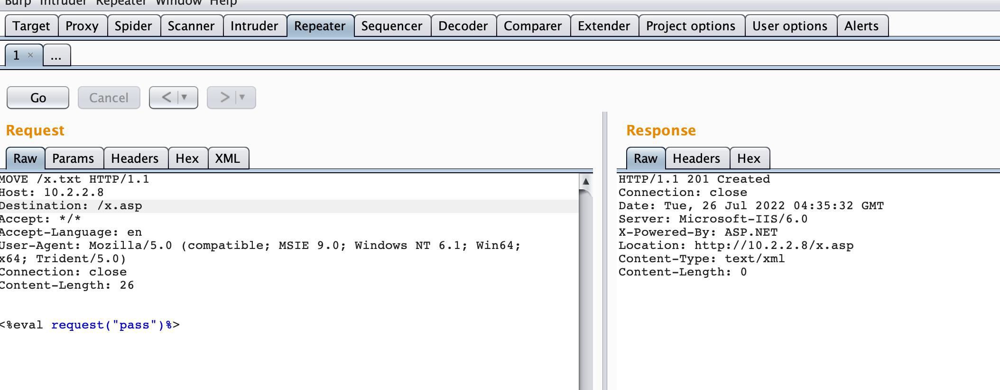
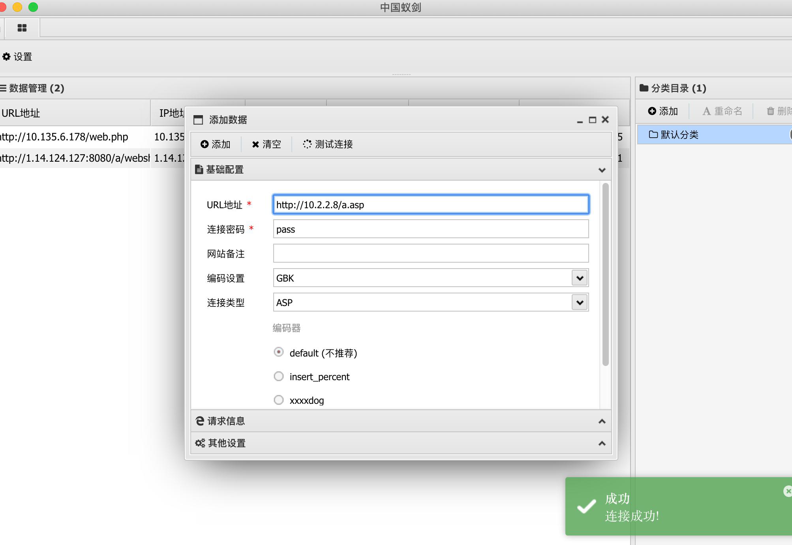
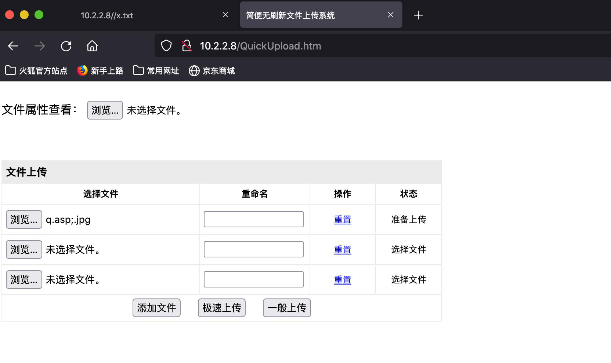
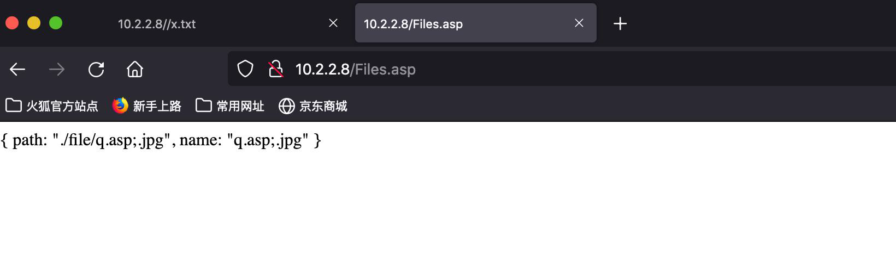
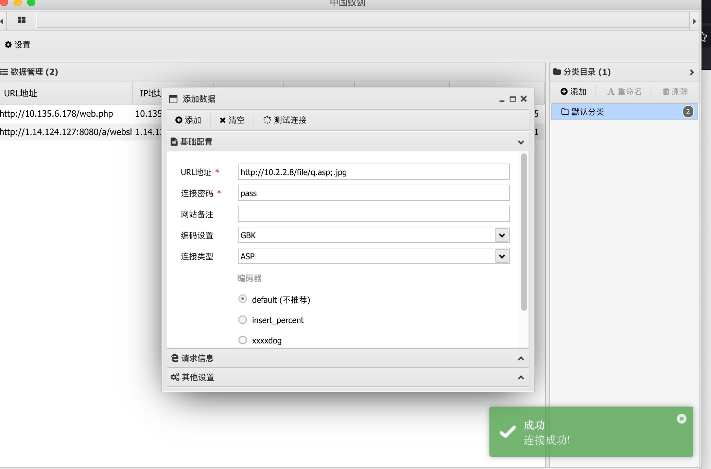

---
tags:
  - 中间件
create_time: 2024-10-17 15:25
modified_time: 2024-10-17 15:25
status: complete
---
> IIS是Internet Information Services的缩写，是由微软公司提供的Microsoft Windows的互联网基本服务。内置在Windows2000、Windows XP Professional和Windows Server 2003一起发行，但在Windows XP Home版本上并没有IIS。IIS是一种Web（网页）服务组件，其中包括 Web服务器、FTP服务器、NNTP服务器和SMTP服务器，分别用于网页浏览、文件传输、新闻服务和邮件发送等方面，它使得在网络（包括互联网和局域网）上发布信息成了一件很容易的事。

# 0x01 IIS put文件上传

1. 使用fscan扫描发现目标存在iis文件上传漏洞

2. 使用burp发个options的包

3. 再使用put传个文件

4. 访问地址看是否上传成功

5. 最后使用move方法将文件变成asp后缀

6. 蚁剑一键连接

# 0x02 IIS后缀解析漏洞

- IIS 6.0在处理含有特殊符号的文件路径时会出现逻辑错误，从而造成文件解析漏洞。上传名为【test. Asp;. Jpg】的文件，虽然该文件真正的后缀名是【. Jpg】, 但因为文件名中含有特殊符号【;】，所以【;】后面的【. Jpg】会直接忽略，只剩余【test. Asp】被作为asp文件执行。

1. 访问靶机：http://ip/QuickUpload.html, 上传一个文件名为q.asp;. Jpg即可绕过

2. 上传成功返回路径

3. 蚁剑一键连接

