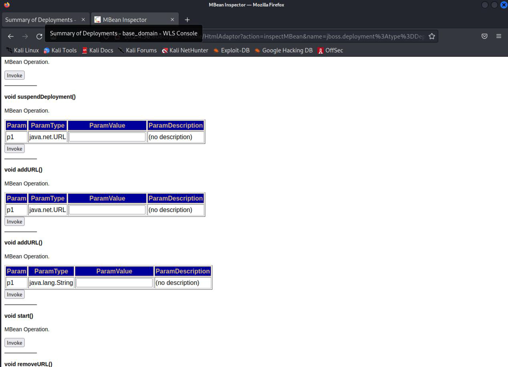

---
tags:
  - 中间件
create_time: 2024-10-17 15:26
modified_time: 2024-10-17 15:26
status: complete
---
> JBoss是一个基于J2EE的开发源代码的应用服务器。 JBoss代码遵循LGPL许可，可以在任何商业应用中免费使用。JBoss是一个管理EJB的容器和服务器，支持EJB1.1、EJB 2.0和EJB3的规范。但JBoss核心服务不包括支持servlet/JSP的WEB容器，一般与Tomcat或Jetty绑定使用。

## 0x00 扫描结果

使用fscan对目标进行扫描


## 0x01 jboss未授权访问getshell

1. 访问8080端口，看到是一个jboss页面


2. 点击JMX Console进入后台


3. 划到jboss. Deployment处点击就仅以进入部署平台



4. 在本地的kali开启http服务


5. 在第二个addURL处添加地址 ```http://x.x.x.x:xxxx/1.war```，自己的http服务地址，war包为恶意文件


6. 部署成功后会返回如下界面


7. 访问页面发现已经解析。追加参数执行命令


## 0x02 jboss反序列化利用

> 该jboss 靶机还存在历史的反序列化漏洞，使用第三方工具完成利用


