---
tags:
  - 中间件
create_time: 2024-10-17 15:28
modified_time: 2024-10-17 15:28
status: complete
---
> WebLogic是美国Oracle公司出品的一个applicationserver，是一个基于JAVAEE架构的中间件，WebLogic是用于开发、集成、部署和管理大型分布式Web应用、网络应用和数据库应用的Java应用服务器。

## 0x00 weblogic历史漏洞

| **CVE-2015-4852** | **CVE-2016-0638** | **CVE-2016-3510** | **CVE-2017-10271** |
| ----------------- | ----------------- | ----------------- | ------------------ |
| **CVE-2017-3248** | **CVE-2018-2628** | **CVE-2018-2893** | **CVE-2018-2894**  |
| **CVE-2018-3252** | **CVE-2018-3191** | **CVE-2018-3245** | **CVE-2019-2725**  |
| **CVE-2019-2729** | **CVE-2020-2551** | **CVE-2020-2555** | **CVE-2021-2109**  |

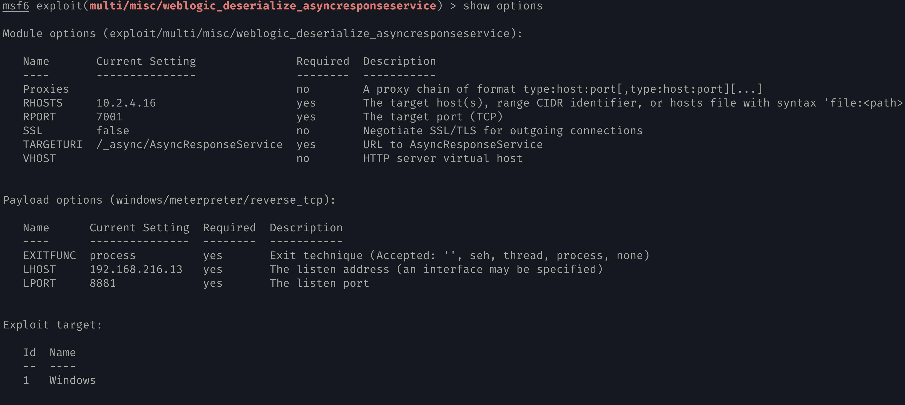

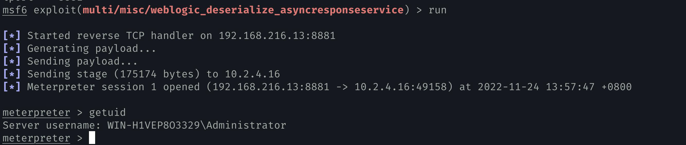

- https://github.com/shack2/javaserializetools

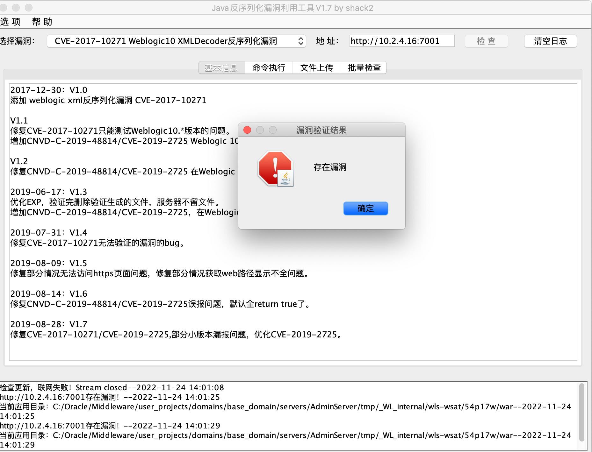

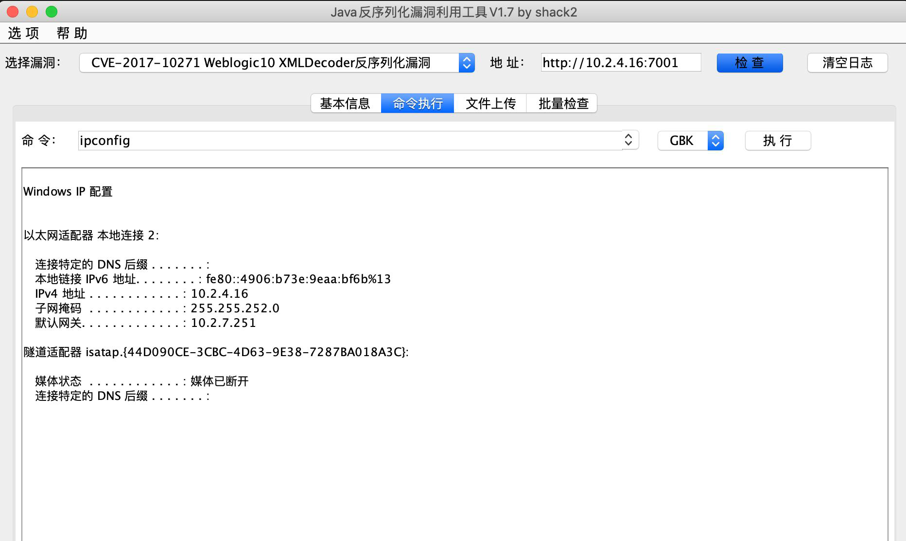

## 0x01 Weblogic弱口令+后台部署war包

> 漏洞简介及成因：由于WebLogic后台存在弱口令，可直接登陆后台上传包含后门的war包。

1. 访问http://127.0.0.1:7001/console

2. 自动重定向到http://127.0.0.1:7001/console/login/LoginForm.jsp，使用弱口令登陆后台。
3. 点击部署，进一步点击右边的安装。

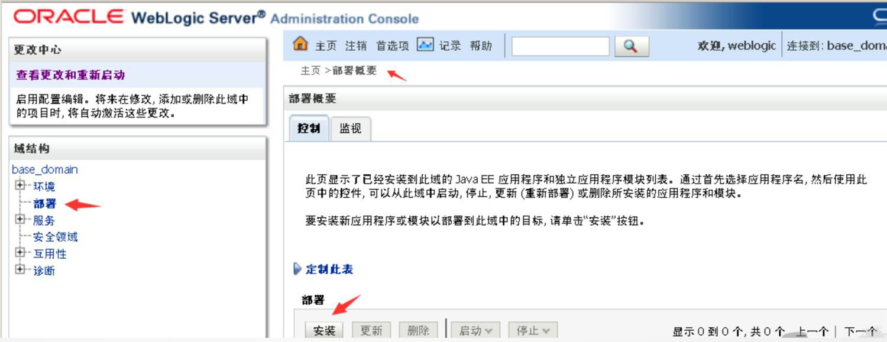

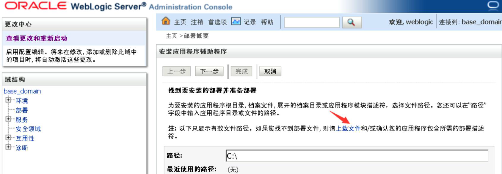

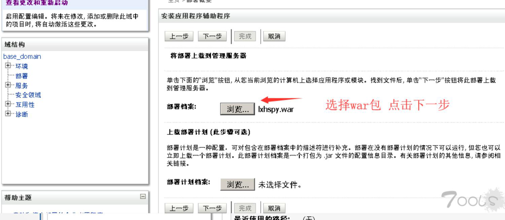

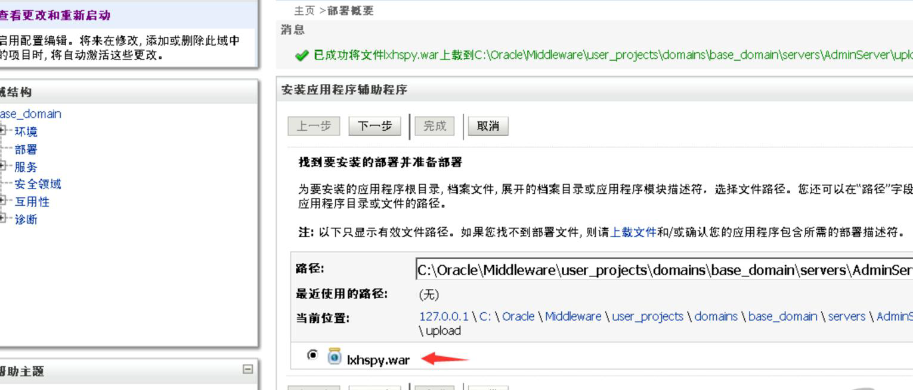

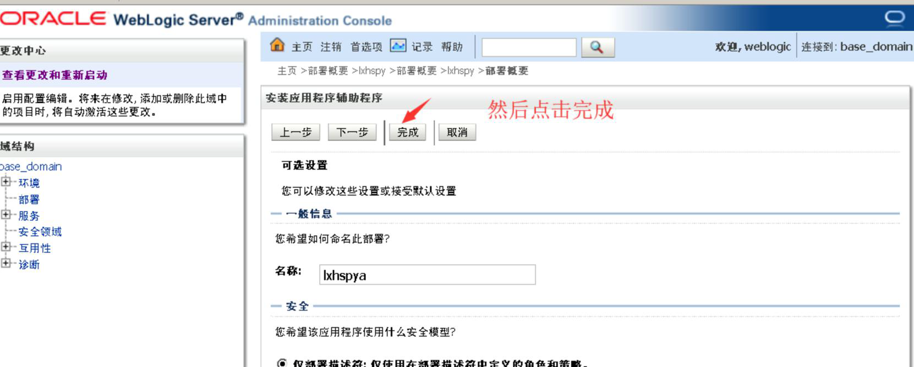

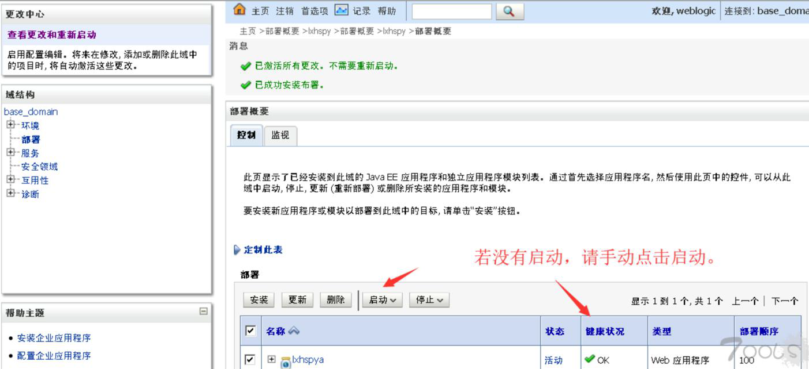

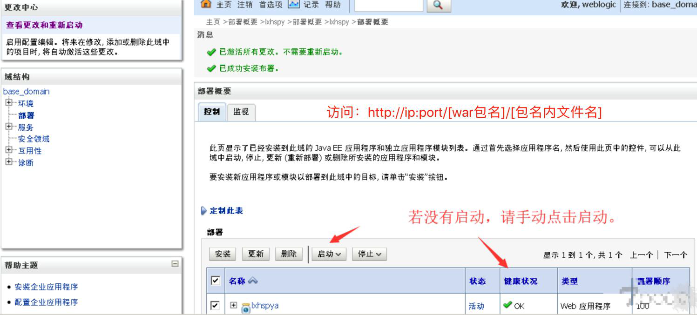

