---
tags:
  - src
create_time: 2024-05-31 17:14
modified_time: 2024-05-31 17:14
status: complete
---
## 图片验证码

### 图片验证码失效

1. 图片验证码在返回包中
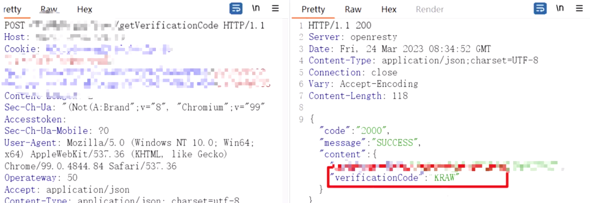

2. 图片验证码字段可删除。将数据包中的type字段改为0，并删除调validCode=x5qs，即可发送短信，绕过了图片验证码机制，进行短信轰炸
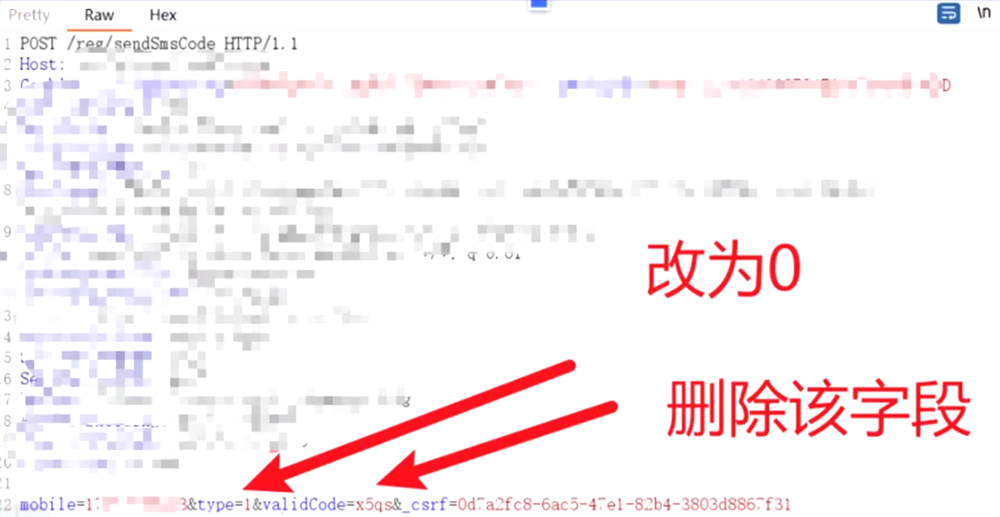

3. 图片验证码不失效，可进行爆破:该案例中第一次将图片验证码填写正确后，输入任意账户密码，点击登录进行抓包，报文中的random字段为图片验证码，直接爆破即可，此处图片验证码可无限复用
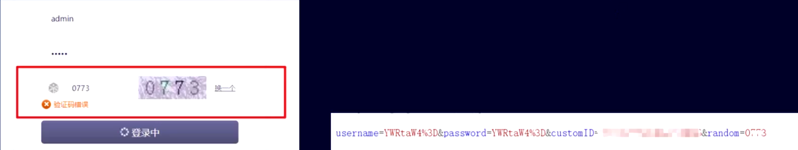

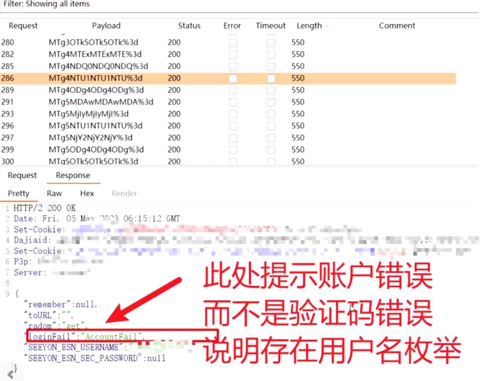

### 图片验证码拒绝服务漏洞

漏洞原理:开发者在网站开发过程中为了图片验证码能够适应网站在显示过程中的大小，从而加入了隐藏参数，当这个参数被攻击者猜测出以后攻击者就可以修改图片验证码、二维码的大小，让服务端返回的验证码无限放大，最终导致服务端生成的图片超级大然后网站停止服务。

测试:
1. 点击图片验证码进行抓包
2. 在请求后面拼接隐藏参数:height、width、size、mergin、h、w等实战过程中以h、w、height、width居多3、逐步增加大小例如:第一次:height=111第二次:height=222，看burp会不会延时，或者直接看burp响应中的Render模块图片有没有变形
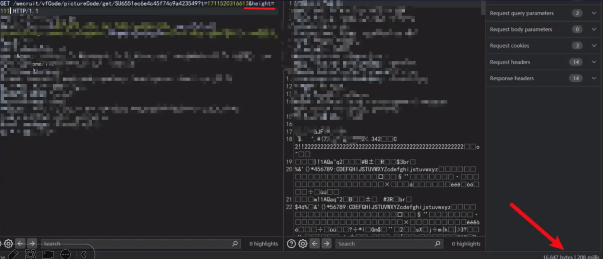

## 登录口高危漏洞

### 用户名枚举
字典:手机号用户名枚举小字典+手机号用户名枚举大字典(放知识大陆和知识星球)
1. 为什么要用户名枚举:
   方便下一步对弱口令进行爆破，或者验证已存在的用户
2. 单交用户名枚举收不收?
   分src有的src会收，有的src会觉得危害过低不收。

实战操作:
为什么会能爆破出来手机号?
因为开发一开始开发登录口的时候为了方便调试，创建了很多测试手机号例如:13333333333、13555555555等，我们字典就是收集了很多这种手机号，然后证明能把手机号枚举出来，写报告一定有对手机号打码，别让看出来是测试手机号
1. 有手机号验证的功能都可以试试、注册、登录、重置、注销等
2. 默认如果爆破有问题，可以调整burp爆破线程和爆破速度
3. 小字典没爆破出来，可以用大字典试一试

### 任意用户漏洞
四个类型
1. 任意用户注册
2. 任意用户登录
3. 任意用户密码重置
4. 任意用户注销

场景:短信验证码场景(满足上述四个类型)
1. 短信验证码直接写在回显的包里
2. 可以把同一个短信验证码发给两个不同的手机号(一个受害者一个攻击者)
3. 四位数短信验证码可爆破

#### 案例1-四位数验证码爆破-任意用户登录+任意用户密码重置

四位数验证码爆破-任意用户登录+任意用户密码重置（使用同样的短信接口）
复现：
1. 获取验证码，抓登陆包，对登录的验证码字段进行爆破
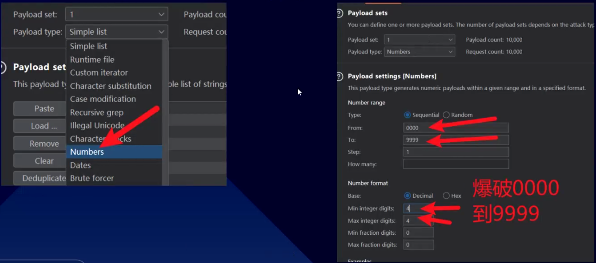
2. 回显中成功获取用户的token，用token即可登录别人的账号
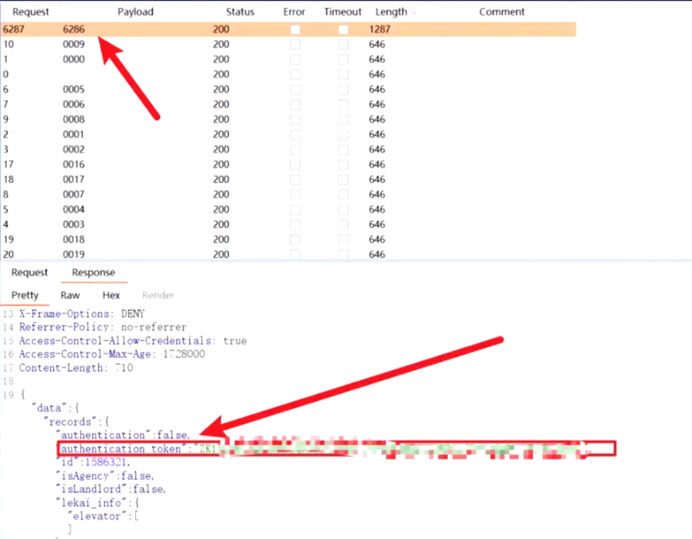

#### 案例2-不同手机号收到相同验证码
不同手机号收到相同验证码

复现
点击验证码抓包，然后构造请求报文，例如原本请求是:
http://www.xxx.com?phone=13344556677
修改为:http://www.xxx.com?phone=13344556677,14444444444
此时:13344556677和1444444444两个手机号收到相同的验证码都可以登录成功

特殊情况：虽然收到了相同的验证码，但是用验证码登录出现验证码已过期，这种不算，只有能登录进去才算

#### 案例3-任意用户密码修改-短信验证码写在响应包里
任意用户密码修改-短信验证码写在响应包里(测试系统居多)

复现：
1. 首先注册一个账号能进系统(合法测试，不要修改别人的账号)
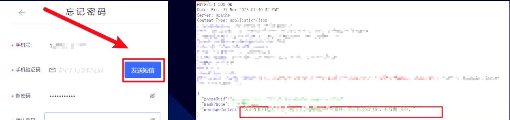

#### 案例4-任意用户密码重置
1. 首先注册一个账号能进系统，来到修改密码功能，此处原密码验证存在问题，随意输入即可
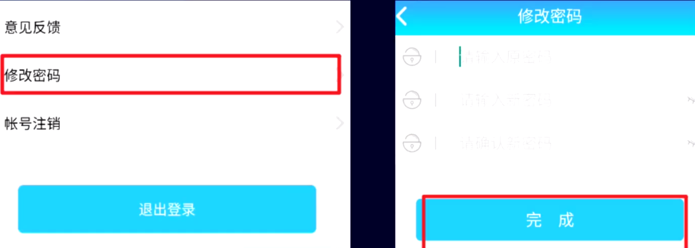

## 结合findsomething找找未授权访问和信息泄露

原理：通过正则表达式在is中提取符合正则的数据

信息泄露：
打开一个登录界面后点findsomething去看里面的数据，有时候会泄露一些云的ak、sk这些怎么利用可以自己看看公众号这块，这些漏洞就存粹捡了
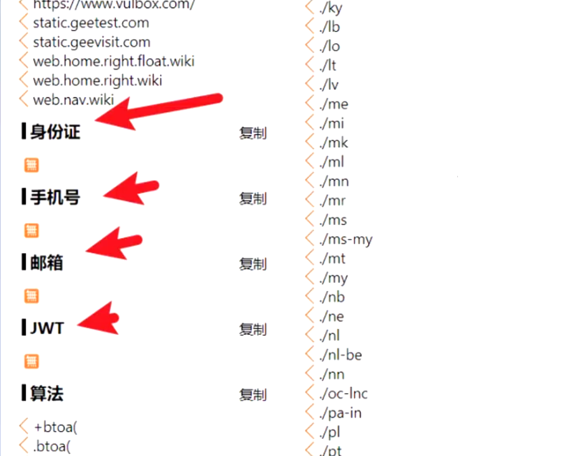

未授权访问：
复制url放入burp模块直接结合登录口域名进行爆破，get爆破一遍，post爆破一遍有时候能捡到未授权访问
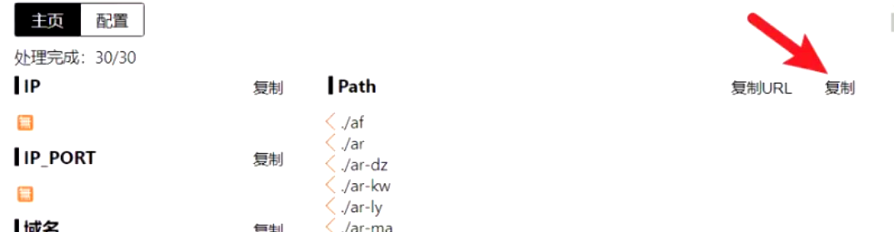

## 可能捡到的漏洞
登录口可能会捡到的漏洞
1. 地图api接管漏洞(我就是靠这个洞被大家记住的，虽然现在不收了但是干渗透项目可以给甲方交一交，偶尔众测src碰碰运气)我挖了一万四左右https://www.freebuf.com/articles/web/360331.html
   https://www.freebuf.com/vuls/380521.html
2. sourcemap文件泄露，很少收
3. session会话固定，很少收
4. jsonp的xss，bp插件-jsonpxss
5. 登录口客服的地方也可以试试xss，或者任意文件上传，能上传exe到本网站并且发给别人链接能下载可以交下钓鱼试试

实战案例：session会话固定
满足三个条件:
1. 网站使用cookie鉴权,
2. 登录后和登录前cookie中的鉴权字段没变
3. 能把这个带有cookie的url发给别人进行登录(此处我没满足，我交的都是只满足前两个的，但是严格来说应该满足这条才行)
登录前登录后下面这个sessionid没变，并且系统权限就是用这个控制还存在几个别的session会话类型的漏洞，但是其它我没挖到给钱的，大家想学习可以看这个:https://www.yaklang.io/Yaklab/wiki/SessionManagement/Session-id
