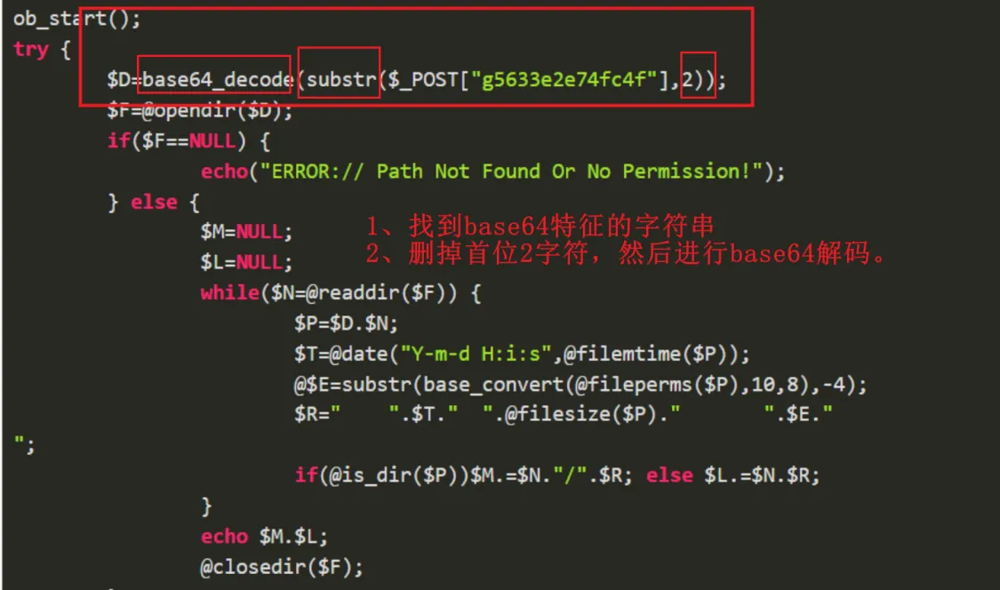
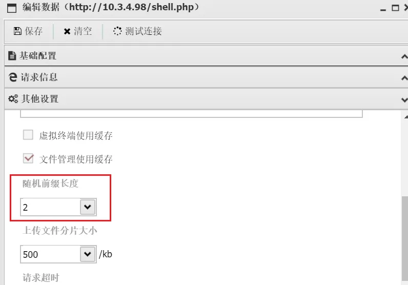
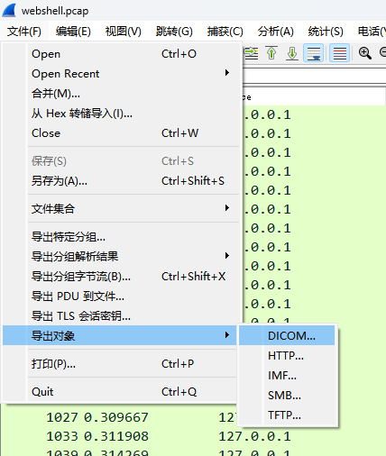
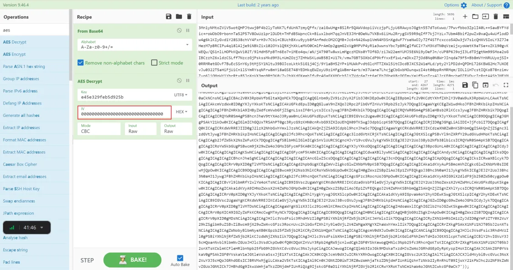
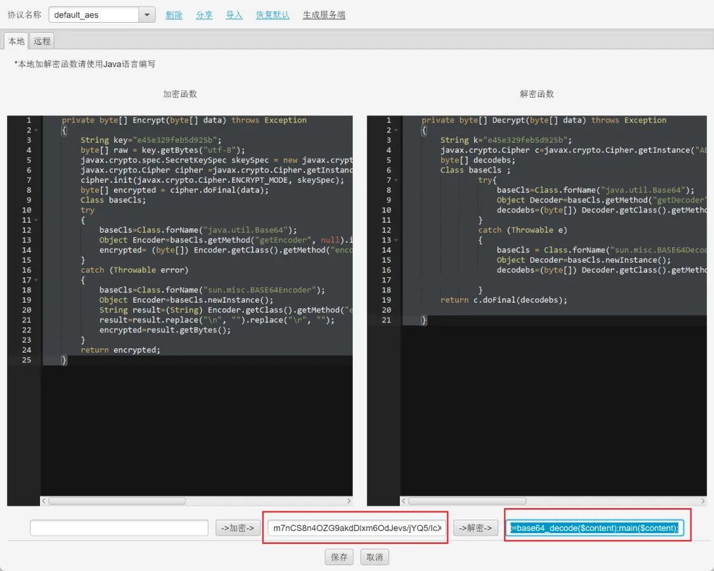
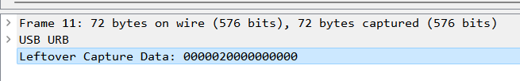

---
tags:
  - wireshark
create_time: 2024-10-18 10:11
modified_time: 2024-10-18 10:11
status: complete
---
# 基础

搜索流或者包中的关键字

```python
[协议名称] contains "你要搜索的内容"
```

过滤包的长度

```python
frame.len==[长度]
```

过滤HTTP请求方法

```python
http.request.method==POST
```

# 蚁剑流量



修改随机前缀长度：



蚁剑流量特征：
1、请求数据包加密，响应数据包明文显示。
2、攻击者每执行一条命令，都会发送一次POST请求。

追踪流的：

- TCP：可以一个一个包看下去，针对像gzip，显示原始字节流
- HTTP：一个请求一个响应的包，一个请求包一个请求包的看

Gzip的文件头：`1f 8b 08 00 ...`
蚁剑base64的webshell执行命令

```python
substr($_POST["h37e8ca57159a8"],2))
```

`文件->导出对象-HTTP`



查看响应的包的内容：
- 1. 追踪TCP流，然后提取十六进制的字节流恢复
- 2. 直接导出HTTP，然后查看每个包的请求和响应
- 3. 直接追踪单个HTTP包，可直接查看当前响应内容

> 当流量很多的时候，一般前面放一些扫描流量用来干扰，直接从最后的流量包往前看，节省很多时间

# 冰蝎流量

默认密钥开头是 `3Mn1yNMtoZViV5wotQHPJ`

离线解密AES加密的冰蝎流量，`模式：AES-128-CBC`

```php
PS C:\Users\Administrator> php -r "var_dump(openssl_decrypt('mAUYLzmqn5QPDkyI5lvSp0fjiBu1e7047YjfczwY6j707eSlJOR++rc2CLjN5Ka6PQEdaL2069K+yLT9EX0fYg==', 'AES-128-CBC', 'e45e329feb5d925b'));"
Command line code:1:
string(50) "{"status":"c3VjY2Vzcw==","msg":"MTcyLjE3LjAuMgo="}"
PS C:\Users\Administrator> php -r "var_dump(base64_decode('MTcyLjE3LjAuMgo='));"
Command line code:1:
string(11) "172.17.0.2"
```
Cyberchef解密：
偏移量为：0000000000000000000000000000000



冰蝎4



# 键盘流量

工具：[https://github.com/seadog007/UsbKeyboardDataHacker](https://github.com/seadog007/UsbKeyboardDataHacker)
USB的 `usb.capdata` 字段就是存储键盘输入的键位，长度默认是16位，八个字节

```php
data = '0000020000000000'

第一个字节: 02是否按下了Shift data[:2]
第三字节：键位
```

```python
# -*- coding: utf-8 -*-
import re

normalKeys = {"04": "a", "05": "b", "06": "c", "07": "d", "08": "e", "09": "f", "0a": "g", "0b": "h", "0c": "i",
              "0d": "j", "0e": "k", "0f": "l", "10": "m", "11": "n", "12": "o", "13": "p", "14": "q", "15": "r",
              "16": "s", "17": "t", "18": "u", "19": "v", "1a": "w", "1b": "x", "1c": "y", "1d": "z", "1e": "1",
              "1f": "2", "20": "3", "21": "4", "22": "5", "23": "6", "24": "7", "25": "8", "26": "9", "27": "0",
              "28": "<RET>", "29": "<ESC>", "2a": "<DEL>", "2b": "\t", "2c": "<SPACE>", "2d": "-", "2e": "=", "2f": "[",
              "30": "]", "31": "\\", "32": "<NON>", "33": ";", "34": "'", "35": "<GA>", "36": ",", "37": ".", "38": "/",
              "39": "<CAP>", "3a": "<F1>", "3b": "<F2>", "3c": "<F3>", "3d": "<F4>", "3e": "<F5>", "3f": "<F6>",
              "40": "<F7>", "41": "<F8>", "42": "<F9>", "43": "<F10>", "44": "<F11>", "45": "<F12>"}

shiftKeys = {"04": "A", "05": "B", "06": "C", "07": "D", "08": "E", "09": "F", "0a": "G", "0b": "H", "0c": "I",
             "0d": "J", "0e": "K", "0f": "L", "10": "M", "11": "N", "12": "O", "13": "P", "14": "Q", "15": "R",
             "16": "S", "17": "T", "18": "U", "19": "V", "1a": "W", "1b": "X", "1c": "Y", "1d": "Z", "1e": "!",
             "1f": "@", "20": "#", "21": "$", "22": "%", "23": "^", "24": "&", "25": "*", "26": "(", "27": ")",
             "28": "<RET>", "29": "<ESC>", "2a": "<DEL>", "2b": "\t", "2c": "<SPACE>", "2d": "_", "2e": "+", "2f": "{",
             "30": "}", "31": "|", "32": "<NON>", "33": "\"", "34": ":", "35": "<GA>", "36": "<", "37": ">", "38": "?",
             "39": "<CAP>", "3a": "<F1>", "3b": "<F2>", "3c": "<F3>", "3d": "<F4>", "3e": "<F5>", "3f": "<F6>",
             "40": "<F7>", "41": "<F8>", "42": "<F9>", "43": "<F10>", "44": "<F11>", "45": "<F12>"}

def filterProcess(output):
    content = output.replace('<SPACE>', ' ')
    while True:
        if '<DEL>' in content:
            content = re.sub(r'[^>]<DEL>', '', content)
        else:
            break
    return content

with open('usbData.txt', 'r') as f:
    output = ""
    lines = f.readlines()
    for line in lines:
        ifShiftKeys, usbData = line[0:2], line[4:6]
        if usbData != "00":
            if ifShiftKeys == "00":
                if usbData in normalKeys:
                    output += normalKeys[usbData]
            elif ifShiftKeys == "02": # 按下了Shift键
                if usbData in shiftKeys:
                    output += shiftKeys[usbData]
print("[+]Output: {}\n".format(output))
print("[+]Filter Processed: {}".format(filterProcess(output)))
```

USB流量存储的字段名称：`usb.capdata` 或者 `usbhid.data`



# 鼠标流量

工具：[https://github.com/WangYihang/USB-Mouse-Pcap-Visualizer](https://github.com/WangYihang/USB-Mouse-Pcap-Visualizer)

```python
00020400

长度默认为8
第一个字节：01表示左键，02表示按下右键，00没有按键
第二个字节：表示的横坐标x
第三个字节：表示的纵坐标y
```

```python
import matplotlib.pyplot as plt
from PIL import Image

def drawMiceData():
    with open('MiceData.txt', 'r') as f:
        lines = f.readlines()
        currentPosX, currentPosY = 0, 0
        with Image.new('1', (2000, 1000), 1) as img:
            for line in lines:
                line = line.strip()
                if len(line) == 8:# 鼠标流量的长度为8，键盘流量的长度为16
                    pos_x, pos_y = int(line[2:4], 16), int(line[4:6], 16)
                    if pos_x > 127:
                        pos_x -= 256
                    if pos_y > 127:
                        pos_y -= 256
                    currentPosX += pos_x
                    currentPosY += pos_y
                    buttonFlag = int(line[:2]) # 0表示没有按下，1表示鼠标按下左键，2表示鼠标按下右键
                    if buttonFlag == 2:
                        img.putpixel((currentPosX, currentPosY), 0)
            img.show()
            #             plt.scatter(currentPosX, currentPosY, color='r', s=1)
            # plt.show()


if __name__ == '__main__':
    drawMiceData()
```

# 工控流量

[https://xz.aliyun.com/t/6603](https://xz.aliyun.com/t/6603)