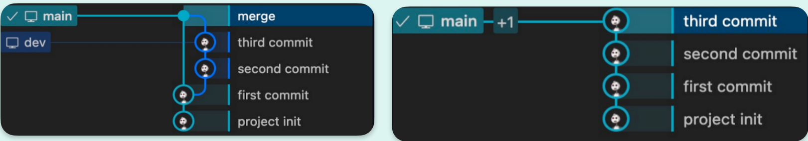
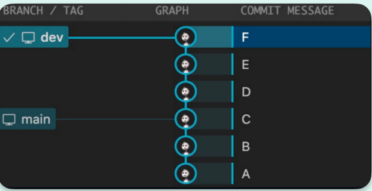

---
tags:
  - tool
create_time: 2024-11-15 16:29
modified_time: 2024-11-15 16:29
status: complete
---
## 初始化配置

```bash
# 配置用户名
git config --global user.name ""
# 配置邮箱
git config --global user.email ""
# 默认分支名字
git config --global init.defaultbranch main
# 存储配置
git config --global credential.helper ""
```

## 创建仓库

```bash
# 新建本地仓库
git init <project-name>
# 克隆远程仓库
git clone <url>
```

## 四个区域

```bash
# 工作区
电脑磁盘中实际的目录和文件
# 暂存区
暂存区也叫索引， 用来临时存放未提交的内容， 一般在.git目录下的index中
# 本地仓库
git在本地的版本库，仓库信息存储在.git目录中
# 远程仓库
托管在远程服务器上的仓库。 常用的有GitHub、 GitLab、 Gitee
```

## 文件状态

```bash
# 已修改（modified）
修改了但是没有保存到暂存区的文件
# 已暂存（staged）
修改后已经保存到暂存区的文件
# 已提交（committed）
把暂存区的文件提交到本地仓库后的状态
```

## 文件状态

```bash
main/master		# 默认主分支
origin			# 默认远程仓库
HEAD			# 指向当前分支的指针
HEAD^			# 上一个版本
HEAD~			# 上四个版本
```

## 特殊文件

```bash
.git		# git仓库的元数据和对象数据库
.gitignore	# 忽略文件，不需要提交到仓库的文件
.gitattributes	# 指向当前分支的指针
.gitkeep	# 使空目录被提交到仓库
.gitmodules	# 记录子模块的信息
.gitconfig	# 记录仓库的配置信息
```

## 添加和提交

```bash
# 添加文件到暂存区
git add <file>
# 提交所有暂存区文件到本地仓库
git commit -m "message"
# 提交所有已修改的文件到本地仓库
git commit -am "message"
```

## 远程仓库

```bash
# 添加远程仓库
git remote add <remote-name> <remote-url>
# 查看远程仓库
git remote -v
# 删除远程仓库
git remote rm <remote-name>
# 重命名远程仓库
git remote rename <old-name> <new-name>
# 从远程仓库拉取代码。默认拉去origin的master/main分支
git pull <remote-name> <branch-name>
# 将本地改动的代码rebase到远程仓库的最新代码上(为了有一个干净线性的提交历史)
git pull --rebase
# 推送代码到远程仓库(然后再发起Pull request)
git push <remote-name> <branch-name>
# 获取所有远程分支
git fetch <remote-name>
# 查看远程分支
git branch -r
# fetch某一个特定的远程分支
git fetch <remote-name> <branch-name>
```

## 分支

```bash
# 查看所有本地分支，当前分支*，-r查看远程分支，-a查看所有分支
git branch
# 创建新分支
git branch <branch-name>
# 切换到指定分支，并更新工作区
git checkout -b <branch-name>
# 删除一个已合并的分支
git branch -d <branch-name>
# 删除一个分支，不管是否合并
git checkout -D <branch-name>
# 给当前的提交打赏标签，通常用于版本发布
git tag <tag-name
# 合并分支，--no-ff标识禁用fast forward模式，合并后的历史有分支，能看出曾经做过合并，而-ff标识使用fast forward模式，合并后的历史会变成一条直线
git merge --no-ff -m message <branch-name>
```


```bash
# 合并&挤压所有提交到一个提交
git squash <branch-name>
# rebase操作可以把本地未push的分叉提交历史整理成直线， 看起来更加直观。 但是， 如果多人协作时， 不要对已经推送到远程的分支执行rebase操作。
# rebase不会产生新的提交， 而是把当前分支的每一个提交都 “复制”到目标分支上， 然后再把当前分支指向目标分支， 而merge会产生一个新的提交， 这个提交有两个分支的所有修改。
git checkout <dev>
git rebase <main>
```


## 撤销和恢复

```bash
# 移动一个文件到新的位置
git mv <file> <new-file>
# 从工作区和暂存区删除一个文件，并将这个删除放入暂存区
git rm <file>
# 从暂存区中删除文件，但是本地工作区文件还在，只是不希望这个文件被版本控制
git rm --cached <file>
# 恢复一个文件到之前的版本
git checkout <file> <commit-id>
# 创建一个新的提交，用来撤销指定的提交，后者的所有变化将被前者抵消，并且应用到当前分支
git revert <commit-id>
# 重置当前分支的HEAD为之前的某个提交，并且删除所有之后的提交
# --hard 重置工作区和暂存区
# --soft 重置暂存区
# --mixed 重置工作区
git reset --mixed <commit-id>
# 撤销暂存区的文件，重新放回工作区(git add的反向操作)
git restore --staged <file>
```

## 查看状态或差异

```bash
# 查看仓库状态
git status
# 查看提交历史 --online简洁模式
git log --online
# 查看未暂存的文件更新了哪些部分
git diff
# 查看两个提交之间的差异
git diff <commit-id> <commit-id>
```

## stash

```bash
# Stash操作可以把当前工作现场 “储藏”起来， 等以后恢复现场后继续工作。
# -u 参数表示把所有未跟踪的文件也一并存储；
# -a 参数表示把所有未跟踪的文件和忽略的文件也一并存储；
# save参数表示存储的信息， 可以不写。
git stash save "message"
# 查看所有stash
git stash list
# 恢复最近一次stash
git stash pop
# 恢复指定的stash stash@{2}表示第三个stash stash@{0}表示最近的stash
git stash pop stash@{2}
# 重新接受最近一次stash
git stash apply
# pop 和 apply的区别是 pop会把stash内容删除 apply不会
# 可以使用git stash drop来删除stash
git stash drop stash@{2}
# 删除所有stash
git stash clear
```

## gitflow

```bash
GitFlow 是一种流程模型，用于在Git上管理软件开发项目

主分支（master/main）：代表了项目的稳定版本，每个提交到主分支的代码都应该是
经过测试和审核的

开发分支（develop)：用于日常开发。所有的功能分支、发布分支和修补分支都应该从
开发分支派生出来

功能分支（feature）：用于开发单独的功能或者特性。每个功能分支都应该从开发分
支派生，并在开发完成后合并回开发分支

发布分支（release)：用于准备项目发布。发布分支应该从开发分支派生，并在准备好
发布版本后合并回主分支和开发分支

热修复分支（hotfix）：用于修复主分支上的紧急问题。热修复分支应该从主分支派
生，并在修复完成后，合并回主分支和开发分支
```