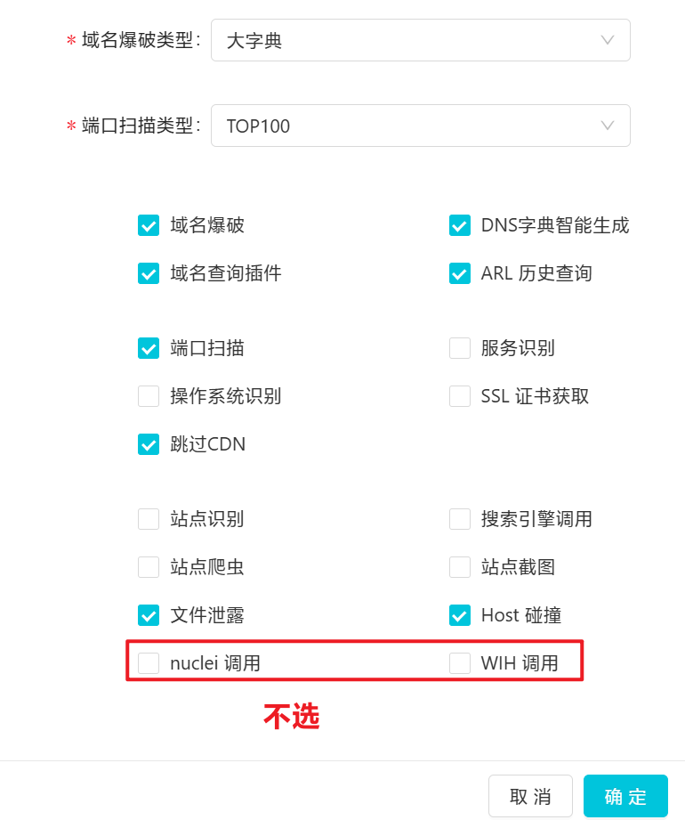

---
tags:
  - 信息收集
create_time: 2024-05-31 17:35
modified_time: 2024-05-31 17:35
status: complete
---
# ARL灯塔安装（官方删库后的安装方法）

5月初，ARL灯塔官方的github删库了，据说是要转成收费软件。
本文中介绍的安装方法用的是docker，源码安装参考https://github.com/Aabyss-Team/ARL（只支持centos。
地图大师建议使用“ubuntu系统+docker”，本人试过“centos7（云服务器&虚拟机）+docker”也是可以的，但是，centos即将停止更新和维护，而且内置的python为2.X版本，后续要安装的其他工具，有的要求是python3，为了避免踩坑，还是建议按地图大师的来。

**命令终端的代理设置（Linux系统）方法**：

使用文本编辑器（如 `nano` 或 `vi`或vim）打开网络配置文件。在大多数 Linux 发行版中，这通常是 `/etc/environment` 或 `/etc/profile` 文件。注意：profile内设置的参数可能会被覆盖，如果这个文件写了没用，就写enviroment。
在文件中，加入以下两行：
 `http_proxy=http://proxy_server:port`  
 `https_proxy=http://proxy_server:port`

需要替换里面的proxy_server:port，其他的不要改，确认过了，我也试过了，没错。

# 正式安装

以下安装过程，主要是参考了官方的安装指南。 
在ubuntu系统中安装docker：[Install Docker Engine on Ubuntu | Docker Docs](https://docs.docker.com/engine/install/ubuntu/#installation-methods)
在docker中安装ARL：[GitHub - TophantTechnology/ARL: ARL(Asset Reconnaissance Lighthouse)资产侦察灯塔系统旨在快速侦察与目标关联的互联网资产，构建基础资产信息库。 协助甲方安全团队或者渗透测试人员有效侦察和检索资产，发现存在的薄弱点和攻击面。](https://github.com/TophantTechnology/ARL?tab=readme-ov-file#docker-%E5%90%AF%E5%8A%A8)   


## 安装docker

### 设置docker仓库
```bash
sudo apt-get install ca-certificates curl
sudo install -m 0755 -d /etc/apt/keyrings
sudo curl -fsSL https://download.docker.com/linux/ubuntu/gpg -o /etc/apt/keyrings/docker.asc
sudo chmod a+r /etc/apt/keyrings/docker.asc
```

以下几行英文，其实是完整的一个命令代码，整个复制粘贴，如果师傅们分行复制粘贴了的话，记得加上空格。
```bash
echo \
  "deb [arch=$(dpkg --print-architecture) signed-by=/etc/apt/keyrings/docker.asc] https://download.docker.com/linux/ubuntu \
  $(. /etc/os-release && echo "$VERSION_CODENAME") stable" | \
  sudo tee /etc/apt/sources.list.d/docker.list > /dev/null
```

然后更新一下apt的包

`sudo apt-get update`

### 安装docker包

完整的一个指令代码开始

```bash
sudo apt-get install docker-ce docker-ce-cli containerd.io docker-buildx-plugin docker-compose-plugin
```

完整的一个指令代码结束

2，安装ARL
```bash
cd /opt
mkdir docker-arl
wget -O docker-arl/docker.zip https://github.com/darknight2018/own_arl/releases/download/arl/darknight2018.zip
cd docker-arl
unzip -o docker.zip
docker volume create arl_db
docker compose pull
docker compose up -d
```

### 登录web

管理端口为5003
本地URL：https://127.0.0.1:5003
密码：admin/arlpass
登陆后先改密码

## 配置
Docker环境配置文件路径 `docker/config-docker.yaml`

| 配置                          | 说明                       |
| --------------------------- | ------------------------ |
| CELERY.BROKER_URL           | rabbitmq连接信息             |
| MONGO                       | mongo 连接信息               |
| QUERY_PLUGIN                | 域名查询插件数据源Token 配置        |
| GEOIP                       | GEOIP 数据库路径信息            |
| FOFA                        | FOFA API 配置信息            |
| DINGDING                    | 钉钉消息推送配置                 |
| EMAIL                       | 邮箱发送配置                   |
| GITHUB.TOKEN                | GITHUB 搜索 TOKEN          |
| ARL.AUTH                    | 是否开启认证，不开启有安全风险          |
| ARL.API_KEY                 | arl后端API调用key，如果设置了请注意保密 |
| ARL.BLACK_IPS               | 为了防止SSRF，屏蔽的IP地址或者IP段    |
| ARL.PORT_TOP_10             | 自定义端口，对应前端端口测试选项         |
| ARL.DOMAIN_DICT             | 域名爆破字典，对应前端大字典选项         |
| ARL.FILE_LEAK_DICT          | 文件泄漏字典                   |
| ARL.DOMAIN_BRUTE_CONCURRENT | 域名爆破并发数配置                |
| ARL.ALT_DNS_CONCURRENT      | 组合生成的域名爆破并发数             |
| PROXY.HTTP_URL              | HTTP代理URL设置              |
| FEISHU                      | 飞书消息推送配置                 |
| WXWORK                      | 企业微信消息推送                 |

## 改装

1. 增强指纹识别：https://github.com/Ernket/ARL-Finger-ADD-Go
2. 增强敏感文件识别能力：知识大陆
3. 配置所有API接口
任务配置：




