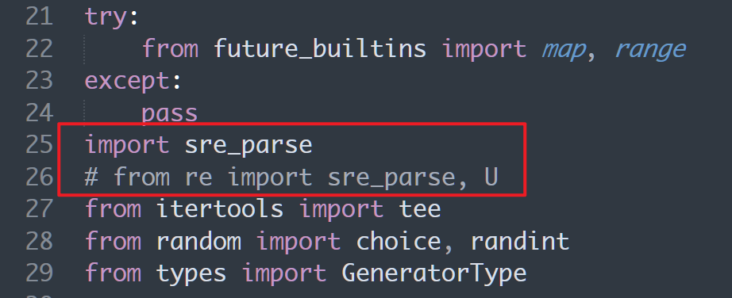

---
tags:
  - 信息收集
create_time: 2024-06-03 17:31
modified_time: 2024-06-03 17:31
status: complete
---
https://github.com/shmilylty/OneForAll

## 下载

由于该项目**处于开发中**，会不断进行更新迭代，下载时请使用`git clone`**克隆**最新代码仓库，也方便后续的更新，不推荐从Releases下载，因为Releases里版本更新缓慢，也不方便更新， 本项目已经在[码云](https://gitee.com/shmilylty/OneForAll.git)(Gitee)镜像了一份，国内推荐使用码云进行克隆比较快：

```shell
git clone https://gitee.com/shmilylty/OneForAll.git
```

或者：

```shell
git clone https://github.com/shmilylty/OneForAll.git
```

## 安装

你可以通过pip3安装OneForAll的依赖，以下为**Windows系统**下使用**pip3**安装依赖的示例：注意：如果你的Python3安装在系统Program Files目录下，如：`C:\Program Files\Python36`，那么请以管理员身份运行命令提示符cmd执行以下命令！

```bash
cd OneForAll/
python3 -m pip install -U pip setuptools wheel -i https://mirrors.aliyun.com/pypi/simple/
pip3 install -r requirements.txt -i https://mirrors.aliyun.com/pypi/simple/
python3 oneforall.py --help
```

其他系统平台的请参考[依赖安装](https://github.com/shmilylty/OneForAll/tree/master/docs/installation_dependency.md)，如果在安装依赖过程中发现编译某个依赖库失败时可以参考[常见问题与回答.md](https://github.com/shmilylty/OneForAll/tree/master/docs/troubleshooting.md)文档中解决方法，如果依然不能解决欢迎加群反馈问题。

## 更新

执行以下命令**更新**项目（可保存对`/config/setting.py`和`/config/api.py`的修改）：

```shell
git stash        # 暂存本地的修改
git fetch --all  # 拉取项目更新
git pull         # 下载覆盖
git stash pop    # 释放本地修改
```

## 使用

配置接口：api.py

如果你是通过pip3安装的依赖则使用以下命令运行示例：

```shell
python3 oneforall.py --target example.com run
python3 oneforall.py --targets ./example.txt run
```

## 运行结果
我们以`python3 oneforall.py --target example.com run`命令为例，OneForAll在默认参数正常执行完毕会在results目录生成相应结果：
`example.com.csv`是每个主域下的子域收集结果。
`all_subdomain_result_1583034493.csv`是每次运行OneForAll收集到子域的汇总结果，包含`example.com.csv`，方便在批量收集场景中获取全部结果。
`result.sqlite3`存放每次运行OneForAll收集到子域的SQLite3结果数据库，其数据库结构如下：
其中类似`example_com_origin_result`表存放每个模块最初子域收集结果。
其中类似`example_com_resolve_result`表存放对子域进行解析后的结果。
其中类似`example_com_last_result`表存放上一次子域收集结果（需要收集两次以上才会生成）。
其中类似`example_com_now_result`表存放现在子域收集结果，一般情况关注这张表就可以了。


## 报错解决

windows中安装报错：
```bash
Traceback (most recent call last):
  File "E:\Tools\shouji\OneForAll\oneforall.py", line 16, in <module>
    from brute import Brute
  File "E:\Tools\shouji\OneForAll\brute.py", line 14, in <module>
    import exrex
  File "D:\CodeEnv\Python\Python311\Lib\site-packages\exrex.py", line 25, in <module>
    from re import sre_parse, U
ImportError: cannot import name 'sre_parse' from 're' (D:\CodeEnv\Python\Python311\Lib\re\__init__.py)
```

是因为高版本python中re模块没有了sre_parse模块，可以修改exrex.py 代码，直接导入sre_parse模块

路径：
`D:\CodeEnv\Python\Python311\Lib\site-packages\exrex.py`




