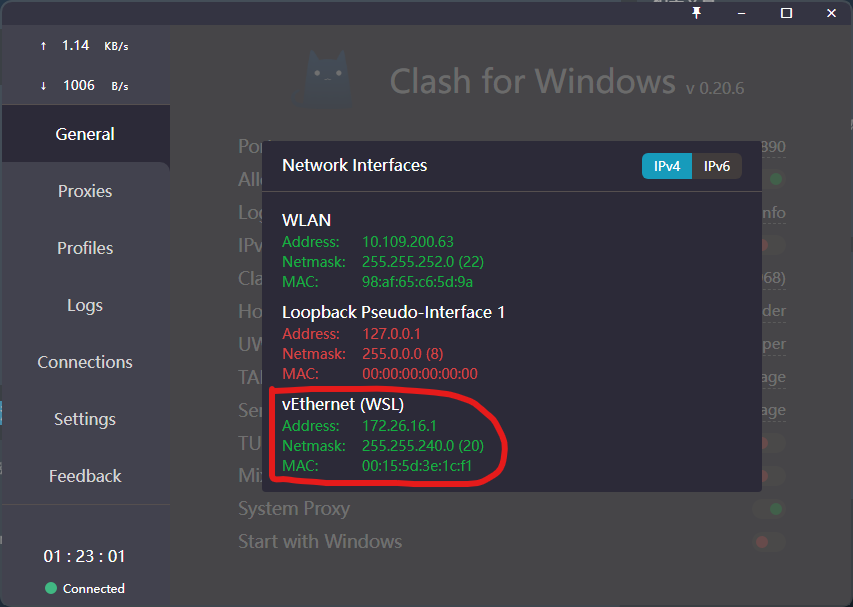

---
tags:
  - 代理
create_time: 2024-11-29 09:35
modified_time: 2024-11-29 09:35
status: complete
---
## WSL 终端代理

打开小猫，General===>Allow LAN 开启

然后点Allow LAN旁边的小图标，可以看到WSL的 一些代理的 Address和 其它信息。



但是， 动态的IP ，不可能每次去修改。所在我们在MAC 代理的脚本上 ，做个小修改，动态获取IP即可，像这样 修改 ~/.bash_profile

```bash
function proxy_off(){
        unset http_proxy
        unset https_proxy
        unset ftp_proxy
        unset rsync_proxy
        echo -e "已关闭代理"
}

function proxy_on() {
        export no_proxy="localhost,127.0.0.1,localaddress,.localdomain.com"
        host_ip=$(cat /etc/resolv.conf |grep "nameserver" |cut -f 2 -d " ")
        export http_proxy="http://$host_ip:7890"
        export https_proxy=$http_proxy
        export ftp_proxy=$http_proxy
        export rsync_proxy=$http_proxy
        export HTTP_PROXY=$http_proxy
        export HTTPS_PROXY=$http_proxy
        export FTP_PROXY=$http_proxy
        export RSYNC_PROXY=$http_proxy
        echo -e "已开启代理"
}
```

最后
```bash
# 环境变量生效
source ~/.bash_profile

# 打开 代理
proxy_on

# 关闭 代理
proxy_on
```

## PowerShell 终端代理

在使用过程中发现 PowerShell 走的线路默认 不是代理线路。

实际上 PowerShell Core 还支持可用于启用代理设置的特殊 Windows 环境变量： - HTTP_PROXY – HTTP 请求的代理 - HTTPS_PROXY — HTTPS 请求的代理 - ALL_PROXY – HTTP 和 HTTPS 的代理 - NO_PROXY – 代理排除地址列表

### 临时代理

可以使用以下 PowerShell 命令设置环境变量：

```powershell
$proxy='http://127.0.0.1:7890'
$ENV:HTTP_PROXY=$proxy
$ENV:HTTPS_PROXY=$proxy

# 一行
$ENV:ALL_PROXY ='http://127.0.0.1:7890'
```

### 永久代理

手动开关
管理员模式修改 配置

```powershell
code $profile


function proxy_on{
    $env:all_proxy="http://127.0.0.1:7890"
}

function proxy_off{
    $env:unsetproxy=""
}
```

### CMD 终端代理

```cmd
# 使用 http 类型代理
set http_proxy=http://127.0.0.1:7890
set https_proxy=https://127.0.0.1:7890

# 使用 socks 类型代理
set http_proxy=socks5://127.0.0.1:1089
set https_proxy=socks5://127.0.0.1:1089

# 取消代理
set http_proxy=
```

如果只是要在 Cmd 中临时使用代理，则可以直接在 Cmd 中设置上述环境变量。

如果需要永久设置代理，则可以到 Windows 系统环境变量页面（直接用 Windows 的搜索工具搜索：「编缉系统环境变量」，然后到弹出的页面点击「环境变量」），新建两个系统环境变量 http_proxy 和 https_proxy，值同上。配置完后保存后 Cmd 即会使用对应的代理。


